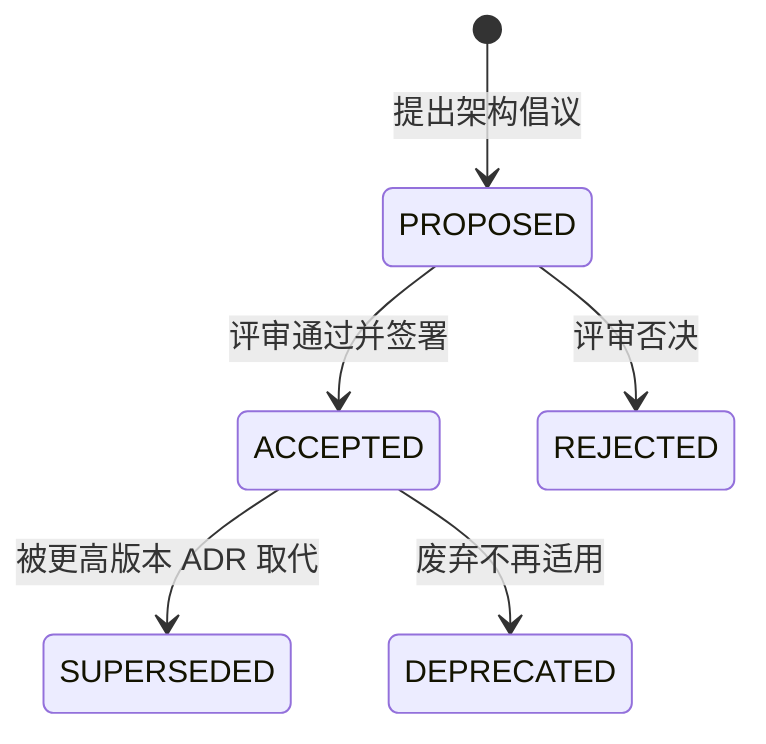

# ADR (Architecture Decision Record) 架构决策记录规范

遵循 Michael Nygard 架构决策记录标准与 MADR (Markdown Architectural Decision Records) 工业级格式。用于捕获系统演进过程中所有的关键技术决策、上下文动因、长远后果与折衷权衡，建立永久可审计的架构知识沉淀。

---

## 1. 何时启用

- **系统拓扑与边界变更**：单体域拆分至独立插件或微服务、新增第一方业务插件。
- **协议与契约选型**：HTTP / RPC（NATS request-reply、gRPC protobuf）选型与协议演进。
- **持久层与存储决策**：引入新的存储引擎、修改多租户隔离方案、数据库兼容性策略调整。
- **破坏性变更评估**：修改公共 API 契约、弃用遗留数据模型、废除旧版本鉴权机制。
- **基础设施与通信演进**：调整 Service Bus 容错策略、引入熔断降级或可靠消息 Outbox 机制。

---

## 2. ADR 生命周期状态机



- **PROPOSED (拟议)**：方案已成型，正处于架构评审或 RFC 阶段。
- **ACCEPTED (已采纳)**：经技术委员会/架构师评审通过，已合并至主干并在代码中实施。
- **REJECTED (已否决)**：经 DAR 评估后被否决，但仍保留记录供后人借鉴避免重蹈覆辙。
- **SUPERSEDED (已取代)**：随架构演化被新的 ADR（如 ADR-0024）取代，必须在头部注明替换关系。
- **DEPRECATED (已废弃)**：功能退役或相关技术已完全下线。

---

## 3. 标准 MADR 模板

文件命名规范：`docs/03_design/adr/ADR-<4位序号>-<kebab-case-title>.md`。

```markdown
# ADR-0018: 采用自研 NATS 语义实现跨域可靠消息总线

- **状态**: ACCEPTED <!-- PROPOSED | ACCEPTED | REJECTED | SUPERSEDED | DEPRECATED -->
- **决策人**: @architect-team
- **决策日期**: 2026-09-15
- **关联需求/DAR**: DAR-20260912-EVENT-BUS, REQ-SYS-EVENT-001

## 1. 背景与问题阐述 (Context and Problem Statement)
在业务域逐步插件化与微服务化演进过程中，跨域同步调用存在强依赖、雪崩效应风险。系统需要一套高性能、低资源消耗且具备可靠事件发布机制的事件总线。

## 2. 考虑的候选方案 (Considered Options)
1. 方案 A：引入外部 RabbitMQ / Apache Kafka 独立中间件集群。
2. 方案 B：基于自研轻量级 NATS 协议语义与数据库 Outbox 事务表模式。
3. 方案 C：使用进程内 Node.js EventEmitter 直接广播。

## 3. 决策结果 (Decision Outcome)
**选用方案 B**。
- **决策动因 (Justification)**：
  - 极简部署：无需在客户机部署重型 Java/Erlang 容器，单体与拆分模式无缝平滑迁移；
  - 强一致性：借助 Kysely 本地事务与 Outbox 表（同库同事务），实现 At-Least-Once 可靠投递；
  - 协议标准：天然与未来的独立 Go 微服务节点互通。

## 4. 后果与权衡 (Consequences)
- **积极影响 (Positive)**：
  - 跨域解耦：各域通过 `broker.publishReliable()` 进行事件发布，消灭代码级直接引用；
  - 零外部组件依赖：极大降低交付部署与运维复杂度。
- **消极影响与妥协 (Negative / Trade-offs)**：
  - 自研 Consumer Inbox 需处理消息去重与幂等（基于 `x-idempotency-key`）；
  - 极高并发场景（>10万 QPS）需后续演进为外部独立 NATS 部署。
- **风险缓释 (Mitigation)**：
  - 制定 Outbox 定时清理与死信队列重试策略，纳入 SRE 监控。

## 5. 合规与校验手段 (Compliance & Verification)
- 运行 `npm run microservice:check` 验证不存在跨域 Service 直接 import。
- 自动化契约验证：`npm run rpc:actions:check` 确保事件 Payload 符合 JSON Schema。
```

---

## 4. 与 ruoyi-all-next 架构联动

1. **不可动摇的三大架构铁律联动**：
   - 跨域通信必须走 Domain Facade 或 RPC，严禁直接 import 其他域 Service 或 Repository。
   - 任何涉及多租户的数据访问必须依托 Kysely AST 或 `withAdminRoute`，不可手写未加 tenant 限制的 raw SQL。
   - 所有外部 HTTP 暴露必须保持 `/api/v{n}/` 版本化，禁止破坏存量客户端契约。
2. **ADR 变更门禁**：
   - 任何标记为 ACCEPTED 的 ADR，必须有对应的自动化门禁（如 `npm run microservice:check`）进行代码级防御。

---

## 5. 检查清单与门禁

- [ ] ADR 是否按 `ADR-<序号>-<标题>.md` 规范命名并存放在 `docs/03_design/adr/`？
- [ ] 状态标记是否严谨（PROPOSED / ACCEPTED 等）并注明决策日期与参与人？
- [ ] 是否详细记录了至少 2 个备选方案及各自的利弊权衡？
- [ ] 是否明确列出了 Positive、Negative 及风险缓解措施（Trade-offs）？
- [ ] 是否在 `npm run check` 门禁中具备对应的自动化代码约束？

---

## 6. 严禁事项

1. **严禁悄无声息的架构漂移**：禁止未经 ADR 评审私自引入全新重型第三方中间件或运行时。
2. **严禁只报喜不报忧**：每个架构决策必须如实记录其代价（Negative Consequences）与潜在风险。
3. **严禁覆盖历史决策**：已被取代的决策应置为 `SUPERSEDED` 并保留原文，禁止直接篡改历史记录。
