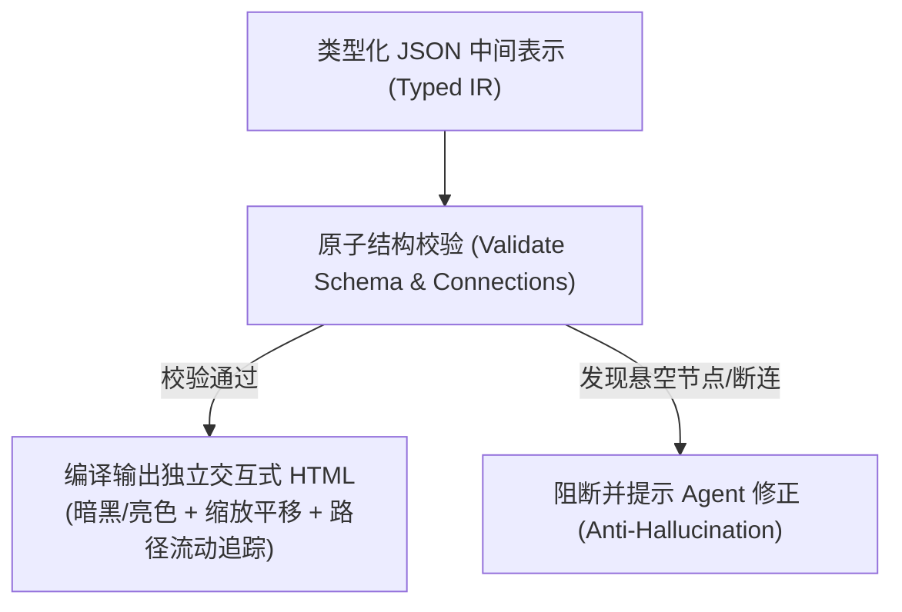

# Archify 可验证与交互式架构图生成规范

遵循开源顶流 `tt-a1i/archify` (47,000+ Stars, MIT) 工业标准。传统手工绘图（Draw.io/Excalidraw）无法被 AI 机器验证，而静态文本图（纯 Mermaid）在大规模微服务拓扑中经常因布局错乱、文字折行或 AI 幻觉导致“死连线”。Archify 开创了 **`Validate-Preview-Deliver`** 契约闭环：通过类型化 JSON Schema 结构化定义，并在输出前进行原子连线与边界校验，最终编译为支持缩放平移、暗黑模式切换与**全链路流动请求路径追踪（Path Tracing）**的独立交互式 HTML 制品。

---

## 1. 何时启用

- **系统概要设计 (HLD)**：绘制 17 领域拓扑、微服务 A/B/C 拆分演进图、边缘网关与 BFF 分层图。
- **子系统详细设计 (LLD)**：绘制跨域 RPC（NATS request-reply / gRPC protobuf）时序图与 Outbox 可靠事件投递流程。
- **业务流程与审批流 (BPM)**：绘制泳道流程图（Lanes / Phases / Nodes）、动态加签与退回路径。
- **数据流与对账拓扑 (Data Flow)**：绘制三方财务对账数据流、ETL 同步阶段流水。
- **状态机生命周期 (Lifecycle)**：绘制订单状态、工单状态、插件生命周期状态流转图。
- **OpenWiki (LLM-Wiki) 百科全景增强**：为 `wiki/domains/<domain>.md` 生成带动态交互的架构卡片。

---

## 2. Archify 5 大核心图表类型与 Schema 契约

每个架构图定义必须为纯类型化 JSON 中间表示（IR），严格声明 `schema_version`、`diagram_type` 与 `meta`：



| 图表类型 (`diagram_type`) | 核心构成元素 | 典型应用场景 |
|---|---|---|
| **1. `architecture`** | `boundaries` (边界容器), `components` (组件节点), `connections` (连接线与协议) | 全站分层架构、微服务调用拓扑、多租户数据网关 |
| **2. `workflow`** | `lanes` (角色泳道), `phases` (阶段), `groups` (分组), `nodes` (任务步骤), `edges` | BPM 审批流、CMMI 01~09 交付管道、CI/CD 构建流 |
| **3. `sequence`** | `participants` (参与方), `segments` (交互片段), `messages` (同步/异步调用) | 跨域 Facade 调用、JWT 鉴权握手、支付三方回调 |
| **4. `dataflow`** | `stages` (流转阶段), `nodes` (处理节点), `flows` (数据管道/流向) | 财务业务双向平账、Binlog 数据同步、审计日志清洗 |
| **5. `lifecycle`** | `lanes` (租户/主体泳道), `states` (状态节点), `transitions` (事件跃迁) | 订单状态机、插件安装状态机、工单流转状态守卫 |

---

## 3. 标准 Architecture 图 IR 编写范例

以下为定义 ruoyi-all-next 跨域与微服务边界的 Archify JSON 结构范例：

```json
{
  "schema_version": "1.0",
  "diagram_type": "architecture",
  "meta": {
    "title": "ruoyi-all-next 跨域 Facade 与多租户网关调用全景",
    "theme": "auto",
    "export": ["svg", "png"]
  },
  "boundaries": [
    { "id": "client-layer", "label": "Client Surface (终端展示面)", "type": "container" },
    { "id": "gateway-layer", "label": "Traefik Edge Gateway (边缘网关)", "type": "container" },
    { "id": "bff-layer", "label": "Next.js App BFF (薄路由解析层)", "type": "container" },
    { "id": "domain-layer", "label": "First-Party Business Plugins (第一方业务插件面)", "type": "container" },
    { "id": "db-layer", "label": "Database Storage (真实数据持久层)", "type": "container" }
  ],
  "components": [
    { "id": "web-admin", "boundary": "client-layer", "label": "Admin Dashboard", "tech": "React 19 / Tailwind" },
    { "id": "traefik", "boundary": "gateway-layer", "label": "Traefik Gateway", "tech": "Reverse Proxy / SSL" },
    { "id": "route-bff", "boundary": "bff-layer", "label": "API Route Handler", "tech": "Next.js 16" },
    { "id": "plugin-mall", "boundary": "domain-layer", "label": "Mall Plugin", "tech": "BaseService / CAS" },
    { "id": "plugin-pay", "boundary": "domain-layer", "label": "Pay Plugin", "tech": "Domain Facade" },
    { "id": "db-pg", "boundary": "db-layer", "label": "PostgreSQL / SQLite", "tech": "Kysely AST / 8 Base Audit" }
  ],
  "connections": [
    { "from": "web-admin", "to": "traefik", "label": "HTTPS / TLS", "protocol": "http" },
    { "from": "traefik", "to": "route-bff", "label": "/api/v1/admin/*", "protocol": "http" },
    { "from": "route-bff", "to": "plugin-mall", "label": "withAdminRoute Guard", "protocol": "internal" },
    { "from": "plugin-mall", "to": "plugin-pay", "label": "payPublicFacade.createOrder()", "protocol": "rpc" },
    { "from": "plugin-mall", "to": "db-pg", "label": "where tenant_id = ?", "protocol": "sql" }
  ]
}
```

---

## 4. 与 ruoyi-all-next 架构联动

1. **过程资产归档路径**：
   - 架构与设计图统一存放于 `docs/03_design/diagrams/<name>.arch.json`，并编译输出对应的 `<name>.arch.html`。
   - 业务特性规格图存放于 `docs/specs/<domain>/<feature>/assets/diagrams/`。
   - OpenWiki 词条可在对应 `wiki/domains/<domain>.md` 中直接超链接挂载该交互式 HTML。
2. **防幻觉校验准则 (Anti-Hallucination Guard)**：
   - 所有 `connections` 中的 `from` 与 `to` 必须存在于 `components` 清单中，严禁未声明节点直接连线。
   - 跨域调用必须显式标注调用协议（`protocol: "rpc"` 或 `protocol: "facade"`），严禁直接连接其他域内部 Service。
   - 数据持久层连接线必须标明租户隔离守卫约束。

---

## 5. 检查清单与门禁

- [ ] 是否选用了正确的 `diagram_type`（architecture / workflow / sequence / dataflow / lifecycle）？
- [ ] 所有节点和连接是否通过了 Schema 校验，不存在任何悬空（Dangling）孤儿节点？
- [ ] 架构分层是否严格对应工程实际拓扑（Client -> Gateway -> BFF -> Plugin -> DB）？
- [ ] 是否输出了可独立离线浏览的交互式 HTML 制品（包含亮色/暗色自适应）？
- [ ] 门禁验证：`npm run check` 确保文档索引与架构设计无破损。

---

## 6. 严禁事项

1. **严禁手画未受控位图**：禁止将未经验证的手绘草图直接作为正式架构交付资产。
2. **严禁脱离代码实际产生架构幻觉**：禁止在图表中画出代码中并不存在的微服务组件或数据库。
3. **严禁跨域穿透连线**：严禁画出前端或 BFF 绕过 Service 规则直接穿透连接底层数据库的违规连线。
