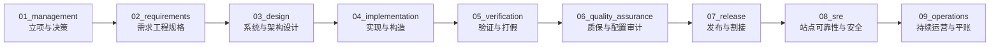

# CMMI 01~09 全生命周期过程资产标准作业规程 (CMMI Asset Authoring SOP)

> **适用标准**: CMMI V2.0 / V3.0 (DEV + SVC 融合模型) × IEEE 29148 需求规范 × Google SRE 最佳实践  
> **核心哲学**: **过程资产工程化 (Process-as-Code)、交付证据物理化 (Evidence-First)、全链路双向可追溯 (End-to-End Traceability)、零造假实事求是 (Zero Fake Demos)**  
> **最高铁律**: 严格遵循 Rule 0 底线法则与高阶反向思维，严禁大模型人肉写样板 Markdown，统一由 `npm run cmmi:asset` 脚手架生成并由专属 Skill 驱动作业。

---

## 一、 高阶反向思维与设计底座铁律 (Core Invariants)

在进行 CMMI 01~09 任意阶段过程资产作业时，任何工程师或 AI Agent 必须恪守以下 4 条底线法则：

1. **声明式 DSL 驱动与消灭 Token 浪费 (Zero Token Waste)**：
   - 严禁人肉或大模型手写成百上千行的 Markdown 格式样板；
   - 资产的创建一律经由 `npm run cmmi:asset new --phase <XX> --type <type>` 引擎展开标准骨架，输入声明参数压缩至极简 (<500 Tokens)。
2. **实事求是与反虚假 Demo 铁律 (Zero Fake Demos & Real Data Gate)**：
   - 严禁在基座仓库中凭空捏造未发生的生产故障（如“超发优惠券”、“资金损失”）或虚假财务流水账单；
   - 事故复盘（`postmortem`）、对账流水（`reconciliation`）、变异测试报告（`mutation-report`）与渗透演练（`strix-report`）等事实态资产，在未实际发生线上事件或实跑容器时，相关目录必须保留规范拓扑并使用 `.gitkeep` **严格留空**；
   - 工具层强制内置 `--real` 鉴权门禁，无真实事实证明严禁生成运行期业务资产。
3. **单一真源与禁止根目录散落 (Single Source of Truth & No Root Orphans)**：
   - 严禁在 `docs/` 根目录随意散落孤儿 markdown 文件；
   - 过程资产必须精确落位至 `docs/01_management` 至 `docs/09_operations` 9 大标准子目录；业务需求规格垂直隔离于 `docs/specs/<domain>/<name>/`（向下兼容 `docs/features/`）。
4. **交付物物理工程资产化 (No Artifact, No Done)**：
   - 一切阶段结项与工单交付终局必须沉淀为可审计、可机器校验的物理工程资产（OpenAPI 契约、真实数据库单测、FCA/PCA 审计单、SOP 回滚手册等），严禁口头声明完工。

---

## 二、 CMMI 01~09 全生命周期工序与顶级 Skill 分配总表

全生命周期 9 大阶段均有确定性专属 Skill 驱动专业作业，并由统一的脚手架引擎生成基线：



| 阶段 | 阶段目录 | CMMI 实践域 | 核心工作内容 | 资产类型 (type) | 承载专属 Skill | 准入门禁与防假规则 |
|---|---|---|---|---|---|---|
| **01** | `docs/01_management/` | PLAN / MC / RSKM / DAR | 项目立项书、综合研发计划、风险台账、DAR 加权决策分析 | `charter`, `plan`, `risk`, `dar`, `pcm` | **`dar-decision-matrix`**<br/>`project-init`<br/>`agent-harness` | **G0 门禁**: 明确 In/Out 范围；DAR 必须含 >=2 候选 + 1 阴性对照 |
| **02** | `docs/02_requirements/` | RDM (需求开发与管理) | EARS 5 态需求规格、需求双向跟踪矩阵 (RTM)、NFR 非功能指标 | `srs`, `rtm`, `nfr`, `urs` | **`ears-spec-writer`**<br/>`spec-driven-development`<br/>`product-requirements` | **G1 门禁**: EARS 句式消除二义性；RTM 需双向绑定设计与测试 |
| **03** | `docs/03_design/` | TS (技术解决方案) | MADR 架构决策、8 大审计底座列、Archify 拓扑建模、OpenAPI 契约 | `adr`, `erd`, `archify`, `hld`, `api-spec` | **`adr-architect`**<br/>`archify`<br/>`database-design`<br/>`api-design` | **G2 门禁**: 继承 8 大审计列；MADR 格式；交互式 Mermaid/Archify 拓扑 |
| **04** | `docs/04_implementation/` | TS (构造与编码) | 第一方插件架构实现蓝图、代码审查红线清单、软件物料清单 (SBOM) | `code-review`, `plugin-blueprint`, `sbom` | **`coding`**<br/>`plugin-authoring`<br/>`new-feature`<br/>`new-business-plugin` | **G3 门禁**: 跨域经由 Facade/Broker；0 编译报错；WBS 任务 100% 勾选 |
| **05** | `docs/05_verification/` | VV (验证与确认) | 真实测试套件执行大盘、测试计划、变异测试打假、同行评审纪要 | `test-plan`, `test-summary`, `mutation-report`, `peer-review` | **`automated-testing`**<br/>**`mutation-tester`**<br/>`webapp-testing` | **G4 门禁**: 真实数据库测试 100% 通过；变异测试需真实运行带 `--real` |
| **06** | `docs/06_quality_assurance/` | PQA / CM (质保与配置) | 功能配置审计 (FCA)、物理配置审计 (PCA)、20 道门禁数字指纹记录 | `qa-plan`, `audit`, `gate-trace` | **`compliance-auditor`** | **G4_QA 门禁**: `npm run check` 20 道门禁 Exit Code 严格为 0 |
| **07** | `docs/07_release/` | TRANS (转型与发布) | 6 步零停机割接 SOP、秒级自动回滚 Runbook、版本发布说明 | `deployment-sop`, `release-notes`, `rollback-runbook`, `user-manual` | **`devops`** | **G5 门禁**: 割接 SOP 闭环验证；秒级回滚 Runbook 可执行可演练 |
| **08** | `docs/08_sre/` | SCON / CAM / SRE | 服务等级目标 (SLO/SLI)、多活容灾预案、5-Whys 免责复盘、红队渗透 | `slo-matrix`, `postmortem`, `dr-plan`, `strix-report` | **`sre-slo-manager`**<br/>**`postmortem-analyzer`**<br/>`strix-penetration-testing` | **G6_SRE 门禁**: 单机吞吐 >=5,000 RPS；事故复盘与渗透必须带 `--real` |
| **09** | `docs/09_operations/` | CMMI-SVC / BizOps / DataOps | 日常资金轧差对账平账、AI 数字员工运营台账、系统日常健康巡检 | `reconciliation`, `agent-ops-ledger`, `inspection-report` | **`financial-reconciliation-agent`**<br/>`new-business-plugin` | **G7_OPS 门禁**: 复式记账借贷恒等平衡；真实对账单必须带 `--real` |

---

## 三、 九大阶段标准作业规程 (SOP Walkthrough)

### Phase 01: 项目策划与决策分析 (PLAN / MC / RSKM / DAR)
- **触发时机**: 项目立项、重大架构重构、引入重型外部依赖、技术路线选型。
- **驱动 Skill**: `dar-decision-matrix`, `project-init`, `agent-harness`。
- **作业步骤**:
  1. 运行 `npm run cmmi:asset new -- --phase 01 --type charter --title "<项目全称>"`，完善边界 In/Out 范围与 RACI 矩阵；
  2. 运行 `npm run cmmi:asset new -- --phase 01 --type risk`，识别技术架构风险与防御预案；
  3. 遇多方案选型时，运行 `npm run cmmi:asset new -- --phase 01 --type dar --title "<选型决策>" --slug "<SLUG>"`，启动 `dar-decision-matrix` 技能开展加权打分（必须设置阴性对照）。
- **交付产物**: `docs/01_management/project-charter.md`, `risk-register.md`, `DAR-*.md`。

### Phase 02: 需求工程与规格定义 (RDM / EARS / SRS)
- **触发时机**: 新功能迭代、业务变更、客户定制需求导入。
- **驱动 Skill**: `ears-spec-writer`, `spec-driven-development`, `product-requirements`。
- **作业步骤**:
  1. 调用 `ears-spec-writer`，以 Rolls-Royce EARS 5 态句式（Ubiquitous / Event / State / Unwanted / Optional）消除需求二义性；
  2. 运行 `npm run cmmi:asset new -- --phase 02 --type srs --version "<版本>"`，固化软件需求规格；
  3. 运行 `npm run cmmi:asset new -- --phase 02 --type rtm`，建立需求到设计与测试用例的双向追溯矩阵。
- **交付产物**: `docs/02_requirements/srs/SRS-*.md`, `rtm-traceability-matrix.md`, `non-functional-reqs.md`。

### Phase 03: 技术解决方案与架构设计 (TS / MADR / Archify)
- **触发时机**: 数据模型变更、跨域通信、插件拆分、API 契约制定。
- **驱动 Skill**: `adr-architect`, `archify`, `database-design`, `api-design`, `database-compatibility`。
- **作业步骤**:
  1. 运行 `npm run cmmi:asset new -- --phase 03 --type adr --id <编号> --title "<决策标题>" --slug "<SLUG>"`，调用 `adr-architect` 撰写 MADR 架构决策记录；
  2. 检查表结构设计，确保持久化实体严格继承 8 大审计底座字段（`database-design`）；
  3. 运行 `npm run cmmi:asset new -- --phase 03 --type archify --title "<架构全景>" --slug "<SLUG>"`，生成可交互架构图谱（`archify`）。
- **交付产物**: `docs/03_design/adr/ADR-*.md`, `database-design-erd.md`, `architecture-topology-*.md`。

### Phase 04: 实现构造与工程蓝图 (TS / Coding / Plugins)
- **触发时机**: 业务编码、第一方插件开发、通用底座扩展。
- **驱动 Skill**: `coding`, `plugin-authoring`, `new-feature`, `new-business-plugin`。
- **作业步骤**:
  1. 运行 `npm run cmmi:asset new -- --phase 04 --type code-review`，对照 8 大工程红线进行同行代码审查；
  2. 遵循第一方业务插件隔离规约，跨域调用一律经由 Domain Facade / Broker，严禁跨域直接 import Service；
  3. 编写真实业务状态机与并发防超卖 CAS 乐观锁逻辑，严禁写假 Mock。
- **交付产物**: `docs/04_implementation/code-review-checklist.md`, `plugin-architecture-blueprint.md`。

### Phase 05: 验证确认与变异打假 (VV / Testing / Mutation)
- **触发时机**: 代码合并主干前、版本发布前验证。
- **驱动 Skill**: `automated-testing`, `mutation-tester`, `webapp-testing`。
- **作业步骤**:
  1. 运行 `npm run test:matrix`，执行全矩阵真实数据库驱动测试（100% 退出码 0）；
  2. 运行 `npm run cmmi:asset new -- --phase 05 --type test-summary --version "<版本>"`，记录测试大盘；
  3. 针对核心交易链路，调用 `mutation-tester` 启动真实变异引擎，杀灭存活突变体与假 Mock，生成实测报告：
     `npm run cmmi:asset new -- --phase 05 --type mutation-report --version "<版本>" --real --score "91.5%"`。
- **交付产物**: `docs/05_verification/test-summary-report.md`, `mutation/mutation-testing-report-*.md`。

### Phase 06: 质量保证与双基石审计 (PQA / CM / FCA-PCA)
- **触发时机**: 交付里程碑节点、正式发版封版前夕。
- **驱动 Skill**: `compliance-auditor`。
- **作业步骤**:
  1. 运行 `npm run check`，总检全仓 20+ 道自动化门禁（退出码必须为 0）；
  2. 运行 `compliance-auditor` 执行 FCA 功能配置审计（功能做对了吗）与 PCA 物理配置审计（依赖放对了吗、pnpm-lock 确定性）；
  3. 运行 `npm run cmmi:asset new -- --phase 06 --type audit --version "<版本>"`，签发合规审计报告。
- **交付产物**: `docs/06_quality_assurance/audit/PCA-FCA-COMPLIANCE-AUDIT-*.md`, `gate-evidence-trace.json`。

### Phase 07: 转型交付与割接回滚 (TRANS / DevOps)
- **触发时机**: 生产环境发布、版本割接、客户现场交付。
- **驱动 Skill**: `devops`。
- **作业步骤**:
  1. 运行 `npm run cmmi:asset new -- --phase 07 --type deployment-sop`，明确 6 步零停机割接流程；
  2. 运行 `npm run cmmi:asset new -- --phase 07 --type rollback-runbook`，制定 60 秒故障回滚预案；
  3. 运行 `npm run cmmi:asset new -- --phase 07 --type release-notes --version "<版本>"`，整理版本发布说明与破坏性变更指引。
- **交付产物**: `docs/07_release/system-deployment-sop.md`, `rollback-runbook.json`, `RELEASE_NOTES_*.md`。

### Phase 08: 服务连续性与 SRE 稳定性 (SCON / CAM / SRE / Postmortem)
- **触发时机**: 系统上线后稳定性监控、容量压测、线上故障复盘。
- **驱动 Skill**: `sre-slo-manager`, `postmortem-analyzer`, `strix-penetration-testing`。
- **作业步骤**:
  1. 运行 `npm run cmmi:asset new -- --phase 08 --type slo-matrix`，固化 Tier-1/Tier-2 SLO 指标与容量护栏；
  2. 运行 `npm run load:test` 验证单机吞吐量（>= 5,000 RPS）；
  3. 若生产发生真实事故，调用 `postmortem-analyzer` 执行 1-5-10 应急并输出 5-Whys 免责复盘：
     `npm run cmmi:asset new -- --phase 08 --type postmortem --title "<真实事故>" --slug "<SLUG>" --real`；
  4. 运行 Strix 容器执行真实红队渗透演练，记录渗透测试报告（需带 `--real`）。
- **交付产物**: `docs/08_sre/01_slo_sli_metrics/SLO-SLI-ERROR-BUDGET-MATRIX.md`, `06_incidents_postmortem/POSTMORTEM-*.md`。

### Phase 09: 持续运营与对账平账 (BizOps / DataOps / CMMI-SVC)
- **触发时机**: 日终清算、渠道对账、日常系统巡检、AI 数字员工管理。
- **驱动 Skill**: `financial-reconciliation-agent`, `new-business-plugin` (包含 `agent:ops`)。
- **作业步骤**:
  1. 运行 `npm run agent:ops -- <domain>.<entity> health` 执行无头运营健康巡检；
  2. 针对具备资金交易的衍生业务工程，调用 `financial-reconciliation-agent` 进行三方对账与资金轧差：
     `npm run cmmi:asset new -- --phase 09 --type reconciliation --title "<对账批次>" --slug "<SLUG>" --real`；
  3. 运行 `npm run cmmi:asset new -- --phase 09 --type agent-ops-ledger`，记录数字员工执行流水。
- **交付产物**: `docs/09_operations/01_financial_reconciliation/RECONCILIATION-*.md`, `04_agent_ops/AGENT-OPS-LEDGER.md`。

---

## 四、 过程资产“三存三不存”生命周期防污染法则

| 准则 | 详细要求 | 负面反例 (严惩) |
|---|---|---|
| **存代码化过程资产** | 规格、ADR、ERD、SOP 一律使用标准 Markdown / JSON 纳入 Git 版本控制 | ❌ 严禁把需求与评审写在外部孤立 Word/Excel 里与代码割裂 |
| **存机器可读契约与指纹** | 324 份跨端契约、Page Schema、20 道门禁数字指纹记录必须与代码同生同灭 | ❌ 严禁脱离代码的人工手写离线契约 |
| **存真实测试与审计证据** | 100% 真实数据库测试结果、FCA/PCA 审计单、真实压测护栏记录 | ❌ 严禁伪造测试报告与假变异得分 |
| **不存未经发生的假数据** | 未发生线上事故或流水时，`08_sre/postmortem` 与 `09_operations` 保持 `.gitkeep` 留空 | ❌ 严禁在模板底座中伪造虚假故障（如“超发优惠券 5,000 元”） |
| **不存形式主义手工假评审** | 评审必须基于真实代码变更与质量门禁退出码，严禁纸面签字应付评估 | ❌ 严禁上线前补录虚假评审签字 |
| **不存二进制大包与临时产物** | 构建产物、临时日志、视频动图严禁提交至 Git 仓库，切图收敛至 `assets/` | ❌ 严禁将 node_modules、zip 压缩包或几十兆构建临时文件推至仓库 |

---

## 五、 标准 CLI 脚手架命令手册

```bash
# ==========================================
# 1. Phase 01: 立项与策划
# ==========================================
npm run cmmi:asset new -- --phase 01 --type charter --title "企业全域业务数字化基座"
npm run cmmi:asset new -- --phase 01 --type risk
npm run cmmi:asset new -- --phase 01 --type dar --title "多数据库方言 AST 解析器选型" --slug "SQL-AST-PARSER"
npm run cmmi:asset new -- --phase 01 --type plan --title "Enterprise System v1.1"
npm run cmmi:asset new -- --phase 01 --type pcm --version "v1.1.0"

# ==========================================
# 2. Phase 02: 需求工程
# ==========================================
npm run cmmi:asset new -- --phase 02 --type srs --version "v1.1.0"
npm run cmmi:asset new -- --phase 02 --type rtm --version "v1.1.0"
npm run cmmi:asset new -- --phase 02 --type nfr
npm run cmmi:asset new -- --phase 02 --type urs

# ==========================================
# 3. Phase 03: 系统设计
# ==========================================
npm run cmmi:asset new -- --phase 03 --type adr --id 0003 --title "第一方业务插件隔离架构" --slug "plugin-isolation"
npm run cmmi:asset new -- --phase 03 --type erd
npm run cmmi:asset new -- --phase 03 --type archify --title "15原生业务域通信拓扑" --slug "plugin-bus"
npm run cmmi:asset new -- --phase 03 --type hld --version "v1.1.0"
npm run cmmi:asset new -- --phase 03 --type api-spec

# ==========================================
# 4. Phase 04: 实现与构造
# ==========================================
npm run cmmi:asset new -- --phase 04 --type code-review
npm run cmmi:asset new -- --phase 04 --type plugin-blueprint
npm run cmmi:asset new -- --phase 04 --type sbom --version "v1.1.0"

# ==========================================
# 5. Phase 05: 验证与打假
# ==========================================
npm run cmmi:asset new -- --phase 05 --type test-plan --version "v1.1.0"
npm run cmmi:asset new -- --phase 05 --type test-summary --version "v1.1.0"
npm run cmmi:asset new -- --phase 05 --type peer-review --slug "SPRINT-4-REVIEW"
# 【反造假受控资产】真实变异测试报告（必须带 --real）
npm run cmmi:asset new -- --phase 05 --type mutation-report --version "v1.1.0" --real --score "91.5%"

# ==========================================
# 6. Phase 06: 质量保证
# ==========================================
npm run cmmi:asset new -- --phase 06 --type qa-plan
npm run cmmi:asset new -- --phase 06 --type audit --version "v1.1.0"
npm run cmmi:asset new -- --phase 06 --type gate-trace

# ==========================================
# 7. Phase 07: 发布交付
# ==========================================
npm run cmmi:asset new -- --phase 07 --type deployment-sop
npm run cmmi:asset new -- --phase 07 --type release-notes --version "v1.1.0"
npm run cmmi:asset new -- --phase 07 --type rollback-runbook
npm run cmmi:asset new -- --phase 07 --type user-manual

# ==========================================
# 8. Phase 08: SRE 稳定性
# ==========================================
npm run cmmi:asset new -- --phase 08 --type slo-matrix
npm run cmmi:asset new -- --phase 08 --type dr-plan
# 【反造假受控资产】真实事故复盘报告（必须带 --real）
npm run cmmi:asset new -- --phase 08 --type postmortem --title "网关证书轮换瞬断故障复盘" --slug "GATEWAY-SSL-RELOAD" --real
# 【反造假受控资产】真实渗透演练报告（必须带 --real）
npm run cmmi:asset new -- --phase 08 --type strix-report --version "v1.1.0" --real

# ==========================================
# 9. Phase 09: 持续运营
# ==========================================
npm run cmmi:asset new -- --phase 09 --type agent-ops-ledger
npm run cmmi:asset new -- --phase 09 --type inspection-report
# 【反造假受控资产】真实财务对账单（必须带 --real）
npm run cmmi:asset new -- --phase 09 --type reconciliation --title "20261010微信通道资金轧差对账" --slug "WECHAT-20261010" --real

# ==========================================
# 盘点与合规扫描
# ==========================================
npm run cmmi:asset list          # 盘点 01~09 全部交付资产台账
npm run cmmi:asset:check         # 扫描目录拓扑合规性与反造假健康
```

---

## 六、 交付物质量门禁与自检闭环 (Verification Checklist)

在任何过程资产变更提交至 Git 之前，必须执行以下自检：

- [ ] **全 9 阶段拓扑合规**：新创建文档是否严格落入 `docs/01_management` 至 `docs/09_operations` 对应标准目录？
- [ ] **根目录 0 孤儿**：`docs/` 根目录下除 `TEMPLATE_UPGRADE_PLAN.md` 之外是否绝对无散落 `.md` 文件？
- [ ] **反造假实事求是**：未发生的线上事故与财务账目是否严格保留 `.gitkeep` 留空？
- [ ] **脚手架扫描通过**：运行 `npm run cmmi:asset:check`，退出码是否为 0？
- [ ] **全仓质量门禁闭环**：运行 `npm run check`，全部 20+ 道自动化门禁是否保持 100% 绿色通过？
