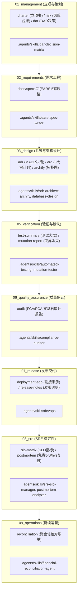

# CMMI 过程资产标准创作与生命周期治理规范 (CMMI Asset Authoring)

遵循 CMMI 2.0 / 3.0 高成熟度过程资产标准、IEEE 29148 需求规范与 Google SRE 最佳实践。以高阶反向思维（High-Order Inverse Thinking）与最高工程铁律（Rule 0）为纲领，为 `ruoyi-all-next` 提供全生命周期（Phase 01 至 Phase 09）工程交付资产的声明式创建、目录合规与反造假治理。

---

## 1. 高阶反向思维与设计哲学 (Rule 0 & High-Order Invariants)

任何工程师或 AI Agent 在创建或演进过程资产时，必须死守以下 4 条底线法则：

1. **声明式 DSL 驱动与消灭 Token 浪费 (Zero Token Waste)**：
   - 严禁人肉或模型手写成百上千行的 Markdown 格式样板；
   - 资产的创建一律经由 `npm run cmmi:asset new` 引擎展开标准骨架，输入声明参数压缩至极简。
2. **实事求是与反虚假 Demo 铁律 (Zero Fake Demos & Real Data Gate)**：
   - 严禁在基座仓库中凭空捏造未发生的生产故障（如“超发优惠券”、“资金损失”）或虚假财务流水账单；
   - 事故复盘（`postmortem`）与对账流水（`reconciliation`）等事实态资产，在未实际发生线上事件时，相关目录必须保留规范拓扑并使用 `.gitkeep` **严格留空**；
   - 工具层强制内置 `--real` 鉴权门禁，无真实事实证明严禁生成运行期业务资产。
3. **单一真源与禁止根目录散落 (Single Source of Truth & No Root Orphans)**：
   - 严禁在 `docs/` 根目录随意散落孤儿 markdown 文件；
   - 过程资产必须精确落位至 `docs/01_management` 至 `docs/09_operations` 9 大标准子目录；业务需求规格垂直隔离于 `docs/specs/<domain>/<name>/`。
4. **交付物物理工程资产化 (No Artifact, No Done)**：
   - 一切交付成果终局必须沉淀为可审计、可机器校验的物理工程资产（OpenAPI 契约、真实数据库单测、FCA/PCA 审计单、SOP 回滚手册等），严禁口头声明完工。

---

## 2. CMMI 01~09 全生命周期资产拓扑与技能映射

全生命周期 9 大阶段均有专属原生 Skill 支持深度建设，并由统一的脚手架引擎生成基线：



| 阶段编号 | 标准目录 | 资产类型 (type) | 核心产物文件 | 支撑 Skill | 反造假与准入规则 |
|---|---|---|---|---|---|
| **01** | `docs/01_management/` | `charter` | `project-charter.md` | `project-init` | 明确 In/Out 范围与 RACI 矩阵 |
| **01** | `docs/01_management/` | `risk` | `risk-register.md` | `agent-harness` | 识别概率/影响并具备缓解措施 |
| **01** | `docs/01_management/` | `dar` | `dar-decision-records/DAR-*.md` | `dar-decision-matrix` | 必须包含 >=2 候选 + 1 阴性对照 |
| **02** | `docs/specs/<domain>/<name>/` | `brief` | `brief.json` + 7 份规格文档 | `ears-spec-writer` | 经由 `npm run spec:new` / `spec:build` |
| **03** | `docs/03_design/` | `adr` | `adr/ADR-*.md` | `adr-architect` | 遵循 Michael Nygard / MADR 格式 |
| **03** | `docs/03_design/` | `erd` | `database-design-erd.md` | `database-design` | 必须继承 8 大核心审计底座列 |
| **03** | `docs/03_design/` | `archify` | `architecture-topology-*.md` | `archify` | 包含可交互 Mermaid/C4 拓扑 |
| **05** | `docs/05_verification/` | `test-summary` | `test-summary-report.md` | `automated-testing` | 真实数据库驱动，100% 退出码 0 |
| **05** | `docs/05_verification/` | `mutation-report`| `mutation-testing-report-*.md`| `mutation-tester` | 需真实执行 Stryker，必须带 `--real` |
| **06** | `docs/06_quality_assurance/`| `audit` | `audit/PCA-FCA-COMPLIANCE-*.md`| `compliance-auditor`| 20 道质量门禁退出码必须全为 0 |
| **07** | `docs/07_release/` | `deployment-sop`| `system-deployment-sop.md` | `devops` | 包含完整 6 步割接与回滚 SOP |
| **07** | `docs/07_release/` | `release-notes` | `release-notes-*.md` | `devops` | 清晰列明破坏性变更与迁移指引 |
| **08** | `docs/08_sre/` | `slo-matrix` | `01_slo_sli_metrics/*.md` | `sre-slo-manager` | 明确吞吐量容量护栏（>=5000 RPS）|
| **08** | `docs/08_sre/` | `postmortem` | `06_incidents_postmortem/*.md`| `postmortem-analyzer` | **严禁造假**，真实事故必须带 `--real` |
| **09** | `docs/09_operations/` | `reconciliation` | `01_financial_reconciliation/*.md`| `financial-reconciliation-agent` | **严禁造假**，真实流水必须带 `--real` |

---

## 3. 标准 CLI 脚手架操作指南

仓库已将全量资产脚手架封装为原生命令 `npm run cmmi:asset`，支持秒级创建与合规扫描。

### 3.1 资产创建命令 (`cmmi:asset new`)

```bash
# 1. 创建 Phase 01 DAR 决策分析记录
npm run cmmi:asset new -- --phase 01 --type dar --title "多数据库方言 AST 解析器选型" --slug "SQL-AST-PARSER"

# 2. 创建 Phase 03 架构决策记录 (MADR)
npm run cmmi:asset new -- --phase 03 --type adr --id 0002 --title "基于 Kysely AST 实现全自动多租户注入" --slug "tenant-ast-injection"

# 3. 创建 Phase 03 Archify 架构拓扑模型
npm run cmmi:asset new -- --phase 03 --type archify --title "15原生业务域插件通信与事件总线拓扑" --slug "plugin-bus"

# 4. 创建 Phase 05 测试总结大盘
npm run cmmi:asset new -- --phase 05 --type test-summary --version "v1.1.0"

# 5. 创建 Phase 06 功能与物理配置审计总结 (FCA/PCA)
npm run cmmi:asset new -- --phase 06 --type audit --version "v1.1.0"

# 6. 创建 Phase 07 生产部署 SOP
npm run cmmi:asset new -- --phase 07 --type deployment-sop

# 7. 创建 Phase 08 SRE SLO 指标与错误预算矩阵
npm run cmmi:asset new -- --phase 08 --type slo-matrix

# 8. 【反造假受控资产】创建事故复盘报告（必须携带 --real 声明真实事件）
npm run cmmi:asset new -- --phase 08 --type postmortem --title "网关证书轮换瞬断故障复盘" --slug "GATEWAY-SSL-RELOAD" --real

# 9. 【反造假受控资产】创建真实财务对账单（必须携带 --real 声明真实发生）
npm run cmmi:asset new -- --phase 09 --type reconciliation --title "20261010微信通道资金轧差对账" --slug "WECHAT-20261010" --real
```

### 3.2 资产盘点与健康体检

```bash
# 盘点当前工程 01~09 全部交付资产台账（实时显示真实资产与留空占位项）
npm run cmmi:asset list

# 执行 CMMI 资产合规与反造假健康扫描（检查 0 散落文件，0 伪造假 Demo）
npm run cmmi:asset:check
```

---

## 4. 质量门禁与自检清单 (Verification Checklist)

在提交任何过程资产变更前，必须依次核验以下清单：

- [ ] **路径合规**：新创建文档是否严格落入 `docs/01_management` 至 `docs/09_operations`，`docs/` 根目录无散落文件？
- [ ] **反假 Demo**：是否存在虚构的线上业务故障或假账目？未发生事件的运营/事故目录是否严格保持 `.gitkeep` 留空？
- [ ] **脚手架体检通过**：运行 `npm run cmmi:asset:check` 退出码是否为 0？
- [ ] **全量门禁闭环**：运行 `npm run check`，全部 20+ 道门禁是否保持 100% 绿色通过？
