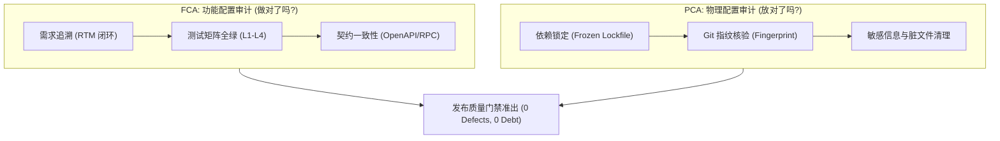

# Compliance Auditor 质量门禁与配置审计规范

遵循 CMMI 过程与产品质量保证（PPQA）、功能配置审计（FCA - Functional Configuration Audit）与物理配置审计（PCA - Physical Configuration Audit）工业标准。用于在软件发布、交付与转测试前，对工程全过程资产、代码基线、自动化门禁与双向追溯性（RTM）进行终局闭环审计，确保 0 债务交付。

---

## 1. 何时启用

- **阶段门禁评审 (Gate Reviews G0 ~ G5)**：每个特性从 Brief 立项到生产割接的准出审查。
- **发布准出审计 (Release Sign-off)**：版本正式打 Tag 发布（如 `v1.0.0`）前的合规体检。
- **功能配置审计 (FCA)**：核验实际实现的功能与测试结果是否与合同/SRS（Brief）严格一致。
- **物理配置审计 (PCA)**：核验代码基线、配置文件、依赖清单（SBOM）与部署产物的完整性，防范配置漂移。
- **CMMI 过程资产归档**：检查 `docs/01_management` 至 `09_operations` 目录资产是否完备。

---

## 2. 审计双基石：FCA 与 PCA 工作流



### 1. 功能配置审计 (FCA) 核查要点
- **需求闭环性**：检查 `docs/specs/<domain>/<feature>/brief.json` 中的每条验收准则是否均有自动化测试用例覆盖。
- **契约一致性**：检查前端路由、OpenAPI/RPC 契约（`packages/domains/<domain>/contract/`）与实际后端 Route 实现是否一致。
- **测试通过率**：测试用例通过率必须为 100%（0 Skip、0 Flaky、0 Failed）。

### 2. 物理配置审计 (PCA) 核查要点
- **依赖锁文件确定性**：`pnpm-lock.yaml` 必须与 `package.json` 完全一致，执行构建必须为 `--frozen-lockfile`。
- **环境安全检查**：不得存在未脱敏的密钥、临时测试文件（`scratch/`、`*.tmp`、`.env.local` 残留）。
- **Git 追溯指纹**：运行指纹核验工具，确认发布产物是由受审计的 Git 提交编译生成。

---

## 3. ruoyi-all-next 20 道自动化门禁审计清单

质量审计员在审查代码库时，必须执行全量门禁检查，并确保所有门禁状态为通过（Exit Code 0）：

| 序号 | 审计命令 | 审计目标与防守底线 |
|---|---|---|
| 1 | `npm run domain:manifests:check` | 验证各领域 manifest 契约合法性 |
| 2 | `npm run contracts:sync` | 校验前后端及 RPC 契约定义同步无漂移 |
| 3 | `npm run rpc:actions:check` | 校验跨域 RPC 动作定义合规 |
| 4 | `npm run domain:loaders:check` | 校验第一方业务插件与领域加载器 |
| 5 | `npm run domain:check` | 领域边界分层守卫（禁止跨域非法 import） |
| 6 | `npm run microservice:check` | 微服务/拆分单体架构调用面隔离检查 |
| 7 | `npm run harness:check` | DeepSeek Harness 环境组合基线守卫 |
| 8 | `npm run admin:routes:check` | 管理后台 Route 与 BFF 映射完整性 |
| 9 | `npm run admin:pages:check` | 管理后台 Page 双轨页面规范与模板守卫 |
| 10 | `npm run foundation:ontology:check` | 本体域实体元数据与权限码全息索引核验 |
| 11 | `npm run skills:check` | Agent Skills 唯一真源与格式规范校验 |
| 12 | `npm run compat:check` | 客户端与下游契约兼容性清单校验 |
| 13 | `npm run surface:check` | 对外消费暴露面合规审查 |
| 14 | `npm run openwiki:check` | OpenWiki 百科全景文档动态同步校验 |
| 15 | `npm run standards:check` | 架构与代码编码通用规范静态扫描 |
| 16 | `npm run agent:native:check` | Agent Native 协议运行时接口健康检查 |
| 17 | `npm run agent:contracts:check` | Agent 契约模型与元数据完整性 |
| 18 | `npm run agent:page-schemas:check` | 极简 DSL / Schema 驱动页面完整性 |
| 19 | `npm run handwritten:check` | 杜绝手写低质重复样板代码审查 |
| 20 | `npm run specs:health` | 业务需求规格健康度与追溯性体检 |

---

## 4. 终极审计执行命令

```bash
# 1. 运行 20 道质量门禁总检 (必须 0 错误)
npm run check

# 2. 运行全链路真实数据库测试矩阵 (必须 100% 通过)
npm run test:matrix

# 3. 运行安全渗透基线扫描
npm run security:scan

# 4. 验证发布制品指纹一致性
npm run fingerprint:verify
```

---

## 5. 检查清单与门禁

- [ ] `npm run check` 的 20 道门禁是否全部通过且退出码为 0？
- [ ] 真实数据库集成测试（`npm run test:matrix`）是否 100% 通过（0 跳过）？
- [ ] `brief.json` 中的验收准则与测试用例是否形成了 1:1 双向追溯（RTM）？
- [ ] 代码库中是否存在任何 `.env` 敏感凭据、未跟踪的大文件或临时目录？
- [ ] 是否在发布前成功执行并归档了 PCA/FCA 审计报告？

---

## 6. 严禁事项

1. **严禁带病发版**：严禁通过修改门禁脚本、注释断言或降低阈值的方式伪造门禁通过。
2. **严禁手工盖章声明完工**：严禁无任何自动化测试报告与门禁日志，仅凭口头承诺宣称“审计通过”。
3. **严禁缺失可追溯性**：严禁提交无法对应任何 Issue、Brief 任务（[T<ID>]）的“幽灵代码”。
