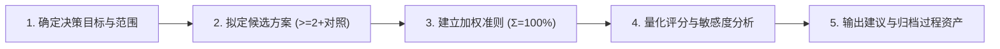

# DAR (Decision Analysis & Resolution) 决策分析与权衡评估规范

遵循 CMMI 01_management 决策分析与解决（DAR）及系统工程加权打分体系。用于对重大架构改造、依赖引入、数据库迁移与业务方案进行量化决策，消灭主观臆断与随意技术选型。

---

## 1. 何时启用

- **方案选型**：需在 2 种及以上技术方案间抉择（如：消息总线选用自研 NATS 协议 vs 外部 RabbitMQ/Kafka）。
- **重大依赖引入**：评估新开源库（需考察 GitHub Stars、License、ROI、安全维护活跃度）。
- **重构与演进**：单体域拆分至独立插件或 Go 微服务的时机与路径判定。
- **降级与兼容**：多数据库方言支持策略（Tier-A/B/C）与持久层抽象选型。

---

## 2. 核心分析流程 (DAR 5 步闭环)



1. **确定决策目标**：明确业务/技术痛点、约束条件（团队技术栈、交期、性能指标）。
2. **拟定候选方案**：必须包含至少 2 个候选方案，且必须设立 1 个基准方案（如：方案 A、方案 B 与维持当前现状方案 C 作为阴性对照）。
3. **建立加权评估准则（权重之和必须等于 100%）**：
   - 业务契合度与 ROI（通常 20-30%）
   - 长期维护与复杂度成本（通常 20%）
   - 性能与资源开销（通常 15-20%）
   - 开源成熟度与社区活跃度（Stars/Issues/更新周期，通常 15%）
   - 交付周期与改造成本（通常 15%）
4. **量化评分（1~5 分制）**：
   - 1分：严重不足或阻断；3分：勉强满足；5分：完全契合且具备显著优势。
   - 加权得分 = $\sum (\text{权重}_i \times \text{评分}_i)$。
5. **决策结论与风险缓释**：给出推荐方案、次优备选方案，并制定选中方案的 Top 3 风险规避预案。

---

## 3. 标准 DAR 权衡矩阵模版

```markdown
### 决策项：[如：工作流引擎选型与自研边界决策]

#### 1. 评估准则与权重
| 准则编号 | 准则维度 | 权重 | 评分标准 (1-5 分) |
|---|---|---|---|
| C1 | 业务契合度 (DSL扩展与审批流) | 30% | 5分: 完美支持动态加签与驳回; 1分: 无法扩展 |
| C2 | 维护与运行成本 (零外部重组件) | 25% | 5分: 纯Node/TS内存轻量运行; 1分: 需强依赖重型JVM/K8s |
| C3 | 租户隔离与审计能力 (8大底座字段) | 20% | 5分: 原生挂载 AST 租户过滤器; 1分: 侵入改造极大 |
| C4 | 交付周期与改造工作量 | 15% | 5分: <3天完成集成; 1分: >1个月 |
| C5 | 开源许可与社区活跃度 (Stars/License) | 10% | 5分: MIT/Apache-2.0且>10k星; 1分: GPL/闭源风险 |

#### 2. 量化打分与综合加权得分
| 方案 | C1 (30%) | C2 (25%) | C3 (20%) | C4 (15%) | C5 (10%) | 综合加权总分 | 排名 |
|---|---|---|---|---|---|---|---|
| 方案 A: 沉淀自研 BPM 轻量状态机引擎 | 5 (1.5) | 5 (1.25) | 5 (1.0) | 4 (0.6) | 5 (0.5) | **4.85** | **1 (推荐)** |
| 方案 B: 引入外部 Camunda/Flowable 独立集群 | 4 (1.2) | 1 (0.25) | 2 (0.4) | 2 (0.3) | 5 (0.5) | **2.65** | 2 |
| 方案 C: 维持当前纯手工硬编码状态变更 (对照) | 1 (0.3) | 3 (0.75) | 2 (0.4) | 5 (0.75) | 1 (0.1) | **2.30** | 3 |

#### 3. 决策决议与跟进行动 (Action Items)
- **决议**：采用方案 A。
- **风险与缓解**：复杂网状流程开发周期可能超期 -> 引入分阶段交付，首期仅支持串并行审批。
- **过程资产归档**：成果提交至 `docs/01_management/dar/` 并关联 ADR 决策记录。
```

---

## 4. 与 ruoyi-all-next 架构联动

1. **不可动摇的底线约束**：
   - 严禁引入带商业传染性许可的开源库（严禁 GPL/AGPL 运行时代码直接进入工程代码库，可参考 `UPSTREAM-NOTICE.md`）。
   - 必须复用工程底座能力：多租户隔离、8 大审计底座字段、Domain Facade 跨域解耦。
2. **过程资产落位**：
   - 决策分析报告统一归档于 `docs/01_management/dar/DAR-<YYYYMMDD>-<TOPIC>.md`。
   - 架构级决策需同步触发 `adr-architect` 生成对应 ADR 记录。

---

## 5. 检查清单与门禁

- [ ] 是否设立了至少 2 个候选方案及 1 个阴性对照方案？
- [ ] 评估权重总和是否严格等于 100%？
- [ ] 评分标准是否客观透明且附有评分依据？
- [ ] 是否核验了引入开源项目的 GitHub Stars 真实度与开源 License？
- [ ] 是否制定了最终选用方案的风险应急缓释计划？
- [ ] 门禁验证：`npm run check` 确保文档索引与架构约束不破损。

---

## 6. 严禁事项

1. **严禁拍脑袋决策**：禁止“我觉得这个库好用”、“同事推荐”等无量化数据支撑的选型。
2. **严禁事后倒推分数**：禁止预定结论后人为编造不合理的极端权重操纵评分。
3. **严禁脱离本仓地基**：禁止选型任何破坏多租户隔离、强耦合数据库方言的外部重型方案。
