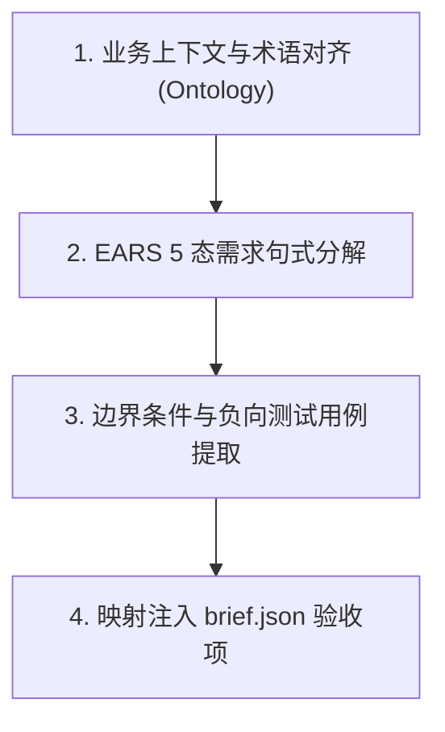

# EARS (Easy Approach to Requirements Syntax) 需求规格编写规范

遵循 IEEE 29148 需求工程标准及 Rolls-Royce EARS (Easy Approach to Requirements Syntax) 语法体系。用于消除业务需求中的模糊主观描述，将其转化为可测试、可验证、无歧义的高阶工程需求规格说明书（SRS / Brief）。

---

## 1. 何时启用

- **业务立项与需求分析**：将产品经理或业务方一句话非结构化需求转化为精准工程规格。
- **编写 `brief.json`**：填充 `docs/specs/<domain>/<feature>/brief.json` 中的验收准则与业务不变量。
- **边界与异常行为定义**：澄清系统在网络超时、超卖、重放攻击等异常状态下的确定性行为。
- **测试用例反向推导**：为 SpaceX 级真实数据库集成测试（L1/L2）提供精准的断言前置与后置条件。

---

## 2. EARS 核心 5 种句式结构

EARS 规定任何工程需求必须归入以下 5 类语法模板之一，**严禁使用模糊的形容词（如“快速响应”、“友好提示”、“高并发支持”）**：

| 类型 | 触发场景 | EARS 语法模板 | 示例 |
|---|---|---|---|
| **1. 普遍型 (Ubiquitous)** | 任何时刻恒成立的业务不变量 | 系统**应当** [系统动作] | 系统应当在所有写入表中自动维护 `tenant_id` 及 8 大审计底座字段。 |
| **2. 事件驱动型 (Event-Driven)** | 离散事件触发的操作 | **当** [触发事件] 发生时，系统**应当** [系统动作] | **当** 收到已支付回调事件时，系统**应当** 将订单状态变更为 `PAID` 并扣减冻结库存。 |
| **3. 状态驱动型 (State-Driven)** | 系统处于特定状态时的持续行为 | **当处于** [特定状态] 时，系统**应当** [系统动作] | **当处于** 促销秒杀活动期内时，系统**应当** 限制每个会员账号在单日内最多下单 1 次。 |
| **4. 异常容错型 (Unwanted Behavior)** | 错误、边界溢出或异常输入 | **如果** [异常条件]，**那么** 系统**应当** [系统动作] | **如果** 扣减库存时可用库存不足，**那么** 系统**应当** 抛出 `409 Conflict` 错误并回滚事务。 |
| **5. 可选特性型 (Optional Feature)** | 针对特定配置、特性开关或租户套餐 | **在配置了** [特性开关] 的前提下，系统**应当** [系统动作] | **在配置了** 多级审批特性的前提下，系统**应当** 在创建工单后自动指派一级审批人并挂起单据。 |

---

## 3. 需求编写 4 步交付工作流



1. **术语与领域实体对齐**：使用项目本体库已注册的领域词汇（如：`WorkOrder`、`TenantEntitlement`），禁止自造混淆术语。
2. **EARS 格式化**：逐条将业务逻辑拆分为可原子验证的 EARS 规则，每条需求均具备唯一编号（如 `REQ-SYS-001`）。
3. **负向与容错矩阵补齐**：针对每个正常操作（Happy Path），强制补充至少 2 条 Unwanted Behavior 规则（如参数非法、权限不足、并发冲突）。
4. **生成交付 Brief**：
   - 运行命令建立规格：`npm run spec:new -- --name <feature> --domain <domain> --title "<标题>"`
   - 将 EARS 规则填入 `docs/specs/<domain>/<feature>/brief.json` 的 `invariants` 与 `acceptanceCriteria`。

---

## 4. EARS 需求转化范例

### 反面教材 (模糊无序)：
> “系统要支持用户下单，速度要快，不能超卖，库存不够的时候要有提示，有 VIP 的时候要打折。”

### 正面教材 (EARS 规范工程语言)：
```markdown
- REQ-MALL-001 (Ubiquitous): 
  系统应当在创建订单时锁定商品单价、计算实付总额，并在单事务内校验全局租户隔离约束。
- REQ-MALL-002 (Optional Feature): 
  在客户拥有有效 VIP 会员权益的前提下，系统应当对订单中的非促销商品自动按等级权益折扣抵扣金额。
- REQ-MALL-003 (Event-Driven): 
  当用户提交有效的结算指令时，系统应当使用数据库 CAS 原语原子扣减商品库存并生成 `UNPAID` 状态的订单单据。
- REQ-MALL-004 (Unwanted Behavior): 
  如果商品可用库存小于请求购买数量，那么系统应当中断下单事务、拒绝生成订单并返回 HTTP 409 业务错误码 `INSUFFICIENT_STOCK`。
- REQ-MALL-005 (State-Driven): 
  当处于订单创建后的 15 分钟待支付窗口期内时，系统应当保持预扣库存的锁定状态；若超时未支付，系统应当通过定时补偿任务自动解锁预扣库存。
```

---

## 5. 检查清单与门禁

- [ ] 所有需求语句是否 100% 遵循 5 类 EARS 语法关键字（`shall`, `WHEN`, `WHILE`, `IF...THEN`, `WHERE`）？
- [ ] 是否剔除了所有不可度量的主观形容词（如“快速”、“智能”、“友好”）？
- [ ] 每个正常分支是否均附带对应的 `IF...THEN` 异常容错用例？
- [ ] 验收标准是否能无缝映射为自动化测试的 `expect()` 断言？
- [ ] 门禁验证：运行 `npm run specs:health` 确保新特性的 brief.json 健康度达到 100%。

---

## 6. 严禁事项

1. **严禁自然语言口语化入库**：禁止直接将即时通讯工具中的聊天截图或口头对话作为系统需求规格。
2. **严禁遗漏异常分支**：严禁只写正常流程（Happy Path）而遗漏边界与错误恢复。
3. **严禁跨域隐式耦合**：需求说明中涉及跨域操作时，必须显式声明通过 Domain Facade 或 Event 异步通知，严禁跨域数据直读直写。
