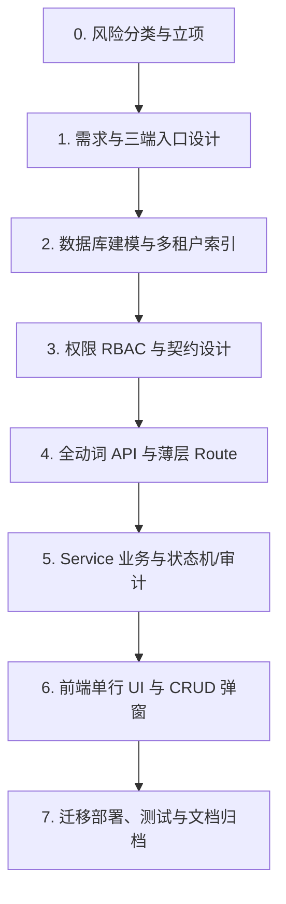

# 全链路一站式新功能研发规范 (End-to-End Feature Delivery Workflow)

## 1. 适用场景与核心目标
- 用户提出“新增功能”“设计接口”“设计表结构”“生成 CRUD”“配置菜单”“多端扩展”等需求时，**必须强制启用本 Skill 闭环执行**。
- **绝对禁止仅交付只读骨架或占位页面（Forbidden Skeleton-Only Delivery）**。
- 交付标准：用户在界面上即可**直接新增、筛选、编辑、启停、删除、调测并多端动态可见**。

---

## 2. 标准七步闭环交付体系 (End-to-End Checklist)



### 第 0 步：风险分类与立项门禁 (Classification & Feature Gate)
1. **分类识别**：
   - **标准 CRUD**：字典、日志、基础配置、目录列表；
   - **高风险领域**：订单、支付、履约、库存/容量日历、状态机、多租户资金、外部回调、异步 Cron；
2. **立项记录**：需求与对话事实按规范实时追加到 `docs/features/sprint-prod/{MMDD}.md`。

---

### 第 1 步：RBAC 数据库菜单与权限持久化 (Database RBAC)
1. **代码层常量声明**：在 `src/modules/shared/backend/constants/permissions.ts` 中声明 4 级增删改查权限码：
   - `{DOMAIN}_{ENTITY}_VIEW`: `"{domain}:{entity}:view"`
   - `{DOMAIN}_{ENTITY}_CREATE`: `"{domain}:{entity}:create"`
   - `{DOMAIN}_{ENTITY}_UPDATE`: `"{domain}:{entity}:update"`
   - `{DOMAIN}_{ENTITY}_DELETE`: `"{domain}:{entity}:delete"`
2. **数据库持久化迁移**：在 `prisma/migrations/` 中编写纯 SQL 迁移，插入 `system_menu`（目录 DIR、页面 MENU、按钮 BUTTON），并通过 `system_role_menu` 动态关联赋权管理员角色，**禁止仅改前端内存假菜单**。

---

### 第 2 步：数据建模与多租户索引设计 (Prisma & Kysely)
1. **标准 6 大审计与租户字段（强制）**：
   - `tenant_id`（带 B-Tree 索引）、`created_by`、`updated_by`、`created_at`、`updated_at`、`deleted`；
2. **从读写路径倒推索引**：针对组合查询（如 `tenant_id + status + created_at`）建立复合索引；
3. **Repository 落地**：必须实现 `findAll`、`findById`、`create`、`update`、`delete`，并在所有 SQL/Kysely 查询中强制限定 `tenant_id = :currentTenantId`。

---

### 第 3 步：数据契约与验证器 (Contract & Zod Validator)
1. **Zod Validator**：在 `backend/validators/` 中定义严格的输入白名单（`createSchema` / `updateSchema` / `pageQuerySchema`）；
2. **Contract Actions 契约**：在 `contract/actions.ts` 中注册 `ACTION_SCHEMAS`，实现 HTTP 与 ServiceBus/RPC 双模共用。

---

### 第 4 步：全动词 API 路由 (Full Verbs API Route)
在 `src/app/api/v1/admin/{domain}/{entity}/route.ts` 中**完整实现全部 4 大 HTTP 动词**：
- `GET`: 列表分页查询，挂载 `withAdminRoute({ permission: PERMISSIONS.{DOMAIN}_{ENTITY}_VIEW })`；
- `POST`: 新增实体，挂载 `withAdminRoute({ permission: PERMISSIONS.{DOMAIN}_{ENTITY}_CREATE })`；
- `PUT`: 更新实体，挂载 `withAdminRoute({ permission: PERMISSIONS.{DOMAIN}_{ENTITY}_UPDATE })`；
- `DELETE`: 删除实体，挂载 `withAdminRoute({ permission: PERMISSIONS.{DOMAIN}_{ENTITY}_DELETE })`。

---

### 第 5 步：Service 业务逻辑与审计日志 (Service & Audit)
1. **Service 门面方法**：实现 `page`、`get`、`create`、`update`、`delete`；
2. **审计与事件输出**：关键动作记录 `domainLog.event()`，敏感及写操作记录 `domainLog.audit()`；
3. **图片统一上传（如涉及图片）**：严禁手填任意外部 URL，必须使用项目统一上传组件与托管存储。

---

### 第 6 步：前端开箱即用 UI 与弹窗交互 (Frontend UI Standard)
严格遵循 `.agents/skills/ui-design/SKILL.md`：
1. **API Client 封装**：`src/modules/{domain}/frontend/api/{entity}.api.ts` 暴露 `page/create/update/delete`；
2. **顶部工具栏**：配备 `[+ 新增]` 主按钮、多条件筛选输入、`[查询]`、`[重置]` 与 `[刷新]`；
3. **严格单行排版（whitespace-nowrap）**：表格行高整齐一致，严禁无序折行；
4. **超长内容单行截断（Truncate）**：URL、密钥、长名称等使用 `max-w-[200px] truncate` + `title="..."` 悬停提示；
5. **多标签收敛**：列表 Tags 单行最多显示 2 个，超出显示 `+N` 徽标；
6. **操作列横向排布**：操作列固定保底宽度（`min-w-[190px]`），横向平铺 `[编辑]`、`[启用/禁用]`、`[删除]`、业务动作（如探测/测试）；
7. **模态表单弹窗（Form Modal）**：具备参数校验、新增/编辑状态复用与友好反馈。

---

### 第 7 步：迁移部署、测试与文档归档 (Verification & Delivery)
1. **数据库迁移执行与自动备份**：
   ```bash
   npm run db:migrate
   npm run db:backup
   ```
2. **契约生成与门禁检查**：
   ```bash
   npm run domain:contracts
   npm run domain:manifests
   npm run check
   ```
3. **自动化单元测试**：编写并运行 `src/modules/{domain}/backend/services/__tests__/{entity}.service.test.ts` 确保 100% 绿灯。
