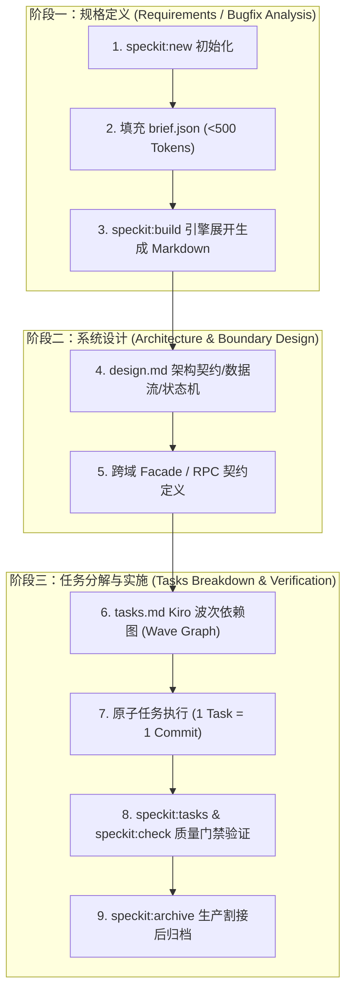

# Kiro 规范驱动开发 (Spec-Driven Development, SDD) 核心技能

遵循 Kiro 官方规范驱动开发哲学（Spec-Driven Development）与 IEEE 29148 / EARS / CMMI 高阶工程标准。用于将复杂业务诉求、线上缺陷排查、架构重构演进、性能优化突破与红队安全加固，在敲入任何生产代码前收敛为**完备、结构化、机器可验证的规格包 (Spec Bundle)**。

---

## 1. 核心哲学：No Spec, No Code

在 Agent 研发体系中，**大模型直接编写生产代码是产生幻觉、架构漂移与技术债务的头号根源**。Kiro SDD 强制确立以下 4 大公理：

1. **规格先验 (Spec-First)**：先有可验证规格，再有系统设计，最后按原子任务依赖波次（Waves）逐行编写代码。
2. **类型特化 (Type-Specialized Specs)**：拒绝单一模板应付所有场景。针对 `feature`（新特性）、`bugfix`（缺陷修复）、`enhancement`（性能指标优化）、`refactor`（架构重构）、`security`（安全加固），使用具备专属语义与不变量守卫的专用规格体系。
3. **极简驱动与防 Token 浪费 (Schema-Driven, Zero Token Waste)**：大模型仅需以 `<500 Tokens` 结构化声明 `brief.json`，由底层引擎自动化展开生成完备的 7 份工程资产与验证链路，严禁人肉手写千行格式样板。
4. **全生命周期闭环与单一真源 (Lifecycle Traceability & Anti-Pollution)**：
   - 活跃期规格按领域物理隔离存储于 `docs/specs/<domain>/<name>/`；
   - 严格遵循 `1 Task = 1 Commit`，通过 Git 历史与自动化测试双向核验；
   - 生产割接完毕后一键归档至 `docs/specs/archive/<YYYY-Qx>/<domain>/<name>/`，杜绝工作区认知污染。

---

## 2. 五大规格类型矩阵 (Spec Types Taxonomy)

根据需求本质，严格选择对应的规格类型。运行 `npm run speckit:new -- --name <name> --domain <domain> --title "<title>" --type <type>` 自动初始化对应骨架：

| 规格类型 | 核心关注点 | 核心规格产物 | 专属不变量与验收门槛 |
|---|---|---|---|
| **1. feature** | 新业务能力交付、闭环流转 | `requirements.md`<br>`design.md`<br>`tasks.md` | EARS 5态需求、领域实体图、四态交互、多租户上下文隔离。 |
| **2. bugfix** | 线上/线下缺陷根因定位与无害修补 | `bugfix.md`<br>`requirements.md`<br>`tasks.md` | **Symptom 复现步骤、5-Whys 根因分析、Preserved Behavior（保持既有正常行为，防回归破坏）、Red-to-Green 红绿测试**。 |
| **3. enhancement** | 容量与性能指标定量跃升 | `requirements.md`<br>`design.md`<br>`tasks.md` | **当前基线 (Baseline) vs 目标指标 (Target)、p95 耗时、RPS 吞吐护栏、非侵入数据模型**。 |
| **4. refactor** | 架构债务消除与整洁演进 | `requirements.md`<br>`design.md`<br>`tasks.md` | **债务与代码异味剖析、目标整洁架构边界、绞杀者模式 (Strangler Fig)、业务等价性安全网 (Parity Tests)**。 |
| **5. security** | 漏洞修复与零信任防御 | `requirements.md`<br>`design.md`<br>`tasks.md` | **CVE/安全告警概述、真实 PoC 攻击向量、攻击面削减、AST 防注入、Strix 红队自主渗透拦截**。 |

---

## 3. Kiro 交付三阶段工作流 (Three-Phase SDD Workflow)



---

## 4. Kiro 原生工作流编排机制 (Kiro Workflows & Recipes)

在 Kiro 官方架构中，**工作流 (Workflows)** 是将 SDD 从“静态文档规范”推向“多智能体后台自主执行”的**核心运行引擎**：

### 4.1 核心机制与架构优势
1. **多智能体编排图 (Agent Orchestration Graph)**：工作流将复杂任务拆解为树状/图状步骤链，每个步骤（`step`）在独立的上下文（Fresh Session）中运行。例如代码审查智能体（`wf-reviewer`）拥有干净的上下文，绝不继承编码智能体（`wf-coder`）的代码自辩偏见！
2. **声明式配方文件 (Declarative Recipes)**：所有可复用工作流的物理单一真源存放在 `.agents/workflows/*.workflow.json`（同时由根目录 `.kiro/workflows` 软链接无缝桥接，确保 Kiro IDE 原生识别与 Antigravity / 跨 Agent 平台统一标准）。声明根入参（`inputs`）与步骤执行树（`steps`）。
3. **数据管道自动透传**：后续步骤可通过 `{{previous.output}}` 或 `{{inputs.<param>}}` 顺畅消费上游产物。
4. **人工卡点与交互确认 (Human-in-the-Loop)**：步骤可配置交互等待条件，在进入下一阶段前由人类工程师或审计员确认。

### 4.2 本工程内置的 4 大 SDD 原生工作流配方 (`.agents/workflows/`)

| 配方文件 (`.agents/workflows/`) | 适用场景 | 步骤链编排 (Step Pipeline) | 驱动智能体角色 |
|---|---|---|---|
| 📦 **`feature-delivery.workflow.json`** | 全生命周期新特性交付 | `scaffold` ➔ `requirements` ➔ `design` ➔ `plan-waves` ➔ `implement` ➔ `verify` | `@wf-planner`<br>`@wf-architect`<br>`@wf-coder`<br>`@wf-tester` |
| 🐛 **`bugfix.workflow.json`** | 缺陷排查与红绿验证 | `scaffold` ➔ `diagnose` (5-Whys) ➔ `red-test` ➔ `patch` ➔ `verify-gate` | `@wf-planner`<br>`@wf-tester`<br>`@wf-coder`<br>`@wf-reviewer` |
| 🏛️ **`architecture-refactor.workflow.json`** | 架构债务消除与演进 | `scaffold` ➔ `debt-analysis` ➔ `parity-tests` ➔ `refactor-execution` ➔ `regression-audit` | `@wf-planner`<br>`@wf-architect`<br>`@wf-tester`<br>`@wf-coder` |
| 🛡️ **`security-patch.workflow.json`** | 安全加固与漏洞拦截 | `scaffold` ➔ `threat-model` ➔ `poc-red-test` ➔ `hardening` ➔ `strix-audit` | `@wf-planner`<br>`@wf-security`<br>`@wf-tester`<br>`@wf-coder` |

### 4.3 工作流标准工具链与 CLI 引擎 (`scripts/workflow-engine.ts`)

为了支持人类开发者、Antigravity CLI、DeepSeek Harness 以及无头 CI 闭环驱动工作流，工程提供了统一的 `workflow:*` 标准指令集：

```bash
# 1. 查看全量工作流配方清单与参数
npm run workflow:list

# 2. 静态语法、DAG 依赖无环性与 Agent 角色合法性门禁检查 (已接入 npm run check)
npm run workflow:check

# 3. 模拟展开：变量代换预览、输出 Mermaid DAG 编排图与各 Agent 指令
npm run workflow:dry-run -- --recipe <recipe> --name <spec> --domain <domain> --title "<title>"

# 4. 驱动执行：自动执行脚手架并落盘工作流执行记录
npm run workflow:run -- --recipe <recipe> --name <spec> --domain <domain> --title "<title>"

# 5. 快速生成新的工作流配方模板
npm run workflow:new -- --name <recipe-name> --description "<desc>"
```

---

## 5. 关键产物规范与标准

### 4.1 `requirements.md` / `bugfix.md` 规范

- **严格 EARS 语法**：遵循 `ears-spec-writer`，采用 Ubiquitous / Event-Driven / State-Driven / Unwanted-Behavior / Optional-Feature 5 态句式。
- **Kiro 原生 `bugfix.md` 特别要求**：
  ```markdown
  # Bugfix: [缺陷标题]
  
  ## 1. 缺陷概述 (Defect Overview)
  一句话描述缺陷在何种场景下发生何种异常。
  
  ## 2. 缺陷表现与复现步骤 (Symptom & Reproduction)
  明确的前置条件、输入参数、复现脚本（或 cURL / Red Test 路径）。
  
  ## 3. 根因分析 (Root Cause Analysis - 5-Whys)
  - 现象：接口返回 500。
  - Why 1：空指针异常。
  - Why 2：租户配置上下文未完成初始化。
  - ...
  - 根因：异步任务调度时丢失了全局 RequestContext 中的 Tenant 标识。
  
  ## 4. 必须保持的既有正常行为 (Preserved Behavior & Anti-Regression)
  - 既有同步 HTTP 请求中的租户解析保持 100% 行为不变。
  - 未发生异常的租户隔离数据绝对不受补丁变更影响。
  
  ## 5. 红绿修复与验收准则 (Red-to-Green Test Criteria)
  1. Red Test：运行针对该缺陷编写的复现单测，确信退出码 != 0（稳定复现）。
  2. Green Test：应用补丁代码后，运行同一单测，退出码 = 0（修复确证）。
  ```

### 4.2 `design.md` 架构设计规范

- **架构边界与拓扑**：明确所属业务域与插件（`packages/plugins/plugin-<domain>`），使用 Mermaid 绘制数据流图。
- **跨域调用契约**：严格走 `Domain Facade` 或 `broker.call`，严禁跨域直接 import Service。
- **存储与表结构**：必须包含 `tenant_id` 与 8 大底座审计字段，兼容 SQLite / PostgreSQL / MySQL。
- **不变量守卫**：明确列出业务不变量（如：状态机单向流转、库存扣减防超卖、幂等防重放）。

### 4.3 `tasks.md` 任务编排与 Kiro 波次依赖图 (Wave Graph)

任务采用 Kiro 标准波次分解（Waves），严格区分地基、实现、验证阶段，每项任务均需明确指定影响文件白名单：

```markdown
## Task Dependency Graph

\`\`\`json
{
  "waves": [
    {
      "wave": 1,
      "tasks": ["T1"],
      "description": "契约、表结构与红灯测试基线 (Contract & Red Test)"
    },
    {
      "wave": 2,
      "tasks": ["T2"],
      "description": "业务服务实现与防御守卫 (Implementation)"
    },
    {
      "wave": 3,
      "tasks": ["T3"],
      "description": "门禁全绿、渗透验证与端到端验收 (Verification)"
    }
  ]
}
\`\`\`

## 任务清单 (Tasks)

- [ ] **T1**: 编写缺陷复现单测与接口契约
  - 上游依赖：无 (Wave 1)
  - 文件白名单：`packages/plugins/plugin-<domain>/tests/bugfix-repro.test.ts`
  - 交付验收：运行单测确认红灯稳定复现。
- [ ] **T2**: 落地核心补丁与状态机守卫
  - 上游依赖：T1 (Wave 2)
  - 文件白名单：`packages/plugins/plugin-<domain>/backend/services/...`
  - 交付验收：单测转绿，无回归破坏。
- [ ] **T3**: 运行全量质量门禁与安全扫描
  - 上游依赖：T2 (Wave 3)
  - 文件白名单：`-`
  - 交付验收：`npm run check` 退出码 0，`npm run test:matrix` 100% 通过。
```

---

## 6. 统一控制台与命令行工具箱 (Spec-Kit SDD Engine: Unified CLI)

Kiro SDD 在本工程中由统一引擎 `scripts/speckit.ts` 集中驱动，支持全生命周期闭环：

```bash
# 0. 规格控制台总览与规格列表
npx tsx scripts/speckit.ts list                # 查看全域活跃与归档规格状态
npm run speckit                                 # 查看完整帮助菜单
npm run speckit:workflows                       # 检视全量 Kiro 工作流配方与步骤链

# 1. 快速初始化任意类型的规格骨架
npm run speckit:new -- --name <name> --domain <domain> --title "<title>" [--type feature|bugfix|enhancement|refactor|security]
# 等价于: npx tsx scripts/speckit.ts new --name <name> --domain <domain> --title "<title>" --type <type>

# 2. 从 brief.json 编译展开生成完备 Markdown 规格资产与任务波次图
npm run speckit:build -- --name <name>
# 等价于: npx tsx scripts/speckit.ts build --name <name>

# 3. 实时检查规格完成度与质量卡点
npm run speckit:check -- --spec <name>
# 等价于: npx tsx scripts/speckit.ts check --spec <name>

# 4. 从 Git 历史核验任务大盘与白名单匹配度 (1 Task = 1 Commit)
npm run speckit:tasks -- --spec <name>
npm run speckit:tasks -- --spec <name> --task T1

# 5. 上线割接与回滚 SOP 实操
npm run runbook -- --spec <name> --check
npm run runbook -- --spec <name> --dry-run
npm run runbook -- --spec <name> --run

# 6. 割接完毕后一键归档，防止认知污染
npm run speckit:archive -- --name <name>
# 等价于: npx tsx scripts/speckit.ts archive --name <name>
```

---

## 7. 避坑指南与红线

1. ❌ **严禁人肉手写重复文档**：永远先编辑 `brief.json`，运行 `npm run speckit:build` 自动渲染展开，保持架构与工程一致性。
2. ❌ **严禁跳过 Red Test 直接修复 Bug**：对于 `bugfix` 类型，必须先写复现单测见红（Red），修复后见绿（Green），方可提交代码。
3. ❌ **严禁破坏 Preserved Behavior**：修补缺陷时严禁随意变更既有接口字段定义、响应结构或成功路径业务流转。
4. ❌ **严禁随意使用伪 Mock**：集成测试与契约测试必须基于真实 SQLite 数据库运行，杜绝测试空洞与假绿。
5. ❌ **严禁未归档遗留死文档**：功能交付发布后，必须执行 `npm run speckit:archive` 归档至对应季度目录。
