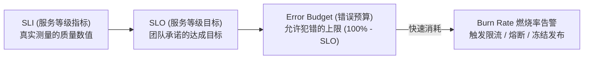

# SRE SLO Manager 服务等级目标与错误预算治理规范

遵循 Google SRE (Site Reliability Engineering) 稳定性保障方法论。以用户真实体验为核心，通过定义服务等级指标（SLI）、服务等级目标（SLO）与错误预算燃烧率（Error Budget Burn Rate），实现系统稳定性与研发迭代速度的量化平衡。

---

## 1. 何时启用

- **稳定性设计与容量规划**：新服务/插件上线前设定可用性与延迟保障目标。
- **配置告警策略**：基于错误预算多窗口燃烧率（Multiwindow, Multi-Burn-Rate）配置精准告警，消灭告警风暴与疲劳。
- **发布节奏控制**：当错误预算耗尽（Budget Depleted）时，自动触发发布冻结并转入稳定性修复。
- **容量与压测评估**：设定本地与生产压测护栏（如 `npm run load:test` 必须达到 RPS $\ge 5,000$, p95 $\le 20\text{ms}$）。

---

## 2. Google SRE 核心指标体系

### 1. 四大黄金信号与典型 SLI 定义
- **可用性 (Availability)**：
  $$\text{SLI}_{\text{avail}} = \frac{\text{成功的 HTTP 请求数 (状态码 < 500)}}{\text{总有效请求数}} \times 100\%$$
- **延迟 (Latency)**：
  $$\text{SLI}_{\text{latency}} = \frac{\text{响应时间} \le 100\text{ms 的请求数}}{\text{总有效请求数}} \times 100\%$$
- **吞吐量 (Throughput)**：系统在满足延迟 SLO 前提下承载的 QPS/RPS。
- **饱和度 (Saturation)**：内存利用率、CPU 利用率、数据库连接池排队率。

---

## 3. 多窗口燃烧率告警模型 (Multi-Burn-Rate Alerts)

严禁直接针对单一瞬间错误率发警报！Google SRE 推荐采用多窗口双重确认机制：

| 严重级别 | 燃烧率 | 耗尽30天预算时间 | 短窗口 (确认中) | 长窗口 (触发告警) | 响应等级 |
|---|---|---|---|---|---|
| **P1 致命 (Page)** | 14.4x | 2 天 (5% 消耗/1小时) | 5 分钟 (错误率 > 1.44%) | 1 小时 (错误率 > 1.44%) | 立即呼叫 On-Call，10分钟恢复 |
| **P2 严重 (Page)** | 6.0x | 5 天 (10% 消耗/6小时) | 30 分钟 (错误率 > 0.6%) | 6 小时 (错误率 > 0.6%) | 工作时间内 30 分钟内介入处理 |
| **P3 预警 (Ticket)** | 1.0x | 30 天 (耗尽全部预算) | 2 小时 (错误率 > 0.1%) | 3 天 (错误率 > 0.1%) | 转化为日常缺陷工单排期修复 |

---

## 4. 与 ruoyi-all-next 架构联动

1. **压测护栏联动**：
   - 生产环境压测基于真实流量护栏；
   - 本地独立压测命令：`npm run load:test`
   - 容量底线：单机独立进程吞吐量必须 $\ge 5,000\text{ RPS}$，p95 延迟 $\le 20\text{ms}$，HTTP 失败率严格为 $0\%$。
2. **边缘网关与熔断联动**：
   - 当特定业务插件的错误预算燃烧率超标时，边缘网关（Traefik）按 `plugin.manifest.json` 中声明的 `resilience` 策略自动触发降级或短路熔断。
3. **错误预算冻结机制**：
   - 若 30 天滚动窗口内错误预算剩余 $< 10\%$，冻结所有新功能发布，强制执行 SRE 稳定性加固冲刺。

---

## 5. 检查清单与门禁

- [ ] 是否针对核心 API 明确制定了可用性 SLO（如核心支付 99.95%，通用后台 99.9%）？
- [ ] 延迟 SLI 是否采用了分位数（p95 / p99），而非易被极端值掩盖的平均值（Average）？
- [ ] 告警规则是否配置了多窗口多燃烧率（短期与长期结合），避免误报风暴？
- [ ] 压测验证是否跑通生产产物编译模式并满足容量基线？
- [ ] 门禁执行：`npm run load:test` 是否顺利通过？

---

## 6. 严禁事项

1. **严禁追求 100% 可用性**：100% 是不切实际且代价极高昂的错误目标；错误预算必须用于合理创新与快速演进。
2. **严禁基于瞬时跳刺单点报警**：禁止配置“只要有 1 次 500 就半夜电话呼叫”的非理性告警。
3. **严禁压测前不清理残留端口**：压测必须在隔离干净的进程环境下进行，严禁打到处于调试模式（Dev Mode）的低性能进程。
