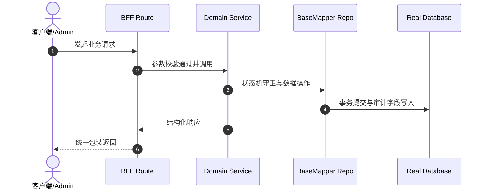

# Technical & Architecture Plan: [FEATURE_TITLE]

> **Spec-Kit 架构与技术实施方案**
> 必须契合 `.specify/memory/constitution.md` 质量基线。
> 所属领域：`[DOMAIN]` | 规格标识：`[SPEC_NAME]`

---

## 1. 领域架构与交互链路 (Architecture & Flows)
- **领域定位**：属于领域 `[DOMAIN]`，对外公开 Facade 契约。
- **调用时序 (Archify Mermaid)**：

## 2. 数据模型与表结构变更 (Data Model)
- **涉及表**：`[TABLE_NAME]`
- **底座集成**：继承 8 大审计底座字段 (`id`, `tenant_id`, `creator`, `create_time`, `updater`, `update_time`, `deleted`, `version`)。

## 3. API 契约与 DTO (API Contracts)
- **HTTP 路由**：`POST /api/v1/admin/[DOMAIN]/[ENTITY]`
- **权限码**：`[domain]:[entity]:create`, `[domain]:[entity]:query`

## 4. 自动化回滚与预案 (Runbook & Rollback)
- **灰度窗口**：[预计分钟数]
- **回滚操作**：[回滚 SQL / 配置开关降级步骤]
