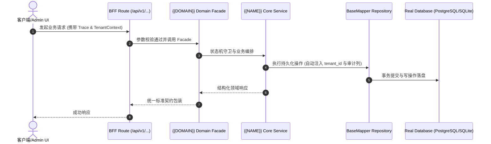

# Technical Architecture & Implementation Plan: {{TITLE}}

> **Spec-Kit 架构与技术实施方案 (ADD: Architecture & Design Document)**
> 上游真源：`spec.md` (或 `requirements.md`)。技术方案严格支撑需求，严禁反向变更业务目标。
> 状态：`PLAN_APPROVED` | 所属领域：`{{DOMAIN}}` | 规格标识：`{{NAME}}`
> 对应项目宪法：`.specify/memory/constitution.md` (Rule 0.2 模式复用 / Rule 0.6 真实测试驱动)

---

## 1. 关键不变量与防御性约束 (Key Invariants & Guards)

{{INVARIANTS_SECTION}}

## 2. 领域架构边界与调用拓扑 (Architecture Topology & Flows)

{{ARCHITECTURE_OVERVIEW}}

### 核心业务时序图 (Archify Mermaid Flow)

## 3. 数据模型与持久化契约 (Data Model & Tables)

实体结构严格遵循底座 8 大审计底座字段规范：
- `id` (主键)
- `tenant_id` (多租户标识)
- `creator` / `create_time` (创建人/时间)
- `updater` / `update_time` (更新人/时间)
- `deleted` (逻辑删除标识)
- `version` (乐观锁版本号)

### 涉及实体与变更说明
{{ENTITIES_SECTION}}

## 4. API 契约与权限体系 (API Contracts & Security)

{{API_CONTRACTS_SECTION}}

## 5. 状态机流转与边界守卫 (State Machine Transitions)

{{STATES_SECTION}}

## 6. 技术风险评估与缓解策略 (Technical Risks & Mitigations)

{{RISKS_SECTION}}
