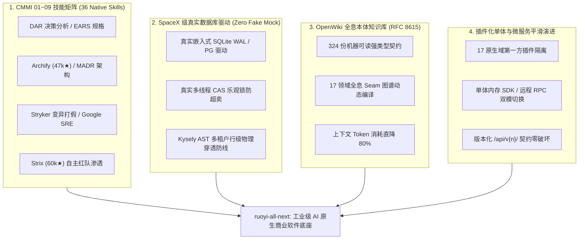

# ruoyi-all-next

[](https://github.com/xaicd/ruoyi-all-next/releases/tag/v1.1.0)
[](https://opensource.org/licenses/MIT)
[](docs/architecture/CMMI-PROCESS-ASSETS-AND-DELIVERY-STANDARD.md)
[](.agents/skills/README.md)
[](test/integration/)
[](wiki/index.md)

> 🤖 **AI-Agent-First 架构宣言与机器契约 (For Autonomous AI Agents & DigitalStaff NPCs)**:  
> 本工程是专为自主 AI Coding Agent（Cursor、Windsurf、Claude Code、Devin、Coolie、DigitalStaff NPC 等）构建的 **AI 原生商业软件工程工作区底座 (Enterprise AI-Native Workspace Bundle)**。  
> **核心铁律 0 (Zero Token Waste)**：业务开发强制采用 **Schema / DSL 极简声明式驱动**（上下文压缩至 <500 Tokens），由通用底层引擎自动展开。以 CMMI 01~09 全生命周期工程规范、36 大工业级原生技能、324 份机器可读契约与真实数据库驱动验证为基石，彻底终结传统大模型“临场手写低质 CRUD、伪造假 Mock、文档口径漂移”的痛点！

---

## 🏛️ 四大核心战略工程支柱 (Core Pillars)



### 1. CMMI 01~09 全生命周期 36 大工业级 Agent 技能矩阵
全仓技能收敛于 [`.agents/skills/`](.agents/skills/) 单一真源，实现全工序确定性工具驱动：
- **01_management (立项与决策)**: `dar-decision-matrix` (CMMI DAR 加权权衡打分与敏感度分析)、`project-init`、`agent-harness`；
- **02_requirements (需求工程)**: `ears-spec-writer` (IEEE 29148 / EARS 5 态无歧义需求规格)、`product-requirements`；
- **03_design (架构与系统设计)**: `archify` (吸收 **47,000+★** 开源顶流，类型化 Schema 驱动生成支持路径流动的交互式架构图)、`adr-architect` (Michael Nygard MADR 架构决策追踪)、`architecture-design`、`microservice-evolution`；
- **04_implementation (构造与编码)**: `coding`、`new-feature`、`new-business-plugin`、`plugin-authoring`、`mcp-builder`；
- **05_verification (验证与打假)**: `mutation-tester` (Stryker / PIT 变异测试，注入 AST 故障突变体打假虚假 Mock，要求 MSI $\ge 85\%$)、`automated-testing`、`webapp-testing`；
- **06_quality_assurance (质量与配置审计)**: `compliance-auditor` (CMMI PPQA 质量保证与 FCA/PCA 配置审计，核验 Git 指纹与 RTM 双向追溯)；
- **07_release (发布与网关)**: `devops` (Traefik 边缘网关、Docker 容器化编排、秒级自动回滚 Runbook)；
- **08_sre (站点可靠性与安全渗透)**: `strix-penetration-testing` (吸收 **60,000+★** 开源顶流，多智能体自主红队渗透并生成真实生效的 PoC 确证漏洞)、`sre-slo-manager` (Google SRE SLI/SLO 矩阵与多燃烧率告警)、`postmortem-analyzer` (Google SRE 免责 1-5-10 复盘与 5-Whys CAPA 闭环)；
- **09_operations (持续运营与平账)**: `financial-reconciliation-agent` (复式记账守卫 $\sum\text{Debit}\equiv\sum\text{Credit}$ 与三方对账长短款自动平账)。

### 2. SpaceX 级真实数据库驱动与反假 Mock (Zero Fake Mock)
- **拒绝内存桩与虚假测试**：测试矩阵 100% 由嵌入式 SQLite (WAL 模式) 及 PostgreSQL 真实数据引擎驱动；
- **真实并发 CAS 乐观锁防超卖**：在真实多线程并发竞争场景下，验证库存与账户余额原子扣减，绝对杜绝超卖脏写；
- **Kysely AST 租户行级物理穿透防线**：在 SQL AST 编译层自动挂载租户上下文，杜绝跨租户数据泄露。

### 3. OpenWiki 动态全息本体知识库与机器契约 (RFC 8615 & LLM-Wiki)
- 自动提取 17 领域元数据、跨域 Seam 图谱与 324 份机器可读契约，编译生成 30 篇高内聚动态维基百科（[`wiki/`](wiki/index.md)）；
- 挂载 `openwiki:sync` 与 `openwiki:check` 进入全仓 20 道自动化门禁，消除文档口径打架，AI 进场 Token 消耗直降 80%。

### 4. 高可拔插第一方插件架构与微服务平滑演进 (Dual-Mode Evolution)
- 平台地基（`system`、`infra`）与 15 个业务域（`mall`、`pay`、`crm`、`erp`、`bpm`、`wms`、`mes` 等）采用第一方插件化彻底物理隔离；
- **单体/微服务双模无缝切换**：同进程打包时走内存 SDK 直接调用，微服务独立部署时平滑切换为自研 NATS/gRPC RPC，对外 HTTP API 保持完全一致。

---

## ⚡ 极速派生与秒级冷启动 (Zero-Git-History Hatching)

外部 AI Agent 或开发者在接入或使用本底座时，**无需下载 500MB+ 全量历史提交包**，可在 10 秒内直接派生一个干净、合规、零外部依赖的全新客户业务工程：

```bash
# 方案 A: 官方专属 CLI 极速派生 (推荐，自动完成初始化与本地库创建)
npx create-ruoyi-app my-app

# 方案 B: degit 骨架拉取 (10秒内完成，0MB 历史提交)
npx degit xaicd/ruoyi-all-next#main my-app
cd my-app && pnpm install
npm run project:init -- --name "my-app" --title "我的新业务系统"
npm run dev
```

> **自动化完成的核心事项**：
> - ⚡ **秒级骨架派生**：彻底规避几百兆历史提交与 packfile 下载；
> - 🏷️ **业务身份重构**：`project:init` 自动重构包名、中文标题、版权声明与运行时配置；
> - 🗄️ **真实本地数据库自动就绪**：基于真实本地 SQLite 驱动（`data/ruoyi.db`），零外部重型依赖即可立即运行全部业务；
> - 🌐 **原生四国语言 (i18n)**：开箱即用支持 🇨🇳 中文 (`zh-CN`)、🇺🇸 英文 (`en-US`)、🇯🇵 日文 (`ja-JP`)、🇰🇷 韩文 (`ko-KR`)；
> - 🔐 **零默认凭据体系 (Zero Default Credentials)**：严禁使用任何静态默认凭证；系统初始化时通过密码学安全伪随机发生器（CSPRNG）在隔离环境动态生成高熵引导凭证并持久化注入本地环境变量，天然免疫凭证撞库；
> - 🛡️ **SpaceX 级全链路门禁**：执行 `npm run check` 自动核验 20 道工程质量门禁，立享 100% 绿灯护栏。

### 🔌 一键接入主流 AI Coding Agent (MCP Server)

Cursor、Windsurf、Claude Code、Cline 等 MCP 兼容客户端，可在其配置中直接引入本底座的 MCP 协议端点：

```json
{
  "mcpServers": {
    "ruoyi-all-next": {
      "command": "npx",
      "args": ["-y", "@ruoyi/mcp-server"]
    }
  }
}
```
*(在本地工作区内开发时，亦可直接执行 `node scripts/mcp/ruoyi-mcp-server.cjs` 启动 stdio 通道)*

---

## 🗺️ 机器可读契约与全息本体导航 (RFC 8615 & Discovery)

外部 AI Agent 可在**下载前**通过 GitHub Raw 或 live HTTP 接口直接检索机器契约，秒级获取架构图谱与工具特征：

| 契约端点 (Machine-Readable Endpoints) | 规范标准 | 核心价值 / Agent 消费场景 |
|---|---|---|
| [`llms.txt`](llms.txt) | LLMs.txt RFC | 专为大模型量身定制的高密度架构全景与执行导航（<15KB） |
| [`wiki/index.md`](wiki/index.md) | OpenWiki 标准 | 专供 AI Agent 消费的高内聚动态全息架构与 17 领域维基百科 |
| [`compat-manifest.json`](compat-manifest.json) | 机器特征契约 | 17 域能力画像、36 个技能、全量 API 路由与 RPC action 元数据 |
| [`agent-profile.json`](agent-profile.json) | DigitalStaff 规范 | AI 智能体画像、NPC L0~L8 角色映射、12 大内置 MCP 工具定义 |
| [`.well-known/agent.json`](.well-known/agent.json) | RFC 8615 行业标准 | 开放标准化 Agent 发现协议，第三方智能体（如 Coolie）可自动化握手 |

> **实时 HTTP 探针**：服务启动后支持根路径直接探活：  
> `GET http://localhost:3200/llms.txt`  
> `GET http://localhost:3200/compat-manifest.json`  
> `GET http://localhost:3200/.well-known/agent.json`

---

## 🏛️ 架构拓扑与三层物理边界 (Architectural Seams)

AI 施工时必须遵守严格的模块分层与物理边界，**严禁凭感觉放置文件**：

```
ruoyi-all-next/
├── packages/
│   ├── shared/                       # 核心基础 SDK (永远是 SDK，严禁当作微服务)
│   │   ├── backend/constants/        # 权限码、菜单、domain-catalog.json 权威真源
│   │   ├── backend/lib/              # 鉴权网关、biz-tenant 上下文、服务总线、审计日志
│   │   └── contract/                 # 跨域共享契约、OpenAPI 3.1、RPC action 契约
│   │
│   ├── domains/                      # 平台基础地基 (不可插件化、永远伴生)
│   │   ├── system/                   # RBAC、用户、角色、租户、权限、数据字典
│   │   └── infra/                    # 配置、定时调度、文件存储、低代码生成引擎
│   │
│   └── plugins/                      # 15 个第一方可插拔业务域 (独立生命周期、可独立打包)
│       ├── plugin-bpm/               # 工作流中心
│       ├── plugin-pay/               # 支付与退款网关
│       ├── plugin-mall/              # 数字化商城
│       ├── plugin-crm/               # 客户关系中台
│       ├── plugin-erp/               # 进销存与经营中台
│       ├── plugin-wms/               # 智能仓储
│       ├── plugin-mes/               # 制造执行系统
│       ├── plugin-ai/                # 大模型中台与网关
│       └── ...                       # report, mp, member, iot, im 等
│
├── src/app/                          # BFF 薄接入层 (API Routes / Proxy / Admin 运营后台页面)
└── clients/expo/                     # 跨端移动与 C 端应用壳
```

### 🚨 跨域调用三原则（门禁强校验）：
1. **严禁跨域直接 import**：禁止在业务域内直接 import 其它域的 Service、Repository 或 Prisma Model；
2. **强制 Domain Facade / Broker**：跨域同步调用必须走 `createDomainFacade("<domain>")` 或 `broker.call("ruoyi.cmd.<domain>.<method>")`；
3. **双模无缝切换**：单体运行时走内存 SDK 直接调用，微服务独立部署时自动切换为 RPC，对外契约完全等价。

---

## 🛠️ AI-Driven 研发交付链与核心指令

```
       【一句话业务诉求】
              │
              ▼
   Step 1. 规格立项 (npm run speckit:new -- --name <名> --domain <域>)
              │   └─ 编辑 docs/specs/<域>/<名>/brief.json (仅约 500 Token)
              ▼
   Step 2. 自动展开 (npm run speckit:build -- --name <名>)
              │   └─ 自动展开 10~15 份标准工程资产、evidence.json 与 runbook.json
              ▼
   Step 3. 域与代码生成 (npm run domain:new <域>)
              │   └─ 基于 Schema 自动展开 CRUD、Service、Validator 与单测
              ▼
   Step 4. 自动化门禁 (npm run check && npm run test:matrix)
              │   └─ 23 道工程门禁与真实数据库测试全绿保障
              ▼
   Step 5. 任务与波次核验 (npm run speckit:tasks -- --spec <名> [--summary|--task T1])
              │   └─ 从 Git 提交历史反推任务完备度 (1 Task = 1 Commit & 白名单)
              ▼
   Step 6. 平台级真实穿透 (npm run smoke:login && npm run security:scan)
              │   └─ 真实数据库登录 200 + 12 项安全穿透扫描
              ▼
   Step 7. 生产部署与实施 (npm run runbook -- --feature <名> --run)
                  └─ 自动化生产割接与失败秒级自动回滚
```

### 常用核心命令速查表：

| 任务类型 | 执行命令 | 产物 / 质量门禁说明 |
|---|---|---|
| **Spec-Kit 规格管理** | `npm run speckit` | 统一 SDD 控制台 (new / build / tasks / check / list / archive) |
|---|---|---|
| **工程初始化** | `npm run project:init` | 交互式/参数化重构品牌、初始化真实本地 SQLite 数据库 |
| **契约同步** | `npm run contracts:sync` | 自动同步 `compat-manifest.json`、`agent-profile.json` 等端点 |
| **OpenWiki 同步** | `npm run openwiki:sync` | 自动从元数据与契约抽取生成 30 篇机器可读架构与业务维基 |
| **全量门禁总检** | `npm run check` | 严格检验 20 道工程标准（包含跨域隔离、路由规范、微服务边界） |
| **真实数据库测试**| `npm run test:matrix` | 运行真实数据库驱动的所有单元与集成测试（零假 Mock、CAS 验证） |
| **平台登录冒烟** | `npm run smoke:login` | 全流程真实数据库建库、迁移、种子、启动并校验超级管理员登录 |
| **安全渗透扫描** | `npm run security:scan` | 12 项安全漏洞测试（包含未认证、越权、伪造 Token/Tenant 等） |
| **容量压测护栏** | `npm run load:test` | 对 standalone 生产产物进行压力测试，防吞吐劣化（$\ge 5000\text{ RPS}$） |
| **新业务域脚手架** | `npm run domain:new <domain>` | 一键新建符合第一方插件规范的业务域代码骨架 |
| **发布制品打包** | `npm run release:package` | 自动构建发布资产包、契约清单与 SHA-256 完整性指纹 |

---

## 🚦 交付哲学：No Artifact, No Done

在大型复杂系统的 AI 施工中，**严禁口头声明完工**。每一次工单交付，必须在以下 7 种物理交付物中至少产出一种，并提供退出码为 0 的可核验凭据：

1. **需求规格资产 (SRS / RTM)**：符合 IEEE 29148 / EARS 语法的无歧义需求与双向追踪矩阵；
2. **架构契约资产**：经过校验且向后兼容的 OpenAPI 3.1 契约、Zod Validator 或 Proto；
3. **源码提交资产**：符合白名单、无破坏性变更且 `pnpm build` 0 报错的代码 Commit（1 Task = 1 Commit）；
4. **状态机单测报告**：覆盖正常流转、异常回滚与并发 CAS 竞争的真实数据库测试套件（变异得分 MSI $\ge 85\%$）；
5. **实施与回滚 Runbook**：经过沙箱演练的自动化割接方案与失败秒级自动回滚脚本；
6. **SRE 与安全基线报告**：通过全部 12 项安全穿透测试及容量压测回归护栏的扫描凭据；
7. **持续运营平账对账单**：符合复式记账法且账实相符的日终对账单据与调账凭证。

---

## 📚 延伸架构文档导航

- [OpenWiki (LLM-Wiki) 动态百科全景](wiki/index.md)
- [CMMI 过程资产与交付标准手册](docs/architecture/CMMI-PROCESS-ASSETS-AND-DELIVERY-STANDARD.md)
- [CMMI 01~09 全生命周期顶级技能分配矩阵](.agents/skills/README.md)
- [AI 全链路交付工厂与工单规范](docs/architecture/ai-agent-driven-delivery-workflow.md)
- [架构总览与分层设计](docs/architecture/ruoyi-all-next-architecture.md)
- [高阶反向思维与 Harness 约束](.agents/rules/HIGH-ORDER-INVERSE-THINKING.md)
- [开发工作手册 (Universal Directives)](AGENTS.md)
- [多数据库兼容与方言隔离](docs/architecture/ruoyi-all-next-database-compatibility.md)
- [多端渠道能力标准](docs/architecture/ruoyi-all-next-client-channels.md)
- [i18n 国际化多语言使用指南](docs/guides/i18n-guide.md)
- [业务项目身份初始化指南](docs/guides/project-profile-bootstrap.md)

---

## 许可证

本项目基于 [MIT License](LICENSE) 开源，Copyright (c) 2026 xaicd。  
本项目自 RuoYi-Vue-Pro 全量迁移而来，上游项目同为 MIT 协议。
