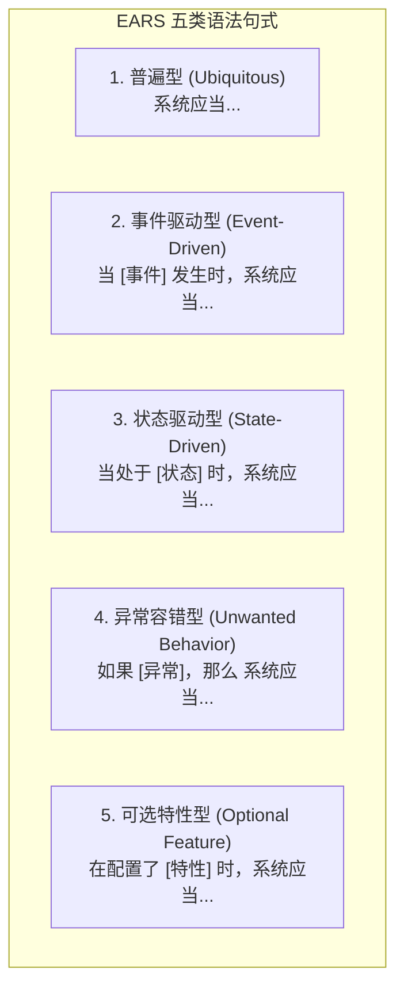

# 软件需求规格说明书 (SRS): 电商交易域高并发下单与库存原子预占

- **规格编号**: `SRS-EARS-MALL-ORDER-CAS-v1.1`
- **归属领域**: `mall` 业务域 / `pay` 支付域联动
- **编制规范**: IEEE 29148 需求工程标准 / Rolls-Royce EARS (Easy Approach to Requirements Syntax)
- **技能出处**: `.agents/skills/ears-spec-writer`
- **版本状态**: BASELINED (已基线化)
- **对应 CMMI 阶段**: CMMI 02_requirements (RDM - 需求开发与管理)

---

## 1. 业务上下文与领域实体 (Domain Context & Ontology)

本需求规格规范商城核心交易链条中：**购物车结算 ➔ 创建待支付订单 ➔ 原子扣减/预占可用库存 ➔ 支付回调确认/超时关闭库存释放** 的端到端业务不变量与异常容错行为。

### 核心领域实体
- `MallOrder`: 订单主表（包含 `order_no`, `user_id`, `status`, `total_price`, `pay_price`, `tenant_id`, `version` 及审计底座字段）；
- `MallOrderItem`: 订单行明细（包含 `order_id`, `sku_id`, `quantity`, `price`）；
- `MallProductSku`: 商品规格库存（包含 `sku_id`, `stock`, `frozen_stock`, `version`）。

---

## 2. EARS 5 态核心需求矩阵 (EARS Requirements Specification)

严禁使用“快速响应”、“高并发支持”、“友好提示”等模糊主观形容词。所有需求严格归入 EARS 5 态语法模型：



### 需求条目分解清单

#### REQ-MALL-ORD-001 (普遍型 - Ubiquitous)
> **系统应当** 在执行任何订单创建、库存扣减与明细写入时，在当前数据库事务上下文自动注入全局 `tenant_id` 与 8 大审计底座字段（`created_by`, `created_at`, `updated_by`, `updated_at`, `deleted_at`, `version`），并依据 Kysely AST 确保跨租户行级数据强隔离。

#### REQ-MALL-ORD-002 (可选特性型 - Optional Feature)
> **在配置了** 租户级会员等级优惠策略的前提下，**系统应当** 在计算订单应付总额时，自动根据下单用户的会员权益比率计算抵扣折扣，且单件商品折后实付价不得低于基础结算保底价（0.01 元）。

#### REQ-MALL-ORD-003 (事件驱动型 - Event-Driven)
> **当** 用户提交合法的订单结算请求时，**系统应当** 在单次数据库事务内，利用数据库 CAS 乐观锁原语执行原子库存锁定：
> ```sql
> UPDATE mall_product_sku 
> SET stock = stock - ?, frozen_stock = frozen_stock + ?, version = version + 1 
> WHERE id = ? AND stock >= ? AND version = ?
> ```
> 并生成状态为 `UNPAID` 的新订单记录，同时返回包含订单流水号的统一结构化响应。

#### REQ-MALL-ORD-004 (异常容错型 - Unwanted Behavior)
> **如果** 商品当前可用库存小于订单请求购买数量，或者 CAS 乐观锁版本号匹配失败（并发竞争冲突），**那么** **系统应当** 立即回滚当前数据库事务，拒绝创建订单，并返回 HTTP 状态码 `409 Conflict` 与明确的业务错误契约 `{ code: "INSUFFICIENT_STOCK", message: "商品库存不足或并发排队中，请重试" }`。

#### REQ-MALL-ORD-005 (状态驱动型 - State-Driven)
> **当处于** 订单自创建起 15 分钟待支付窗口期内时，**系统应当** 保持被预占库存（`frozen_stock`）的锁定状态；**如果** 超过 15 分钟仍未收到任何有效支付成功通知，**那么** 定时巡检补偿任务**应当** 自动将订单状态变更为 `CANCELLED_TIMEOUT`，并将 `frozen_stock` 释放回滚至 `stock` 可用库存。

#### REQ-MALL-ORD-006 (事件驱动型 - Event-Driven)
> **当** 支付网关通过 Service Bus 投递 `ruoyi.evt.pay.order.paid` 支付成功事件时，**系统应当** 通过消费端 Inbox 幂等校验该事件（基于 `x-idempotency-key`），将订单状态从 `UNPAID` 原子变更为 `PAID`，将对应 `frozen_stock` 清零完成正式扣减，并通过 `broker.publishReliable()` 投递履约出库事件。

---

## 3. 边界条件与负向测试用例断言矩阵 (Negative Matrix)

为彻底消灭“假测试”并满足 `mutation-tester` 变异测试击杀要求，针对上述需求显式定义反向防御断言：

| 用例编号 | 前置状态 | 输入 / 触发动作 | 预期受击边界 | 必须阻断的断言结果 |
|---|---|---|---|---|
| **TC-NEG-001** | 库存刚好为 0 | 请求购买 1 件商品 | 临界值边界 (`stock < qty`) | 事务回滚，抛出 409，库中数据零变更 |
| **TC-NEG-002** | 50 线程并发竞争 1 件库存 | 50 个线程同时提交下单 | CAS 乐观锁并发碰撞 | 严格仅有 1 笔订单成功生成，49 笔返回 409，最终库存严格为 0 (严禁超卖为负数) |
| **TC-NEG-003** | 订单已处于 `CANCELLED` | 恶意伪造收到支付通知 | 状态机非法流转守卫 | 抛出 400 非法状态跃迁错误，资金挂起待退款处理 |
| **TC-NEG-004** | 租户 A 用户携带租户 B 的 SkuId | 跨租户下单 | 多租户 AST 行级过滤 | 抛出 404 记录不存在，租户 B 数据未被泄露 |
