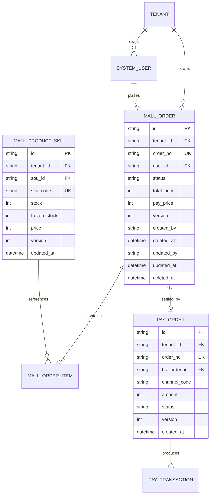

# 数据库底座设计与 8 大审计字段规范 (Database Design & ERD)

- **基线版本**: v1.1.0 Enterprise Baseline
- **生效日期**: 2026-10-09
- **归属规范**: CMMI 03_design (TS) / `.agents/skills/database-design`

---

## 1. 核心架构设计哲学：Schema-as-Code

在 `ruoyi-all-next` 中，数据库表结构严禁开发者直接手写 DDL 或在图形工具中手工改表。所有数据结构遵循：
1. **统一泛型底座 (`BaseEntity`)**：所有业务实体统一继承 8 大审计底座字段；
2. **多租户数据隔离安全**：物理行中强制携带 `tenant_id`，由 Kysely AST 拦截器透明维护；
3. **乐观锁并发并发安全**：通过 `version` 整数列配合 CAS 原语实现数据更新零脏写；
4. **多数据库兼容 (Tier-A/B/C)**：同一份实体定义无缝支持 SQLite (WAL)、PostgreSQL 与 MySQL。

---

## 2. 8 大核心审计底座字段标准 (The 8 Base Audit Columns)

任何持久化实体表在建表时，必须显式包含以下 8 个基础底座列：

| 字段名称 (Column) | 数据类型 (TypeScript / DB) | 必填性 | 说明与业务约束 |
|---|---|---|---|
| `id` | `string` (UUID v4 / CUID / BigInt) | PK, NOT NULL | 实体全局唯一主键，外部接口暴露使用混淆标识 |
| `tenant_id` | `string` (VARCHAR 64) | NOT NULL | 租户全局唯一编码，AST 自动注入，支撑多租户行级隔离 |
| `created_by` | `string` (VARCHAR 64) | NOT NULL | 数据创建人 User ID（未登录操作记录为 `SYSTEM`） |
| `created_at` | `Date` (TIMESTAMP / DATETIME) | NOT NULL | 记录创建时间戳，UTC 时间存储 |
| `updated_by` | `string` (VARCHAR 64) | NOT NULL | 最近一次更新人 User ID |
| `updated_at` | `Date` (TIMESTAMP / DATETIME) | NOT NULL | 最近一次更新时间戳，每次变更自动更新 |
| `deleted_at` | `Date` (TIMESTAMP, NULLABLE) | NULLABLE | 软删除时间戳；为 `NULL` 表示活跃有效，非空表示已逻辑删除 |
| `version` | `number` (INTEGER / BIGINT) | NOT NULL, DEFAULT 1 | 乐观锁版本号，CAS 更新时执行 `SET version = version + 1 WHERE version = :curr` |

---

## 3. 实体关系图 (ERD - Entity-Relationship Diagram)

以下以核心电商与支付域实体关系为例展示结构设计：

---

## 4. 索引与性能治理规范

1. **联合租户索引**：凡是带有 `tenant_id` 的表，在创建业务索引时，必须将 `tenant_id` 作为联合索引的第一前导列（如 `INDEX idx_tenant_status (tenant_id, status)`）；
2. **软删除过滤索引**：在针对活跃数据建立查询索引时，应优先采用部分索引（Partial Index, 如 Postgres `WHERE deleted_at IS NULL`）以节省索引空间；
3. **CAS 乐观锁索引**：主键 `id` 自带唯一索引，CAS 更新 `WHERE id = ? AND version = ?` 命中唯一索引，杜绝全表扫描锁表。
