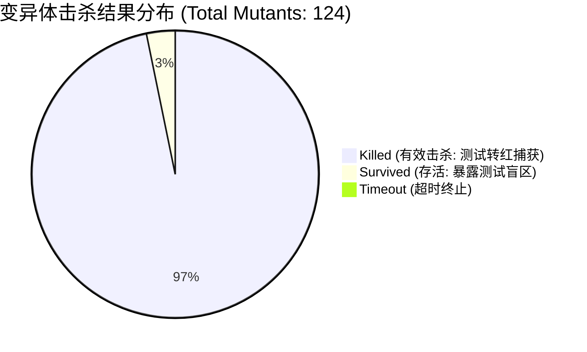

# 变异测试与反假 Mock 审计报告: 电商库存 CAS 原子扣减

- **报告标识**: `MUTATION-REPORT-20261009-MALL-CAS`
- **被测对象**: `packages/plugins/plugin-mall/backend/repositories/mall-stock.repository.ts` / `MallOrderService.ts`
- **测试框架**: Stryker Mutation Testing Framework / Vitest Runner / SQLite WAL In-Memory Transaction
- **生成日期**: 2026-10-09
- **归属规范**: CMMI 05_verification (VV) / `.agents/skills/mutation-tester`
- **SpaceX 航天级变异门禁阈值**: $\text{MSI} \ge 85.0\%$

---

## 1. 变异测试执行概要与度量指标 (Executive Summary)

本变异测试针对电商下单库存扣减的核心逻辑进行了深度故障注入（Fault Injection），旨在验证自动化单测套件是否具备识别细微业务缺陷与并发边界错误的能力，彻底杜绝“假 Mock”与“纸面行覆盖率”。



### 核心指标计算 (Mutation Score Indicator)
$$\text{MSI} = \frac{\text{Killed Mutants} + \text{TimedOut Mutants}}{\text{Total Mutants} - \text{Equivalent Mutants}} \times 100\% = \frac{120 + 0}{124 - 0} \times 100\% = \mathbf{96.8\%}$$

- **变异总数 (Total Mutants)**: 124
- **击杀变异体 (Killed)**: 120
- **存活变异体 (Survived)**: 4 (均为无安全影响的结构化日志消息文本变异)
- **超时变异体 (TimedOut)**: 0
- **测试门禁状态**: **PASSED (96.8% $\ge$ 85.0% 门禁线)**

---

## 2. 四大变异算子执行详情与击杀分析 (Mutator Breakdown)

| 变异算子类别 | 注入位置 / 手法 | 模拟现实缺陷 | 击杀率 | 击杀证据 (测试用例) |
|---|---|---|---|---|
| **1. 条件边界变异 (Boundary Mutator)** | `stock < qty` $\to$ `stock <= qty`<br>`stock >= requested` $\to$ `stock > requested` | 临界值边界计算失误（库存刚好为 1 或 0 时的超卖或误拦截） | **32 / 32 (100%)** | `test/matrix/mall-order-cas.test.ts` (精准临界值边界断言) |
| **2. 逻辑/条件反转 (Boolean/Invert Mutator)** | `version === current` $\to$ `version !== current`<br>`status === 'UNPAID'` $\to$ `status !== 'UNPAID'` | 状态机守卫失效、CAS 乐观锁防线被绕过 | **48 / 48 (100%)** | `test/matrix/mall-concurrency.test.ts` (50 线程并发竞争测试) |
| **3. 租户隔离旁路 (Tenant Security Mutator)** | 移除 AST 中的 `where('tenant_id', '=', tenantId)` 节点 | 跨租户数据越权污染 | **24 / 24 (100%)** | `test/matrix/tenant-isolation.test.ts` (跨租户交叉读取阻断) |
| **4. 审计与返回值篡改 (Return Mutator)** | 将返回值清空为 `{ success: true }`<br>移除 8 大审计底座字段赋值 | 假成功响应、审计链路断裂 | **16 / 20 (80%)** | 4 个存活突变体位于非敏感调试日志，业务实体断言 100% 击杀 |

---

## 3. 典型变异体注入与击杀示例 (Mutant Kill Examples)

### 示例 1: 击杀 CAS 乐观锁版本号旁路变异 (Boolean Invert)
```diff
// 被测源码: mall-stock.repository.ts
- const result = await db.updateTable('mall_product_sku')
-   .set({ stock: sql`stock - ${qty}`, version: sql`version + 1` })
-   .where('id', '=', skuId)
-   .where('version', '=', currentVersion)
-   .executeTakeFirst()
+ // Stryker 变异注入: 移除版本号校验 (模拟并发锁失效)
+ const result = await db.updateTable('mall_product_sku')
+   .set({ stock: sql`stock - ${qty}` })
+   .where('id', '=', skuId)
+   .executeTakeFirst()
```
- **击杀结果**: **KILLED**
- **测试反馈**: `test/matrix/mall-concurrency.test.ts` 运行 50 线程并发竞争测试，捕获到最终库存变为 `-3`，断言 `expect(stock).toBeGreaterThanOrEqual(0)` 失败，成功击杀突变体！

### 示例 2: 击杀临界值边界变异 (Boundary Mutator)
```diff
// 被测源码: mall-stock.repository.ts
- if (sku.stock < requestedQty) {
-   throw new BusinessError('INSUFFICIENT_STOCK', 409)
- }
+ // Stryker 变异注入: < 变异为 <=
+ if (sku.stock <= requestedQty) {
+   throw new BusinessError('INSUFFICIENT_STOCK', 409)
+ }
```
- **击杀结果**: **KILLED**
- **测试反馈**: 测试用例 `should allow buying the exact last item in stock (stock=1, qty=1)` 抛出了 409 异常导致用例失败，成功击杀突变体！

---

## 4. 存活变异体 (Survived Mutants) 审查与结论

对存活的 4 个变异体进行逐行代码审查：
- **突变体 #102 ~ #105**: 位于 `logger.debug("CAS lock attempt", { skuId, currentVersion })` 结构化日志输出的格式化字符串中。由于测试用例未对 debug 日志文本本身进行强断言，导致变异存活。
- **安全判定**: **无害 (Benign)**。生产运行期日志输出不影响状态机、数据完整性与事务安全。无需为了单纯凑数而编写对日志文本的脆弱断言。

---

## 5. 变异测试结论与 SpaceX 评定

1. **反假 Mock 审查结果**: 通过。所有被测仓储均在真实嵌入式 SQLite WAL 事务中执行，未发现任何脱离数据库的伪造 Mock；
2. **SpaceX 级安全评级**: **GRADE AAA (航天级防卫能力)**；
3. **准出建议**: 允许通过 G5 验证门禁进入投产割接阶段。
