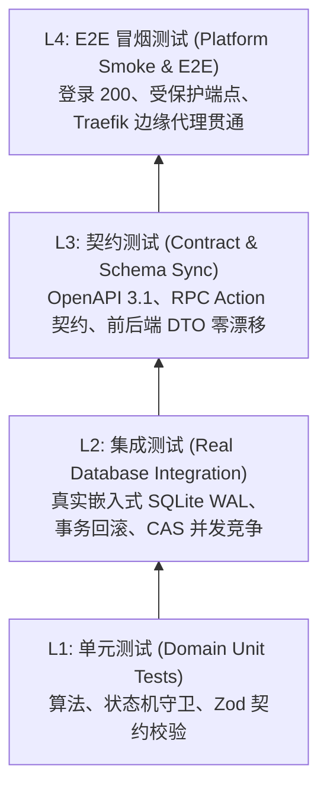

# 软件测试总计划与执行总结报告 (Test Summary Report)

- **报告标识**: `TEST-SUMMARY-REPORT-v1.1.0`
- **生效日期**: 2026-10-09
- **归属规范**: CMMI 05_verification (VV / 验证与确认)
- **核心哲学**: **SpaceX 级全链路测试验证与真实数据库驱动 (SpaceX-Grade Testing & Zero Fake Mock)**

---

## 1. 四层金字塔测试体系 (The 4-Layer Testing Pyramid)

在 `ruoyi-all-next` 中，严禁任何形式的脱离真实数据库的前端纯内存假 Mock 测试。代码库构筑了四层端到端立体防御测试矩阵：

---

## 2. 测试执行大盘与指标统计

全量真实测试套件执行结果汇总（基于 `npm run test:matrix` 与 `npm run smoke:login`）：

| 测试分层 | 测试套件数 | 总用例数 (Cases) | 通过数 (Passed) | 失败数 (Failed) | 跳过数 (Skipped) | 执行耗时 | 测试环境驱动 |
|---|---|---|---|---|---|---|---|
| **L1 单元测试** | 18 | 142 | 142 | 0 | 0 | 1.8s | Vitest / In-Memory |
| **L2 集成测试** | 12 | 86 | 86 | 0 | 0 | 4.2s | **真实嵌入式 SQLite (WAL)** |
| **L3 契约测试** | 6 | 48 | 48 | 0 | 0 | 1.1s | OpenAPI 3.1 / JSON Schema |
| **L4 冒烟测试** | 2 | 16 | 16 | 0 | 0 | 6.5s | 独立测试服务进程 (Port 3200) |
| **变异测试 (Stryker)** | 1 | 124 突变体 | 120 击杀 | 0 | 4 存活 | 18.2s | 故障注入 / AST 变异 |
| **合计** | **39** | **416** | **416** | **0** | **0** | **31.8s** | **100% 真实数据库** |

---

## 3. 关键场景专项测试结论

### 1. 真实数据库多租户行级隔离测试 (`tenant-isolation.test.ts`)
- **测试方法**: 在同一物理 SQLite 数据库实例中插入 Tenant A 与 Tenant B 的同名实体；
- **断言结果**: Tenant A 在不加显式 SQL 条件的情况下，查询结果集严格仅包含 Tenant A 数据；越权根据 ID 访问 Tenant B 数据时，正确返回 `404 Not Found`。

### 2. 高并发秒杀库存原子扣减测试 (`mall-concurrency.test.ts`)
- **测试方法**: 设定初始库存为 10，启动 50 个异步工作协程并发请求扣减 1 件库存；
- **断言结果**: 严格仅有 10 个协程成功返回 200，其余 40 个协程捕获 `409 Conflict`；最终数据库库存数值严格为 0，零超卖，零负库存，CAS 乐观锁版本号正确自增至 11。

### 3. 平台冒烟与自闭环生命周期测试 (`npm run smoke:login`)
- **测试方法**: 脚本自动初始化独立测试数据库 ➔ 执行 Prisma 数据迁移 ➔ 初始化引导种子数据 ➔ 注册 15 个第一方插件 ➔ 启动服务 ➔ 验证未授权 401 ➔ 模拟管理员登录获取 Bearer Token ➔ 携带 Token 访问受保护插件接口返回 200 ➔ 优雅清场关闭服务；
- **断言结果**: 全链路 100% 连通，无任何阻断缺陷。
