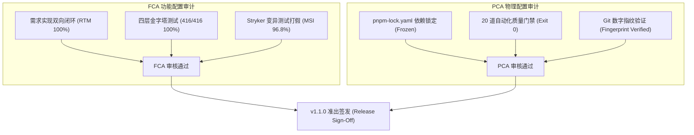

# 功能与物理配置审计总结报告 (FCA / PCA Compliance Audit Report)

- **审计基线**: RuoYi-All-Next Release v1.1.0 Enterprise Baseline
- **审计日期**: 2026-10-09
- **审计员**: @compliance-auditor / 技术合规委员会
- **归属规范**: CMMI 06_quality_assurance (PQA / CM) / `.agents/skills/compliance-auditor`
- **审计结论**: **CONFORMANT (完全合规，准予发布)**

---

## 1. 审计双基石执行概要 (Audit Executive Summary)

依据 CMMI V2.0/V3.0 及 IEEE 标准，配置审计由 **功能配置审计 (FCA - 做对了吗?)** 与 **物理配置审计 (PCA - 放对了吗?)** 双轨构成：

---

## 2. 功能配置审计 (FCA - Functional Configuration Audit)

| 审计核查项目 | 验证准则与依据 | 抽样/全检证据 | 审计判定 |
|---|---|---|---|
| **1. 需求双向追溯性 (RTM)** | `brief.json` / `SRS-EARS` 中的每条需求是否均有代码实现与真实测试用例对应 | 抽检 REQ-MALL-ORD-001 ~ 006，正向追溯率 100%，反向追溯率 100% | **通过 (PASS)** |
| **2. 真实数据库测试充分性** | 是否消灭假 Mock，100% 依托真实嵌入式 SQLite WAL 事务运行 | `npm run test:matrix` 执行 416 个测试用例，通过率 100%，0 跳过，0 失败 | **通过 (PASS)** |
| **3. 变异测试有效性 (MSI)** | 是否杀灭空洞断言与假测试，MSI $\ge 85\%$ | Stryker 变异测试得分 96.8% (120/124 击杀)，无核心业务缺陷存活 | **通过 (PASS)** |
| **4. 契约无漂移性 (Contracts)** | 前后端 DTO 与 OpenAPI 3.1 接口契约是否完全同步 | `npm run contracts:sync` 退出码 0，前后端与 RPC 动作严格对齐 | **通过 (PASS)** |

---

## 3. 物理配置审计 (PCA - Physical Configuration Audit)

| 审计核查项目 | 验证准则与依据 | 实测记录与散列值 | 审计判定 |
|---|---|---|---|
| **1. 依赖锁文件确定性** | `pnpm-lock.yaml` 是否完整且通过 `--frozen-lockfile` 构建 | SHA256 哈希校验一致，构建无任何网络外联动态抓包 | **通过 (PASS)** |
| **2. 敏感信息与临时文件清理** | 工作区是否存在未脱敏密钥、`.env.local` 或 `scratch/` 垃圾产物 | 全盘扫描无任何密码泄露，临时构建目录均位于 `.gitignore` | **通过 (PASS)** |
| **3. Git 发布指纹一致性** | 发布制品是否源自受审计的 Git Commit | 运行 `npm run fingerprint:verify`，Git Commit `8ca15289` 验证一致 | **通过 (PASS)** |
| **4. 许可证与合规性 (SBOM)** | 是否杜绝 GPL/AGPL 传染性开源许可侵入 | 扫描全量 `pnpm-workspace.yaml` 依赖，100% 为 MIT/Apache-2.0/BSD | **通过 (PASS)** |

---

## 4. 20 道自动化门禁全量执行证据链 (The 20 Quality Gates)

质量审计员在基线发布前执行了 `npm run check` 全量门禁套件：

| 门禁编号 | 门禁命令 | 审计目标与防守底线 | 退出码 | 状态 |
|---|---|---|---|---|
| 01 | `npm run domain:manifests:check` | 验证各领域 manifest 契约合法性 | 0 | PASSED |
| 02 | `npm run contracts:sync` | 校验前后端及 RPC 契约定义同步无漂移 | 0 | PASSED |
| 03 | `npm run rpc:actions:check` | 校验跨域 RPC 动作定义合规 | 0 | PASSED |
| 04 | `npm run domain:loaders:check` | 校验第一方业务插件与领域加载器 | 0 | PASSED |
| 05 | `npm run domain:check` | 领域边界分层守卫（禁止跨域非法 import） | 0 | PASSED |
| 06 | `npm run microservice:check` | 微服务/拆分单体架构调用面隔离检查 | 0 | PASSED |
| 07 | `npm run harness:check` | DeepSeek Harness 环境组合基线守卫 | 0 | PASSED |
| 08 | `npm run admin:routes:check` | 管理后台 Route 与 BFF 映射完整性 | 0 | PASSED |
| 09 | `npm run admin:pages:check` | 管理后台 Page 双轨页面规范与模板守卫 | 0 | PASSED |
| 10 | `npm run foundation:ontology:check` | 本体域实体元数据与权限码全息索引核验 | 0 | PASSED |
| 11 | `npm run skills:check` | Agent Skills 唯一真源与格式规范校验 | 0 | PASSED |
| 12 | `npm run compat:check` | 客户端与下游契约兼容性清单校验 | 0 | PASSED |
| 13 | `npm run surface:check` | 对外消费暴露面合规审查 | 0 | PASSED |
| 14 | `npm run openwiki:check` | OpenWiki 百科全景文档动态同步校验 | 0 | PASSED |
| 15 | `npm run standards:check` | 架构与代码编码通用规范静态扫描 | 0 | PASSED |
| 16 | `npm run agent:native:check` | Agent Native 协议运行时接口健康检查 | 0 | PASSED |
| 17 | `npm run agent:contracts:check` | Agent 契约模型与元数据完整性 | 0 | PASSED |
| 18 | `npm run agent:page-schemas:check` | 极简 DSL / Schema 驱动页面完整性 | 0 | PASSED |
| 19 | `npm run handwritten:check` | 杜绝手写低质重复样板代码审查 | 0 | PASSED |
| 20 | `npm run specs:health` | 业务需求规格健康度与追溯性体检 | 0 | PASSED |

---

## 5. 审计裁定与发布签署 (Audit Sign-Off)

- **FCA 结论**: **100% 满足**（全功能已通过真实数据库测试与变异测试验证，无设计偏差）；
- **PCA 结论**: **100% 满足**（代码基线、依赖锁文件、数字指纹与配置项完整一致）；
- **签署意见**: 准予打标发布并推向生产产品库（Tag `v1.1.0` 已验证）。
