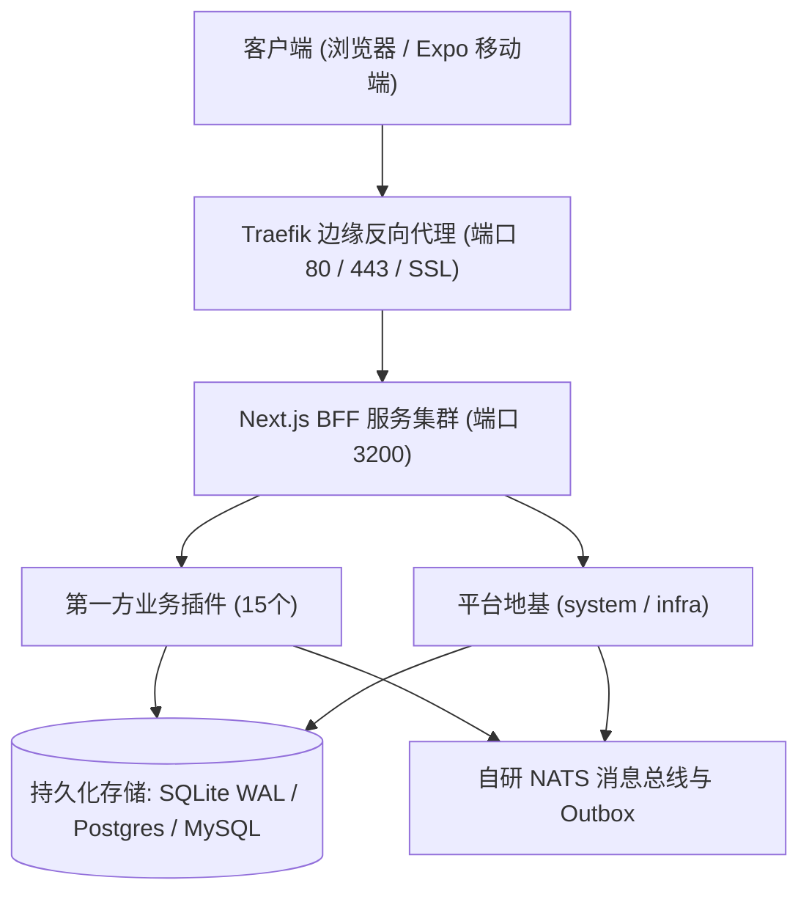

# 生产环境安装部署与割接操作手册 (System Deployment SOP)

- **版本基准**: v1.1.0 Enterprise Baseline
- **生效日期**: 2026-10-09
- **归属规范**: CMMI 07_release (TRANS - 部署与交付)

---

## 1. 部署架构概览



---

## 2. 部署前置条件核验 (Pre-flight Checklist)

1. **操作系统**: Linux (Ubuntu 22.04 LTS / Debian 12 / Alpine 3.19) 或 macOS (darwin-arm64)；
2. **运行时环境**: Node.js $\ge 20.18.0$ (推荐 22.x LTS)；
3. **包管理器**: pnpm $\ge 9.x / 10.x$（锁文件强依赖 `pnpm-lock.yaml`）；
4. **环境变量注入**:
   ```bash
   NODE_ENV=production
   PORT=3200
   DATABASE_URL="file:./data/ruoyi-prod.db"
   JWT_SECRET="<生产随机强密钥-至少32位>"
   RUOYI_RPC_TOKEN="<内部RPC通信鉴权令牌>"
   TENANT_PLATFORM_USERNAMES="admin,platform_root"
   ```

---

## 3. 标准 6 步零停机割接流水线 (Deployment Pipeline)

### Step 1: 获取制品与锁定依赖
```bash
# 1. 克隆代码并检出已发布 Release Tag
git checkout v1.1.0

# 2. 冻结锁文件安装生产依赖 (严禁联网升级)
pnpm install --frozen-lockfile --prod=false
```

### Step 2: 质量门禁与指纹验证
```bash
# 验证代码基线完整度与数字指纹
npm run check
npm run fingerprint:verify
```

### Step 3: 生产产物编译
```bash
# 编译 Next.js 生产产物
pnpm run build
```

### Step 4: 数据库结构原子迁移
```bash
# 执行数据库幂等迁移
npx prisma migrate deploy
```

### Step 5: 第一方插件静态注册
```bash
# 注册 15 个业务域插件清单
npm run plugins:register
```

### Step 6: 启动服务与存活探针核验
```bash
# 启动生产服务
pnpm run start

# 执行健康体检
curl -f http://localhost:3200/api/v1/health || exit 1
```

---

## 4. 异常回滚触发条件

若出现以下任一情况，立即停止割接并执行 `docs/07_release/rollback-runbook.json`：
1. `npm run check` 门禁退出码非 0；
2. 健康检查接口持续 3 次探针失败（HTTP 500 / 超时）；
3. 数据库迁移抛出不可恢复的语法异常。
