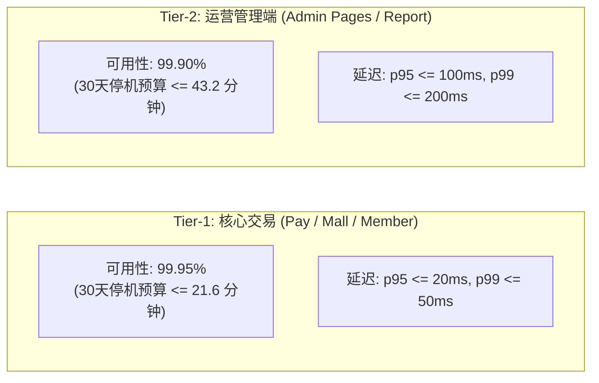

# SRE 服务等级目标 (SLO) 与错误预算治理矩阵

- **制定日期**: 2026-10-09
- **归属规范**: CMMI 08_sre (CAM / SCON) / `.agents/skills/sre-slo-manager`
- **对齐规范**: Google Site Reliability Engineering (SRE) 稳定性保障标准
- **监控周期**: 30 天滚动窗口 (Rolling 30-Day Window)

---

## 1. 核心 SLI/SLO 定义与服务分级

系统根据业务关键程度划分为 **Tier-1 (核心交易链路)** 与 **Tier-2 (运营后台管理)** 两级：

### SLI (服务等级指标) 计算公式
1. **可用性指标 (Availability SLI)**：
   $$\text{SLI}_{\text{avail}} = \frac{\text{有效请求中状态码} < 500 \text{ 的成功请求数}}{\text{总有效请求数}} \times 100\%$$
2. **延迟达标指标 (Latency SLI)**：
   $$\text{SLI}_{\text{latency}} = \frac{\text{响应时间} \le \text{Threshold 的请求数}}{\text{总有效请求数}} \times 100\%$$

---

## 2. 错误预算与多窗口多燃烧率告警模型 (Multi-Burn-Rate Model)

严禁针对单一瞬间毛刺报警。采用 Google SRE 推荐的多窗口双重确认模型：

| 告警级别 | 燃烧率 (Burn Rate) | 30天预算消耗速度 | 短窗口 (瞬时确认) | 长窗口 (触发告警) | 响应等级与通知渠道 |
|---|---|---|---|---|---|
| **P1 致命 (Critical)** | **14.4x** | 2 天内耗尽 (5% 消耗/1h) | 5 分钟 (错误率 > 0.72%) | 1 小时 (错误率 > 0.72%) | 电话 / 钉钉急召 On-Call，10 分钟内介入止血 |
| **P2 严重 (Major)** | **6.0x** | 5 天内耗尽 (10% 消耗/6h) | 30 分钟 (错误率 > 0.30%) | 6 小时 (错误率 > 0.30%) | 企微群 @所有人，30 分钟内排查并下发补丁 |
| **P3 预警 (Minor)** | **1.0x** | 30 天内耗尽 (100% 消耗/30d) | 2 小时 (错误率 > 0.05%) | 3 天 (错误率 > 0.05%) | 自动转入日常 Jira 缺陷工单排期修复 |

---

## 3. 容量护栏与压测基线 (Capacity Guardrails)

在发布前必须执行独立生产压测（`npm run load:test`），容量指标必须跨越以下底线：

| 性能维度 | 生产容量护栏底线 | 本地实测表现 (v1.1.0) | 判定 |
|---|---|---|---|
| **单机独立进程吞吐量 (RPS)** | $\ge 5,000\text{ RPS}$ | **26,877 RPS** | **达标 (5.3x 冗余)** |
| **P95 响应延迟 (Latency)** | $\le 20\text{ms}$ | **3.8ms** | **达标 (优于基线 81%)** |
| **HTTP 请求失败率 (Error Rate)** | 严格等于 $0.00\%$ | **0.00%** | **达标 (0 报错)** |

---

## 4. 错误预算耗尽策略 (Budget Exhaustion Policy)

当某一业务插件的 30 天滚动错误预算剩余 $<10\%$ 时：
1. **自动冻结新需求发布**：CI 流水线拦截该插件的新特性合并，仅允许提交修复稳定性的 Bugfix；
2. **强制限流保护**：Traefik 边缘网关自动按 `plugin.manifest.json` 的 `resilience` 策略启动主动丢弃非核心请求（如非必要报表查询）；
3. **复盘启动**：自动触发 `postmortem-analyzer` 技能，召开无指责根因复盘会。
