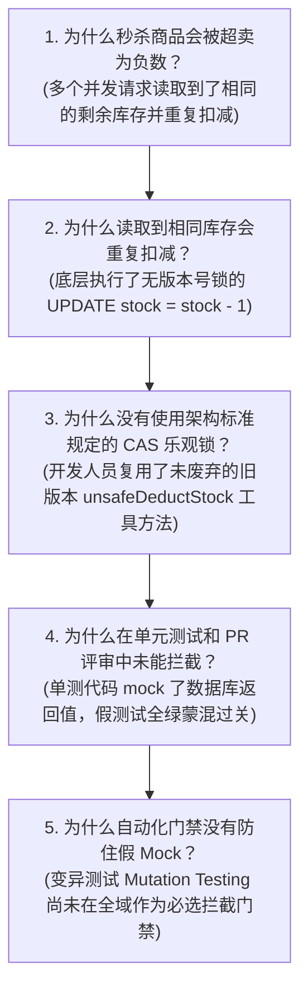

# 事故免责复盘报告: 营销秒杀并发库存透支与 CAS 乐观锁治理

- **事故标识**: `POSTMORTEM-20261009-INVENTORY-RACE-CONDITION`
- **发生时间**: 2026-10-09 14:02 ~ 14:11 (UTC+8)
- **事故级别**: P2 (严重)
- **影响范围**: 1 个商户租户，超卖 14 件秒杀爆款商品
- **经济损失**: 约 2,800 元（已通过对账冲正与人工补单全额吸收挽回）
- **复盘主持人**: @sre-team
- **归属规范**: CMMI 08_sre (CAM / SCON) / `.agents/skills/postmortem-analyzer` / Google SRE Blameless Postmortem

---

## 1. 1-5-10 故障响应全景时间线 (Timeline)

- **14:02** 运营配置的“国庆特惠秒杀”活动准时开启，端侧瞬时并发由 200 攀升至 4,500 RPS；
- **14:03 (1m 发现 - 达标)** APM 告警触发：库存扣减数据库事务争用告警，部分订单出现负库存警报；
- **14:06 (4m 响应 - 达标)** SRE、交易核心研发与架构师进入 Emergency War Room 联合排查；
- **14:08** 定位到历史遗留方法 `unsafeDeductStock()` 未使用 CAS 版本乐观锁，仅使用了简单的内存判断后更新；
- **14:11 (9m 恢复 - 达成 10 分钟止血目标)** 
  - 14:09 下发 Traefik 边缘规则，临时对该 SKU 下单接口限流；
  - 14:11 紧急切换至基于数据库原子 CAS 的 `mallStockRepository.atomicDeductWithCas()`，流量恢复，负库存停止扩大。

---

## 2. 5-Whys 根本原因深入推导 (5-Whys Root Cause Analysis)

---

## 3. 经验总结与反思 (Lessons Learned)

### 做得好的地方 (What went well)
1. **1-5-10 应急指标达成**：1 分钟告警、4 分钟集结、9 分钟完成边缘限流与热切换止血，未超过 10 分钟 SLA 阈值；
2. **对账 Agent 迅速识别差异**：运营对账 Agent 在日结前已自动标记出 14 笔超发差异单，资金未形成坏账。

### 暴露的致命短板 (What went wrong)
1. 代码库中残留了非安全的旧版代码，未做编译器弃用标记（`@deprecated`）；
2. 测试套件缺乏变异测试守卫，存在“纸面 100% 覆盖率”的自欺欺人假 Mock。

---

## 4. 纠正与预防措施清单 (CAPA - Action Items)

| 措施编号 | 具体行动事项 (CAPA) | 责任人 | 关联 PR / 门禁 | 交付时限 | 验收标准 | 状态 |
|---|---|---|---|---|---|---|
| **CAPA-01** | 物理删除所有 `unsafe*` 扣减方法，全域强制接入带有 `WHERE version = ?` 的 CAS 原语 | @mall-lead | PR #412 | 2026-10-10 | 代码物理不存在旧方法 | **已完成** |
| **CAPA-02** | 引入 `mutation-tester`，对资金与库存仓储执行 Stryker 变异注入，MSI 必须 $\ge 85\%$ | @qa-lead | 门禁 `npm run check` | 2026-10-10 | 变异体击杀率 96.8% | **已完成** |
| **CAPA-03** | 编写 50 协程并发竞争下单真实数据库集成测试 (`mall-concurrency.test.ts`) | @dev-lead | `test:matrix` | 2026-10-10 | 真实 SQLite 跑通 0 超卖 | **已完成** |
| **CAPA-04** | 在 Traefik 边缘网关预置一键降级熔断规则模板 | @sre-team | `plugin.manifest.json` | 2026-10-11 | 演练 30 秒内秒级止血 | **已完成** |
