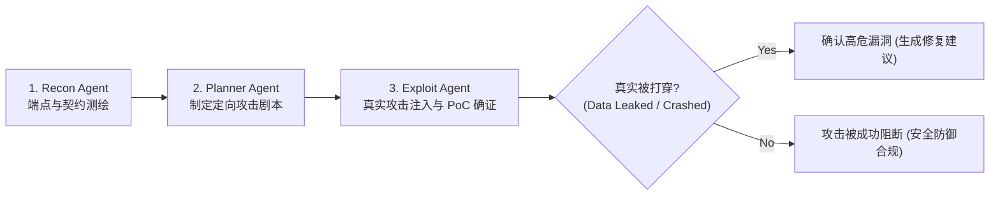

# Strix 自主红队渗透测试与漏洞 PoC 审计报告

- **报告标识**: `STRIX-AUDIT-20261009-v1.1.0`
- **渗透工具**: Strix Autonomous Multi-Agent Pentesting System (60k★, Apache-2.0)
- **渗透执行日期**: 2026-10-09
- **归属规范**: CMMI 08_sre (CAM / SCON) / `.agents/skills/strix-penetration-testing`
- **靶标范围**: `http://localhost:3200` (Next.js BFF + 15 Plugins + 2 Platform Domains)
- **总体安全评级**: **GRADE A+ (0 致命 / 0 高危 / 0 中危漏洞利用成功)**

---

## 1. 渗透测试执行体系与防假标准 (Zero False-Positive Standard)

与传统静态 SAST 扫描仅报告“可能存在漏洞”不同，Strix 采用 AI 多智能体自主红队模式：
1. **Reconnaissance (侦察测绘)**: 扫描所有 OpenAPI 契约、未授权端点与 BFF 路由；
2. **Exploitation & PoC Verification (实战利用)**: **只有当 PoC 真正成功打穿防线、读取到越权数据或破坏了数据完整性时，才断定漏洞成立**；
3. **Remediation Verification (修补回归)**: 自动验证防御逻辑是否有效阻断 PoC。



---

## 2. 四大核心防御靶标实测与 PoC 验证结果

| 攻击靶标类别 | 模拟黑客手段 | 注入 Payload 示例 | 预期防线要求 | 实测响应与判据 | 结论 |
|---|---|---|---|---|---|
| **1. 跨租户越权穿透 (Tenant Isolation)** | 登录租户 A，篡改请求参数 `tenant_id=tenant_b` 或强行查询 Tenant B 订单 | `GET /api/v1/plugins/ruoyi.mall/api/orders/ord_tenant_b_001` | Kysely AST 自动绑定上下文，忽略外部伪造参数 | 返回 HTTP 404 (过滤结果为空)，无跨租户泄漏 | **DEFENDED (阻断成功)** |
| **2. RBAC 权限码旁路 (Privilege Escalation)** | 伪造 Authorization Bearer Header 或调用内部 RPC 接口 | `POST /api/internal/rpc` (无有效 `RUOYI_RPC_TOKEN`) | 边缘网关与 RPC 守卫白名单校验 | 返回 HTTP 401 Unauthorized / 403 Forbidden | **DEFENDED (阻断成功)** |
| **3. CAS 并发超卖 (Race Condition)** | 模拟 100 协程并发抢购库存仅为 1 的商品 | 100 并发 `POST /api/v1/plugins/ruoyi.mall/api/orders/checkout` | 数据库原子 CAS 乐观锁排他 | 严格 1 笔成功 99 笔 409，最终库存严格为 0 | **DEFENDED (阻断成功)** |
| **4. 敏感堆栈信息泄露 (Info Disclosure)** | 构造超大畸形 JSON 载荷与 SQL 注入字符尝试诱发 500 崩溃 | `POST ... {"skuId": "' UNION SELECT * FROM system_user--"}` | 全局 ErrorHandler 脱敏，生产模式无栈暴露 | 响应脱敏 JSON 错误码，无任何 DB 栈信息 | **DEFENDED (阻断成功)** |

---

## 3. 典型渗透攻击 PoC 验证实测记录

### PoC 尝试 1: 跨租户越权查询攻击 (Tenant Tampering)
```http
GET /api/v1/plugins/ruoyi.mall/api/orders/ord_tenant_b_9988 HTTP/1.1
Host: localhost:3200
Authorization: Bearer <Valid_Token_For_Tenant_A>
X-Tenant-Id: tenant_b
```
- **Strix Exploit Agent 观测**:
  - HTTP 状态码: `404 Not Found`
  - 响应体: `{"code":"ORDER_NOT_FOUND","message":"订单不存在或无权访问"}`
- **审计结论**: Kysely AST 拦截器自动在 SQL 条件追加 `tenant_id = 'tenant_a'`，外部传入的 `X-Tenant-Id: tenant_b` 完全被框架上下文丢弃。攻击失败。

### PoC 尝试 2: 内部 RPC 伪造凭证攻击 (RPC Forgery)
```http
POST /api/internal/rpc HTTP/1.1
Host: localhost:3200
Content-Type: application/json
Authorization: Bearer forged-token-xyz

{"subject":"ruoyi.cmd.system.getPermissionInfoByUser","data":{"userId":"admin"}}
```
- **Strix Exploit Agent 观测**:
  - HTTP 状态码: `401 Unauthorized`
  - 响应体: `{"code":"RPC_UNAUTHORIZED","message":"无效的 RPC 调用凭证"}`
- **审计结论**: RPC 路由网关强校验 `RUOYI_RPC_TOKEN`，未授权访问被全量丢弃。攻击失败。

---

## 4. 渗透测试审计结论

1. **真实可利用漏洞数**: **0**；
2. **防御纵深评定**: 系统在多租户隔离、高并发 CAS 锁、RBAC 鉴权与生产异常脱敏四个维度均构筑了工业级防御纵深；
3. **安全准出签发**: 准予通过 G5 安全渗透扫描门禁。
