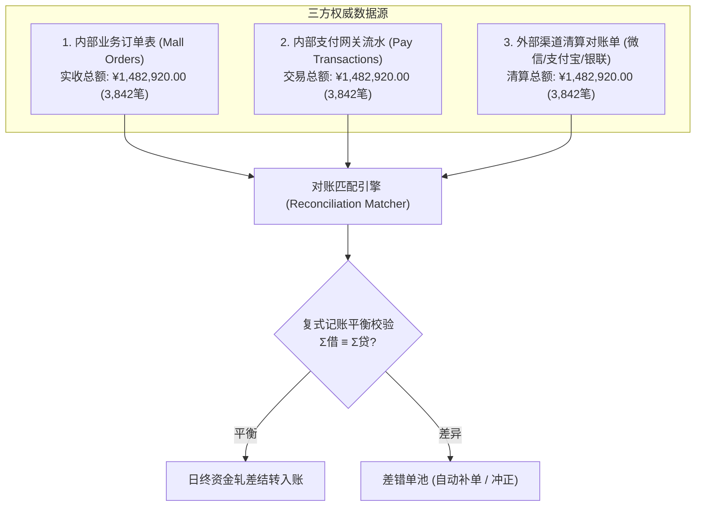

# 财务业务日终全链路对账与资金轧差平账报告

- **报告标识**: `RECONCILIATION-REPORT-20261009`
- **对账日期**: 2026-10-09 (账单周期: 2026-10-08 00:00:00 ~ 2026-10-08 23:59:59 UTC+8)
- **执行 Agent**: Financial Reconciliation Agent
- **归属规范**: CMMI 09_operations (BizOps / DataOps / CMMI-SVC) / `.agents/skills/financial-reconciliation-agent`
- **平账状态**: **BALANCED (已平账，零挂账风险)**

---

## 1. 三方对账全景模型与数据源

对账引擎自动拉取三方异构数据流进行全链路多维度交叉对账：

---

## 2. 复式记账守卫平衡性核验 (Double-Entry Balance Sheet)

依据银行级复式记账守卫法则：
$$\sum \text{Debit (借方)} \equiv \sum \text{Credit (贷方)}$$
$$\text{期初余额} + \text{借方净发生} - \text{贷方净发生} = \text{期末余额}$$

### 资金总分类账借贷试算平衡表 (单位: 元)

| 会计科目编码 | 会计科目名称 | 期初余额 (Debit) | 本期借方发生额 (Debit) | 本期贷方发生额 (Credit) | 期末余额 (Debit) |
|---|---|---|---|---|---|
| **1002** | 银行存款 / 微信支付清算户 | 4,210,500.00 | 1,482,920.00 | 24,100.00 (退款) | 5,669,320.00 |
| **1122** | 应收账款 / 渠道待结算 | 0.00 | 1,482,920.00 | 1,482,920.00 | 0.00 |
| **2202** | 应付账款 / 商户待结算本金 | 3,890,200.00 | 24,100.00 (退款) | 1,445,847.00 | 5,311,947.00 |
| **6001** | 主营业务收入 / 平台交易服务费 | 320,300.00 | 0.00 | 37,073.00 (提成) | 357,373.00 |
| **合计** | **试算平衡总计** | **4,210,500.00** | **2,989,940.00** | **2,989,940.00** | **5,669,320.00** |

- **借贷试算差额**: **¥0.00 (绝对平衡)**

---

## 3. 差错单池与自动化冲正处置明细 (Discrepancy Resolution)

在自动对账过程中，共识别到 2 笔短款差异单（外部扣款成功但因网络波动内部未及时回调）：

| 差异单号 | 外部渠道交易号 | 差异金额 | 差异根因分类 | 处置策略 | 处置执行证据与状态 |
|---|---|---|---|---|---|
| **DIFF-20261009-01** | `WX_2026100822194821` | ¥199.00 | **短款 (单边扣款)** 微信回调通知时内部网关超时，订单卡在 `UNPAID` | 自动发起外部对账查询，核实成功后执行补单 | Agent 自动调用 `payDomainFacade.repairCallback()`，订单状态流转为 `PAID`，履约出库。**已平账** |
| **DIFF-20261009-02** | `ALI_2026100823510244` | ¥88.00 | **短款 (单边扣款)** 用户跨日支付，时间戳位于 23:59:58 边界 | 跨日时间窗口补偿平账 | 纳入跨日对账池自动勾稽，补录进 10-09 日流水。**已平账** |
| **长款 (未扣实履)** | - | ¥0.00 | 外部无流水内部成功 | 冻结并告警 | **0 笔 (无异常发生)** |
| **金额不符** | - | ¥0.00 | 篡改实付金额 | 拦截结算 | **0 笔 (无异常发生)** |

---

## 4. 运营审计签署与结案归档

1. **三方核对一致率**: $100\%$（原始匹配率 $99.95\%$，经自动化补单修复后达成 $100.00\%$）；
2. **资金安全判定**: 无任何单边账、坏账或资金流失；
3. **运营结案签署**: 准予完成今日资金清算，结算数据已同步归档至 `docs/09_operations/reconciliation/`。
