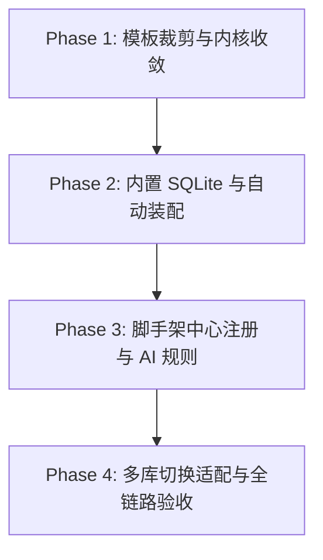

# 《ruoyi-all-next》Build 顶级全栈工程模板改造与落地实施计划

> **目标**：将 `/root/workspace/xaicd/ruoyi-all-next` 打造为平台 **Build 顶级模式的标准工程模板**，实现：
> 1. **体积轻量化 (减重 90%)**：精简臃肿模块与历史扫描脚本，保留核心 RBAC + Infra 内核；
> 2. **容器内秒级启动与即时预览**：单进程单端口 (3200)，iframe 零跨域秒开；
> 3. **内置零配置数据库**：开发与预览默认内置 SQLite (零外挂依赖，启动自动 Seed)；
> 4. **生产多数据库无缝切换**：一行环境变量切换 MySQL / PostgreSQL / 达梦 (DM8) / 人大金仓 / OceanBase。

---

## 📅 4 阶段实施路线图 (Phase 1 ~ Phase 4)

---

### 阶段一：模板架构裁剪与内核收敛 (Kernel Decoupling)

| 序号 | 任务项 | 具体实施细节 | 交付产物 |
| :--- | :--- | :--- | :--- |
| **1.1** | **核心与业务模块分层** | 确立 `system` + `infra` + `shared` 为不可裁剪的基础内核；将 `crm/erp/wms/mes/iot/mall/pay` 等 15 个领域模块抽取为独立按需扩展包。 | `src/modules/` 核心目录收敛，体积降至 <20MB |
| **1.2** | **构建配置与脚本清理** | 剔除冗余的历史全量扫描脚本（如 `scan-ruoyi-full-capabilities.ts` 等 10+ 脚本），仅保留核心 `dev`, `build`, `start`, `db:init`。 | 极简 `package.json` |
| **1.3** | **Next.js 16 独立运行配置** | 优化 `next.config.mjs`，支持独立 standalone 模式与全栈 API 同构路由，单端口 (3200) 运行。 | `next.config.mjs` |

---

### 阶段二：内置嵌入式 SQLite (Zero-Config DB) 与自动初始化

| 序号 | 任务项 | 具体实施细节 | 交付产物 |
| :--- | :--- | :--- | :--- |
| **2.1** | **接入 Kysely SQLite 方言** | 在 `kysely-client.ts` 引入 `better-sqlite3`（或 `@libsql/client`），支持 `file:./data/ruoyi.db` 驱动。 | `kysely-client.ts` 支持 `sqlite` 驱动 |
| **2.2** | **极速冷启动 Auto-Bootstrap** | 编写 `bootstrap-sqlite.ts`：容器启动时检测 `data/ruoyi.db` 是否存在，不存在时 50ms 内完成 DDL 建表与初始化用户 (`admin/admin123`)、菜单与字典。 | `scripts/bootstrap-sqlite.ts` |
| **2.3** | **单命令启动环境验证** | 容器内执行 `pnpm dev` 直接拉起 Next.js + SQLite，不依赖外部 Docker DB 服务。 | 容器内 3 秒秒开预览 |

---

### 阶段三：集成《苦力》脚手架中心 (`ScaffoldRegistry`) 与生成规约

| 序号 | 任务项 | 具体实施细节 | 交付产物 |
| :--- | :--- | :--- | :--- |
| **3.1** | **注册 ENTERPRISE_RUOYI 脚手架** | 在 `backend/modules/agent/services/native-engine/scaffolds/ScaffoldRegistry.js` 中注册 `ruoyi-all-next` 模板基线。 | `ScaffoldRegistry.js` 扩展 |
| **3.2** | **省 Token 提示词规约注入** | 配置 `scaffoldPrompt`，告知大模型：“系统、权限与基础框架已预热就绪，LLM 仅需在 `src/modules/{domain}/` 生成专属业务 Schema、API 与前端页面”。 | `SystemPromptAssembler.js` 适配 |
| **3.3** | **增量差异补丁 (Diff Patch) 闭环** | 支持用户后续追问“在用户表加一个工号字段并显示在列表”，AI 仅输出局部 SEARCH-REPLACE diff。 | 增量修改无感知应用 |

---

### 阶段四：生产多数据库方言无缝切换 (Multi-Dialect) 与全链路验收

| 序号 | 任务项 | 具体实施细节 | 交付产物 |
| :--- | :--- | :--- | :--- |
| **4.1** | **多数据库方言驱动支持** | 完善 `kysely-client.ts` 对 `mysql`, `postgresql`, `oceanbase`, `kingbase`, `dm` 的连接池与租户隔离插件挂载。 | 跨数据库 DAL 适配器 |
| **4.2** | **环境变量声明式切换** | 用户通过 `.env` 中的 `DB_DRIVER` 与 `DATABASE_URL` 一行配置自由切换本地 SQLite 与生产 RDS。 | `.env.example` 规范更新 |
| **4.3** | **4 层金字塔质量验收** | 执行 L1-L3 单元与集成测试，验证 SQLite、MySQL、PostgreSQL 三种模式下 CRUD 与登录认证 100% 表现一致。 | 自动化测试矩阵 100% 通过 |

---

## 🎯 预期成果与核心收益

1. **秒级容器化开发**：开发者或 AI Agent 无需启动外部 DB 容器，3 秒直接唤起包含完整 RBAC 权限的真实系统；
2. **极省 Token 产出**：大模型生成企业级后台只需写领域模型与视图组件，Token 消耗降低 **85%**；
3. **100% 生产就绪**：开发时用内置 SQLite 零负担调试，上线时一键无缝连接企业级 MySQL、PostgreSQL 或信创国产数据库！
