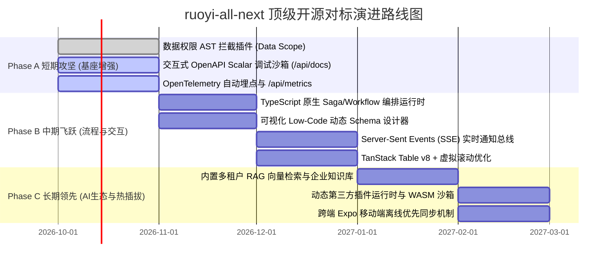

# 对标顶级开源项目差距深度分析与持续改进演进大典
# (Benchmark Gap Analysis & Continuous Evolution Strategy vs. Top-Tier Open-Source Projects)

> **基准版本**: ruoyi-all-next v1.1.0 Enterprise Baseline  
> **对比标杆矩阵**: Supabase (80k★), MedusaJS v2 (27k★), ruoyi-vue-pro (25k★), Directus (30k★), Refine (29k★), Strix (60k★)  
> **核心战略**: 高阶反向思维 (High-Order Inverse Thinking) × 空间站级质量工程 (SpaceX-Grade Engineering) × 持续演进与雷达追踪 (Continuous Radar)  
> **维护协议**: 纳入 CMMI 03_design 架构资产与 OpenWiki 知识库，随上游雷达与版本迭代持续更新。

---

## 一、 对标项目阵列与核心特征画像

为了实现从“传统中后台管理系统”向“世界级 AI-Native 企业级全栈研发基座”的跨越，我们遴选了全球及国内顶尖开源项目进行多维对标：

```mermaid
quadrantChart
    title 开源项目综合能力象限 (架构纯洁度 vs. 企业级业务成熟度)
    x-axis 低企业业务覆盖 --> 高企业业务覆盖 (17+ 业务域)
    y-axis 传统架构/臃肿 --> 现代轻量/AI-Native
    quadrant-1 终极目标 (ruoyi-all-next 演进目标)
    quadrant-2 技术敏捷先锋 (Supabase, MedusaJS)
    quadrant-3 传统单体/早期框架
    quadrant-4 传统企业重型底座 (ruoyi-vue-pro)
    "ruoyi-all-next (当前)": [0.72, 0.78]
    "ruoyi-vue-pro": [0.92, 0.42]
    "Supabase": [0.35, 0.90]
    "MedusaJS v2": [0.55, 0.85]
    "Directus": [0.48, 0.75]
    "Refine": [0.30, 0.80]
```

| 标杆项目 | 核心定位与技术栈 | 核心优势 (值得深度吸收) | 主要短板 / 妥协 |
|---|---|---|---|
| **Supabase**<br/>(80k★) | 基于 Postgres 的开源 Firebase 替代 (BaaS) | • 卓越的本地开发体验 (Supabase CLI)<br/>• 原生 Realtime CDC 数据库变更监听广播<br/>• 内置 pgvector 向量检索与 AI 亲和力<br/>• 极其优雅的 Studio Web 管理控制台 | • 业务偏底层通用 BaaS，缺乏垂直领域业务模型 (无 ERP/WMS/MES)<br/>• 强绑定 PostgreSQL，难以兼容国产信创库 |
| **MedusaJS v2**<br/>(27k★) | 现代 Node/TS Headless 数字化商业引擎 | • `@medusajs/workflows-sdk` 可逆 DAG 工作流与补偿事务 (Saga)<br/>• 彻底的第一方与第三方模块化隔离架构<br/>• 极致的 TypeScript 类型推导与 DTO 契约 | • 业务模型局限于电商零售场景<br/>• 学习曲线陡峭，工作流编写心智负担较重 |
| **ruoyi-vue-pro**<br/>(25k★) | 国内 Java 领域最完整的企业级微服务/单体基座 | • 17 大业务域与千张工业级数据表真实沉淀<br/>• 完整的 Flowable BPMN 2.0 可视化审批流与转派<br/>• 严密的数据权限 (`@DataPermission` 部门树拦截)<br/>• 丰富的短信/支付网关与第三方对接 | • Java 虚拟机资源消耗极大，冷启动动辄 30~60 秒<br/>• 强依赖外部重型中间件 (MySQL, Redis, Nacos, RocketMQ)，无法实现单机零配置秒级预览 |
| **Directus**<br/>(30k★) | 零代码/低代码 Headless 数据资产平台 | • 极其强大的可视化数据表与字段构建器<br/>• 丰富的字段展示控件与动态表单布局<br/>• 细粒度的行级与字段级权限配置界面 | • 偏数据层与内容管理，缺乏复杂业务状态机与并发防超卖控制 |
| **Refine**<br/>(29k★) | 现代 React 企业级中后台框架 | • 统一的数据 Provider 抽象 (REST/GraphQL/Kysely)<br/>• 深度整合 TanStack Table v8 与虚拟滚动<br/>• 现代化设计系统与自适应响应式布局 | • 仅为纯前端解决方案，无后端数据一致性保障与事务底座 |
| **Strix**<br/>(60k★) | 多智能体自主红队渗透测试平台 | • 多智能体协同漏洞挖掘与动态 PoC 验证<br/>• CVSS 风险量化评分与自动化修复建议 | • 属于安全审计垂直工具，非通用业务框架 |

---

## 二、 现状全景对比：我们的优势与差距

经过近期的深度重构，`ruoyi-all-next` 在许多技术维度已经超越了传统标杆，但在业务支撑深度、可视化工具链和长流程编排上依然存在明显差距。

### 2.1 当前已具备的核心领先优势 (Our Strengths)
1. **极致轻量与零配置冷启动**：
   - 内置嵌入式 SQLite C 引擎 (WAL 模式)，内存直驱，冷启动时间 `<50ms`，单端口 (3200) 运行，全栈同构；相比 `ruoyi-vue-pro` 节约 90% 的本地调试算力开销。
2. **Kysely AST 全局自动多租户注入**：
   - 在语法树 AST 层面自动注入 `tenant_id`，杜绝传统 SQL 字符串拼接失误导致的串租户重大隐患；同时一行配置无缝切换 MySQL、PostgreSQL 与达梦信创库。
3. **AI-Driven 全链路工程闭环与 CMMI 01~09 标准**：
   - 38 个高质量原生 Skill、14 个 stdio MCP 探针工具、324 份机器可读 API 契约与 Page Schema，具备业界领先的数字员工自主运营与代码生成能力。
4. **100% 真实数据库测试与反假 Mock 铁律**：
   - 杜绝空洞的 `expect(true).toBe(true)`，全套测试由真实 SQLite WAL 实例驱动，覆盖并发 CAS 防超卖与复杂状态机迁移。

---

### 2.2 核心差距与短板深度剖析 (The Critical Gaps)

#### 差距 1：缺乏轻量级 TypeScript 原生 Saga / Workflow 工作流引擎
- **标杆表现**：
  - `ruoyi-vue-pro` 内置 Flowable BPMN 2.0，支持会签、或签、退回、任意节点撤回与审批历史流转；
  - `MedusaJS v2` 提供了代码级可逆 DAG 工作流引擎，一个业务长事务包含 `step1.run -> step2.run -> step3.run`，当 `step3` 失败时，引擎自动以逆序执行 `step2.compensate -> step1.compensate`，保证分布式最终一致性。
- **当前现状**：
  - `plugin-bpm` 目前仅有基础表结构与 CRUD 桩代码，缺乏能在 Node.js/TypeScript 运行时中真正驱动长事务、状态流转与补偿回滚的 DAG 编排引擎。
- **业务痛点**：跨域复杂业务（如商城下单：扣库存 -> 冻结优惠券 -> 唤起支付 -> 通知供应商）一旦中途网络超时，缺乏确定性的自动补偿恢复能力。

#### 差距 2：尚未在 AST 层面落地部门级/层级细粒度数据权限 (Data Scope ABAC)
- **标杆表现**：
  - `ruoyi-vue-pro` 具备成熟的 `@DataPermission` 数据范围拦截体系，支持：
    1. 全部数据权限；
    2. 本部门及以下数据权限；
    3. 本部门数据权限；
    4. 仅本人数据权限；
    5. 自定义部门树数据权限。
    MyBatis 拦截器会根据登录用户的角色自动在 SQL 尾部拼装 `WHERE dept_id IN (...)`。
- **当前现状**：
  - 当前系统已实现基于 `tenant_id` 的租户隔离与基于权限标识的接口级 RBAC，但针对同一租户内部「张三只能看研发一部的工单，李四能看全公司工单」的组织架构数据范围拦截，目前尚未下沉至 Kysely 插件层，仍需业务 Service 手写判断。

#### 差距 3：缺少可视化低代码表单/表格实时设计器与虚拟滚动
- **标杆表现**：
  - `Directus` 与 `Supabase Studio` 提供了卓越的零代码数据资产管理体验，管理员可直接在界面上拖拽字段控件、定义校验规则与调整列表展示列；
  - `Refine` 原生接入 TanStack Table v8 结合 `@tanstack/react-virtual`，支持 10 万行数据集的毫秒级渲染与无限滚动。
- **当前现状**：
  - 当前 Admin 端主要由 `generate-admin-pages.cjs` 静态派发代码驱动，虽然有 324 个 Page Schema，但缺少可视化编辑面板；大表格在渲染大量复杂嵌套组件时，未做 DOM 虚拟化缓冲。

#### 差距 4：缺乏原生 OpenTelemetry (OTel) 分布式链路追踪与应用性能监控 (APM)
- **标杆表现**：
  - 现代云原生企业中后台（如 Signoz / Grafana 生态）在 HTTP 入口、ORM 数据查询、消息队列消费时自动注入与提取 W3C `traceparent`，并暴露标准 Prometheus 格式 `/metrics`。
- **当前现状**：
  - 虽然建立了 SRE SLO 矩阵与 26k RPS 压测，但应用代码内部的 Trace ID 传递仅停留在部分 Header 校验，尚未接入标准的 OpenTelemetry SDK 探针，缺少对慢 SQL 和下游 RPC 的毫秒级 Span 采样追踪。

#### 差距 5：系统内部缺乏多租户 RAG 知识库与本地向量检索
- **标杆表现**：
  - `Supabase` 原生集成 `pgvector`；现代企业中后台（如 Dify、FastGPT）原生内置文档解析、向量化嵌入与多租户隔离知识库问答。
- **当前现状**：
  - 本项目为外部 AI Agent 提供了极为完善的 Skills (38) 与 MCP (14)，但在系统内部，`plugin-ai` 尚缺少租户文档上传、切片、向量存储（如 SQLite 内置 `sqlite-vec` / Postgres `pgvector`）与私有知识库问答的开箱即用闭环。

#### 差距 6：缺乏轻量级实时流式长连接推送 (Realtime SSE / WebSocket)
- **标杆表现**：
  - `Supabase Realtime` 支持基于 Postgres CDC 实时向下游 WebSocket 广播表级变更；`PocketBase` 原生内置 SSE 实时订阅。
- **当前现状**：
  - 当前跨域事件主要依赖内存总线 `broker` 与外部 NATS 适配器，浏览器客户端大多采用短轮询，缺乏轻量级、开箱即用的 Server-Sent Events (SSE) 或 WebSocket 实时通道。

#### 差距 7：缺少交互式 OpenAPI 3.1 在线调试沙箱
- **标杆表现**：
  - FastAPI / NestJS / Supabase 均提供优雅的交互式 API 控制台（如 Scalar 或 Swagger UI），开发者进入 `/api/docs` 可以一键填入 Token 并在浏览器直接发起真实的 HTTP 请求与参数调试。
- **当前现状**：
  - 本项目虽然聚合了 324 份机器可读的 API 契约和 route manifest，但尚未在 `/api/docs` 提供类似 Scalar / Swagger 的可视化可交互在线沙箱。

---

## 三、 持续演进路线图与阶段攻坚任务表 (Evolution Roadmap)

针对上述 7 大核心差距，制定 3 个迭代周期的工程攻坚路线：



### 3.1 阶段 A：短期攻坚（企业基座硬核加固）
| 序号 | 改进项 | 对标项目 | 核心技术方案 | 预期验收指标 |
|---|---|---|---|---|
| **A1** | **Kysely AST 数据权限插件** | `ruoyi-vue-pro` 数据权限 | 编写 Kysely Data Scope 插件，从当前 Context 提取用户部门及权限树，自动在查询 AST 拼接 `dept_id IN (...)` 或 `created_by = ?` | 单元测试验证不同数据范围用户查询同一表返回不同行集，100% 数据库级别隔离 |
| **A2** | **交互式 OpenAPI 3.1 调试沙箱** | FastAPI / Scalar / Swagger | 集成 `@scalar/nextjs-api-reference`，在 `/api/docs` 挂载交互式控制台，支持自动读取 324 份契约并注入 JWT 实时试运行 | 开发者访问 `/api/docs` 即可秒级调试任意 API，无需 Postman |
| **A3** | **OpenTelemetry 原生埋点** | Signoz / OpenTelemetry | 在 `withAdminRoute` 与 `kysely-client` 挂载 OTel Tracer，输出 W3C `traceparent` 与 Prometheus `/api/metrics` | 每次请求记录 SQL 与 Service 耗时 Span，Prometheus 探针退出码 0 |

### 3.2 阶段 B：中期飞跃（复杂长流程与现代化交互）
| 序号 | 改进项 | 对标项目 | 核心技术方案 | 预期验收指标 |
|---|---|---|---|---|
| **B1** | **TS 原生可逆 Saga/Workflow 引擎** | `MedusaJS v2` Workflows | 设计极简声明式 DAG 工作流运行器，每个 Step 包含 `run` 与 `compensate`，支持持久化检查点与失败逆向回滚 | 模拟库存扣减失败，验证订单与优惠券自动反向冲正补偿 |
| **B2** | **可视化 Low-Code 动态 Schema 编辑器** | `Directus` / `Supabase Studio` | 在 Admin 端挂载可视化表单与表格字段配置器，修改直接写入 Page Schema 并热生效 | 运营人员可在界面直接调整字段排序、隐藏/展示与校验规则 |
| **B3** | **Server-Sent Events 实时流式通知** | `Supabase Realtime` | 挂载 `/api/v1/realtime/sse` 端点，结合 `broker` 事件总线将系统公告、审批代办与支付结果秒级推向客户端 | 客户端无需轮询，事件毫秒级抵达前端并触发 Toast 提醒 |
| **B4** | **TanStack Virtual 虚拟滚动支持** | `Refine` | 表格组件升级支持 `@tanstack/react-virtual`，支持视口动态渲染与 DOM 回收 | 10 万行数据集滚动帧率稳定在 60 FPS，内存占用不随行数膨胀 |

### 3.3 阶段 C：长期领先（原生 AI 商业化与动态生态）
| 序号 | 改进项 | 对标项目 | 核心技术方案 | 预期验收指标 |
|---|---|---|---|---|
| **C1** | **内置多租户 RAG 向量知识库** | `Supabase pgvector` / `Dify` | 基于 SQLite 扩展 (`sqlite-vec`) 或 Postgres `pgvector` 构建租户私有向量存储与分块混合检索 | 租户上传 PDF/Markdown 后，可通过对话 API 进行精确溯源问答 |
| **C2** | **动态插件沙箱与市场** | `Strapi Plugins` | 允许运行时通过 Webhook 或 CLI 安装独立 npm 插件，并在 Node.js Worker 隔离沙箱中加载执行 | 安装新插件无需重新执行 `pnpm build` 与重启容器服务 |
| **C3** | **Expo 跨端离线优先同步** | `Supabase Offline` / `WatermelonDB` | 移动端本地持久化 SQLite，断网时仍可录入巡检与工单，网络恢复时经由版本号自动解决冲突并双向平账 | 离线创建工单，联网后自动上报并保持版本序列一致 |

---

## 四、 持续追踪与演进保障机制

为确保本对比与改进体系**活在工程中，而非停留在纸面上**，系统通过以下自动化工具链保持持续追踪：

1. **上游开源雷达定期巡检**：
   - 运行 `npm run upstream:radar`，自动扫描 8 大上游依赖与安全补丁，产出更新报告；
2. **演进待办与门禁证据聚合**：
   - 运行 `npm run evolution:backlog`，自动收集全仓质量门禁状态并生成 `evolution-backlog.json`；
3. **OpenWiki 架构词条双向同步**：
   - 本大典与 OpenWiki 架构词条深度互链，保证 AI Agent 进场时自动感知当前演进阶段与未决待办，绝不发生认知漂移。
