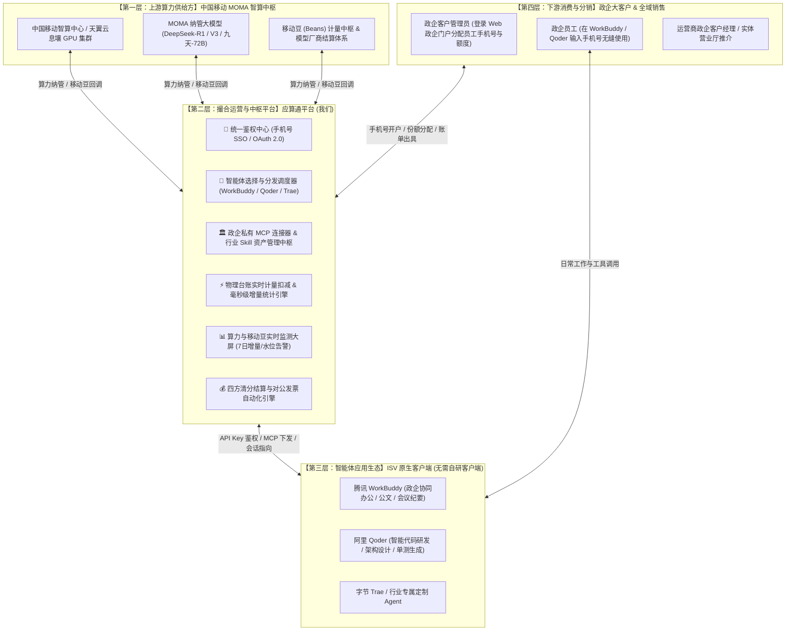
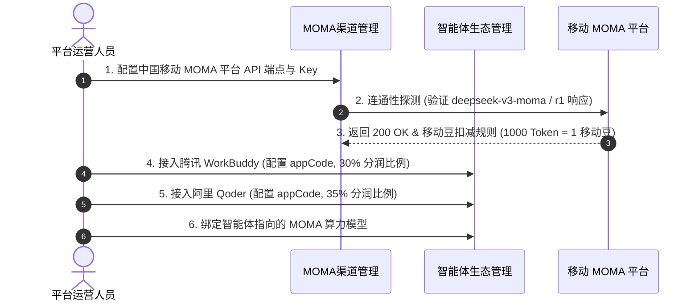
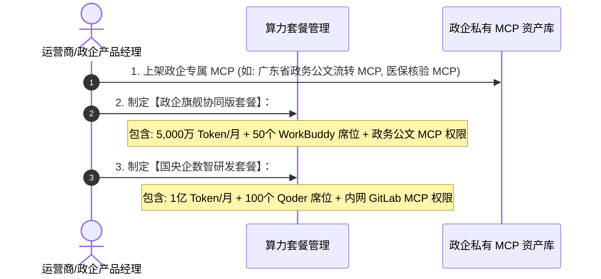
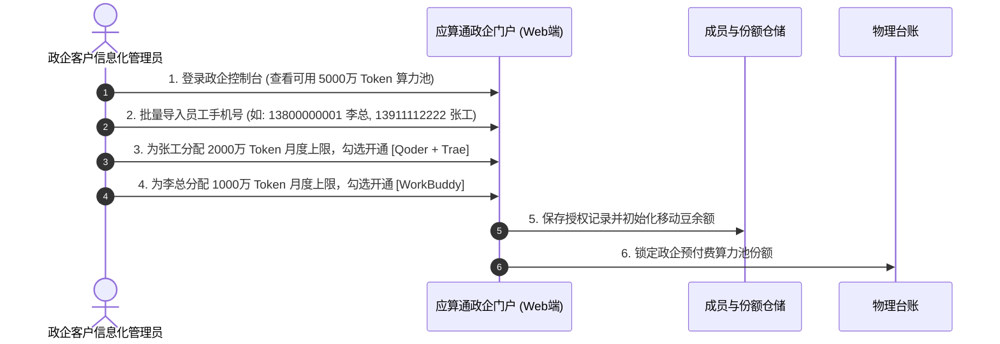
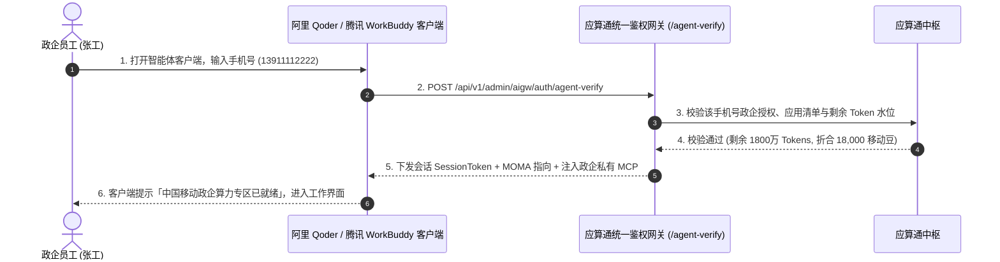
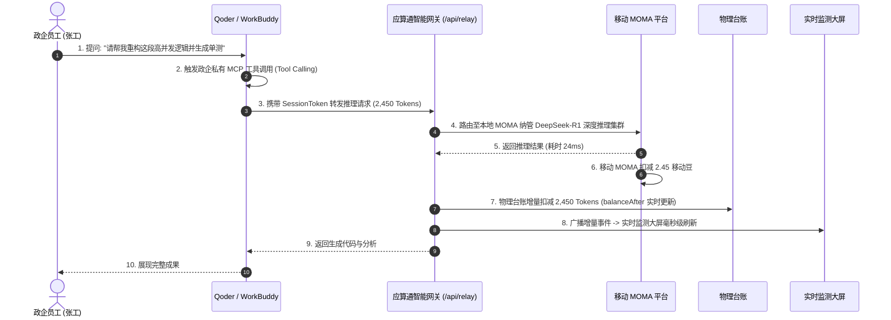
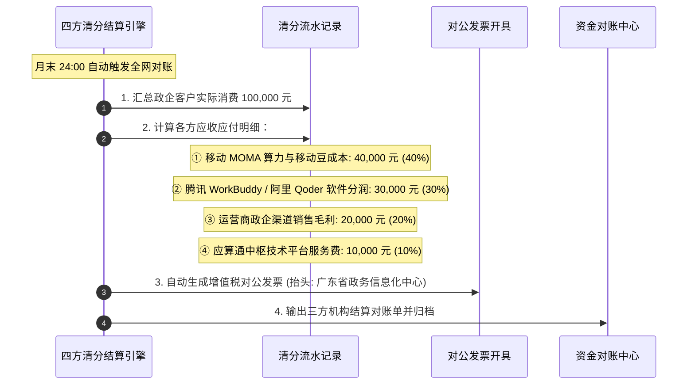

# 「应算通」AI 算力与智能体中枢平台——全景业务运行流程白皮书

本文档确立了**「应算通」**在**中国移动 MOMA 平台**、**智能体应用生态 (ISV)** 与 **政企客户** 之间的权威中枢定位与 6 大端到端核心运行业务流程。

---

## 1. 核心定位与四层架构全景图 (Authoritative 4-Layer Topology)

---

## 2. 六大端到端核心运行业务流程

---

### 流程一：供给侧通道入驻与 ISV 生态接入流程

运营人员在平台配置上游算力与接入下游智能体软件：

---

### 流程二：套餐打包与政企私有 MCP 资产上架流程

将通用模型算力包装为具备行业壁垒的「政企融合解决方案」：

---

### 流程三：政企签约开户与手机号份额分配流程（Web 门户）

政企大客户签约后，管理员在 Web 端完成员工手机号导入与额度授权：

---

### 流程四：第三方客户端手机号 SSO 统一鉴权流程

政企员工打开第三方智能体客户端，通过手机号秒级鉴权并自动挂载算力与 MCP：

---

### 流程五：日常交互、工具调用 (Tool Calling) 与毫秒级扣减流程

员工日常使用智能体，流量透明回流，产生精准计量与大屏呈现：

---

### 流程六：月末四方自动清分与对公发票结算流程

月末系统全自动完成各方分润对账，杜绝人工坏账：

---

## 3. 运营与技术关键指标 (SLO)

1. **统一鉴权延迟**：P99 < 50ms（手机号秒级无感验权）；
2. **算力路由转发额外开销**：< 10ms（纯流式透明转发）；
3. **计量削峰防击穿**：采用物理台账 + 增量聚合缓冲，支持 10万+ QPS 并发实时扣减；
4. **清分对账准确率**：100% 具备物理流水凭证（`aigw_tenant_quota_ledger` 严格一一对应）。
