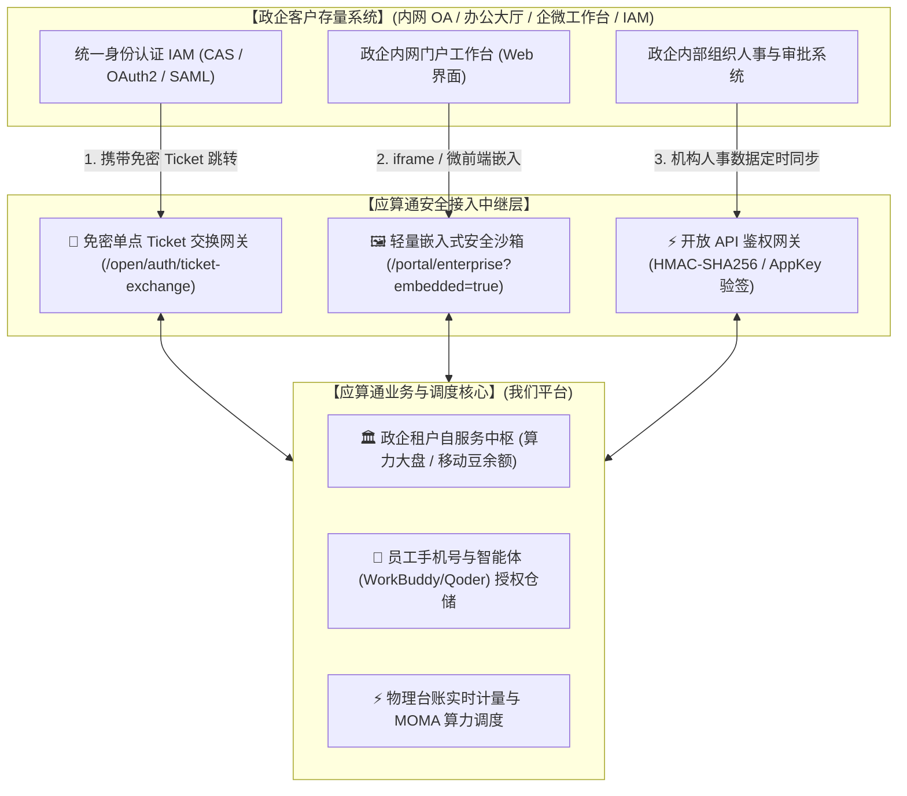
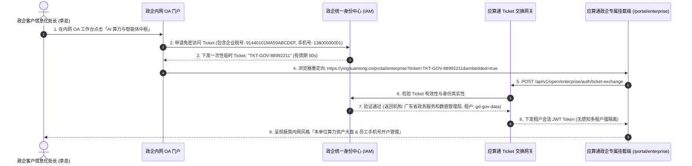
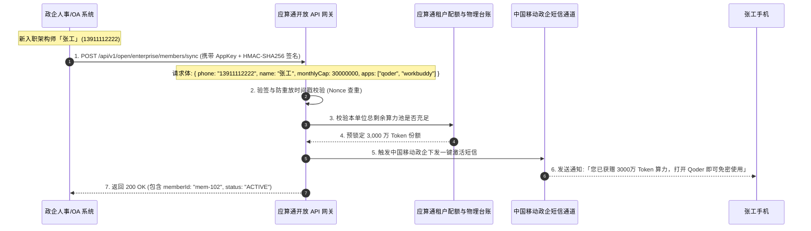
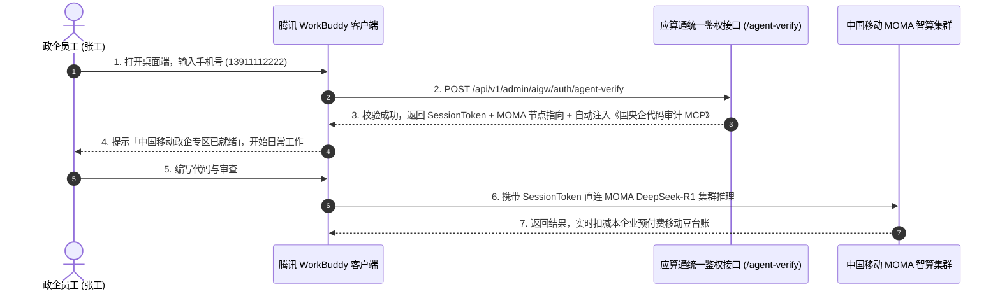

# 「应算通」政企存量系统集成挂载与开放 API 对接规范白皮书

本文档确立了**「应算通」**与**政企客户存量系统（内网 OA、政务一体化办公大厅、企业微信/钉钉工作台、统一身份认证 IAM）**的集成挂载规范、免密单点登录（SSO）协议、时序交互流转及全套 OpenAPI 契约。

---

## 1. 架构定位与三种挂载模式 (Integration Topology)

为避免政企管理员和员工登录多套系统，应算通与政企存量系统完全解耦，支持以下三种无缝集成模式：



| 接入模式 | 适用政企场景 | 用户体验 | 改造工作量 |
|---|---|---|---|
| **模式一：免密单点登录 (SSO)** | 存量政务大厅、内网统一门户已有菜单体系 | 在政企门户点击「AI 算力中枢」，免密 1 秒进入自服务工作台 | **0.5 人天** (配置单点跳转 URL) |
| **模式二：iframe / 微前端嵌入** | 企微工作台、钉钉微应用、政企内网 OA 工作台 | 内嵌于政企系统内部，自动隐藏顶栏侧栏，视觉风格 100% 融入 | **0.5 人天** (内嵌 iframe URL) |
| **模式三：无头开放 API (Headless API)** | 国央企有专属自研前端，要求界面完全自研 | 政企系统直接调用 REST API，数据完全由其自身 UI 渲染 | **2 人天** (调用 4 个 API 接口) |

---

## 2. 端到端核心交互时序图 (Mermaid Sequence Diagrams)

---

### 时序图一：政企员工从内网 OA 免密进入自服务门户



---

### 时序图二：政企人事系统通过 OpenAPI 自动同步员工并开通算力



---

### 时序图三：员工打开 WorkBuddy 客户端，手机号自动关联政企算力



---

## 3. OpenAPI 接口详细契约规范

### 1. 免密单点 Ticket 交换接口

* **接口路径**：`POST /api/v1/open/enterprise/auth/ticket-exchange`
* **接口职责**：政企存量门户免密跳转至挂载自服务页面时，用临时 Ticket 换取租户 JWT。
* **请求头**：`Content-Type: application/json`

#### 请求参数 (Request JSON)：
```json
{
  "ticket": "TKT-GOV-88992211",
  "enterpriseTaxCode": "91440101MA59ABCDEF",
  "timestamp": 1787570000000
}
```

#### 响应报文 (Response JSON)：
```json
{
  "success": true,
  "data": {
    "accessToken": "eyJhbGciOiJIUzI1NiIsInR5cCI6IkpXVCJ9...",
    "expiresIn": 86400,
    "enterprise": {
      "id": "ent-gd-gov",
      "code": "gd-gov-data",
      "name": "广东省政务服务和数据管理局",
      "creditCode": "11440000MB2D00001X",
      "tokensTotal": 100000000,
      "tokensRemain": 82000000,
      "momaBeansRemain": 82000,
      "seatsTotal": 100,
      "seatsUsed": 45
    },
    "operator": {
      "name": "李总",
      "phone": "13800000001",
      "role": "TENANT_ADMIN"
    }
  }
}
```

---

### 2. 查询本单位算力资产与月度账单大盘

* **接口路径**：`GET /api/v1/open/enterprise/quota/summary`
* **接口职责**：政企 OA 门户直接调用，用于在政企工作台看板上展示算力与移动豆水位。
* **请求头**：`Authorization: Bearer <accessToken>`

#### 响应报文 (Response JSON)：
```json
{
  "success": true,
  "data": {
    "enterpriseName": "广东省政务服务和数据管理局",
    "tierName": "旗舰智算融合套餐 (月包)",
    "tokensTotal": 100000000,
    "tokensUsed": 18000000,
    "tokensRemain": 82000000,
    "usagePercent": 18.0,
    "momaBeansBalance": 82000,
    "seatsTotal": 100,
    "seatsAssigned": 45,
    "seatsActive": 38,
    "monthlyBillAmount": 50000.00,
    "currentMonthExpireAt": "2026-08-31T23:59:59.000Z",
    "boundMcps": [
      { "code": "mcp-gov-document", "name": "国家标准红头公文排版与合规审计", "version": "v2.1" },
      { "code": "mcp-meeting-wework", "name": "腾讯会议速记与企微待办任务派发", "version": "v1.4" }
    ]
  }
}
```

---

### 3. 批量同步/开通员工手机号算力授权

* **接口路径**：`POST /api/v1/open/enterprise/members/sync`
* **接口职责**：政企人事系统或管理员批量为员工手机号开通 WorkBuddy / Qoder 权限与月度算力额度。
* **请求头**：`Authorization: Bearer <accessToken>`

#### 请求参数 (Request JSON)：
```json
{
  "members": [
    {
      "phone": "13911112222",
      "name": "张工",
      "deptName": "核心数智研发中心",
      "role": "首席架构师",
      "allowedApps": ["qoder", "workbuddy"],
      "monthlyTokenCap": 30000000,
      "sendSmsNotification": true
    },
    {
      "phone": "13766668888",
      "name": "王主任",
      "deptName": "综合行政办",
      "role": "行政主任",
      "allowedApps": ["workbuddy"],
      "monthlyTokenCap": 10000000,
      "sendSmsNotification": true
    }
  ]
}
```

#### 响应报文 (Response JSON)：
```json
{
  "success": true,
  "data": {
    "totalCount": 2,
    "successCount": 2,
    "failedCount": 0,
    "items": [
      { "phone": "13911112222", "name": "张工", "status": "ACTIVE", "memberId": "mem-101" },
      { "phone": "13766668888", "name": "王主任", "status": "ACTIVE", "memberId": "mem-102" }
    ]
  }
}
```

---

### 4. 调整单个员工月度 Token 上限

* **接口路径**：`POST /api/v1/open/enterprise/members/adjust-quota`
* **请求头**：`Authorization: Bearer <accessToken>`

#### 请求参数 (Request JSON)：
```json
{
  "phone": "13911112222",
  "monthlyTokenCap": 50000000,
  "reason": "重大攻坚项目算力临时扩容"
}
```

#### 响应报文 (Response JSON)：
```json
{
  "success": true,
  "data": {
    "phone": "13911112222",
    "name": "张工",
    "previousCap": 30000000,
    "newCap": 50000000,
    "remainTokens": 38000000
  }
}
```

---

## 4. 安全风控与防伪造机制 (Security Specification)

1. **接口签名机制 (HMAC-SHA256)**：
   政企服务端与 OpenAPI 交互时，所有请求均通过 `X-Signature` 验签：
   $$\text{Signature} = \text{HMAC-SHA256}(\text{AppSecret}, \text{Method} + "\&" + \text{URI} + "\&" + \text{Timestamp} + "\&" + \text{Nonce} + "\&" + \text{Body})$$
2. **防重放攻击 (Anti-Replay Protection)**：
   每次请求必须携带 `X-Timestamp` (有效时间差 $\le 300$ 秒) 与 `X-Nonce` (Redis 缓存 10 分钟唯一排重)；
3. **物理多租户隔离约束 (Tenant Isolation)**：
   OpenAPI 与自服务挂载端通过 JWT 强制注入 `tenant_id`，查询与写入物理级隔离，**杜绝任何跨租户数据泄露**。
