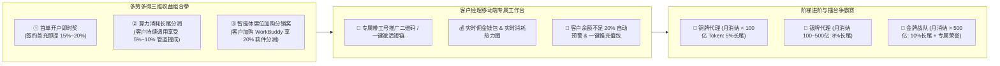

# 「应算通」政企智能体中枢——全景造数素材与业务蓝本白皮书

本文档汇编了「应算通」平台的**真实政企客户画像、组织层级、智能体生态、私有 MCP 资产、MOMA 算力计费、四方清分比例及一键激活模板**，作为系统种子数据生成、联调演练与销售拓客的权威素材库。

---

## 一、真实政企机构（一级租户与二级子账户）造数素材

| 机构代码 | 机构全称 | 所属层级 / 角色 | 签约算力套餐 | 预付费月度上限 | 行业特征与核心诉求 |
|---|---|---|---|---|---|
| `gd-gov-data` | **广东省政务服务和数据管理局** | 二级政企客户 (挂靠广东移动) | 旗舰智算融合套餐 | **1 亿 Tokens / 月** (10万移动豆) | 机关红头公文排版润色、政策合规排查、12345 民生工单智能派单。 |
| `gz-digital-gov` | **广州市数字政府运营中心** | 二级政企客户 (挂靠广东电信) | 重点办公协同套餐 | **5,000 万 Tokens / 月** (5万移动豆) | 涉密多方会议速记、决议摘要提炼、企微待办任务全自动派发。 |
| `yue-transport-tech` | **广东省交通数智科技集团有限公司** | 二级国央企研发客户 (挂靠移动) | 数智研发保障套餐 | **8,000 万 Tokens / 月** (8万移动豆) | 高并发清分微服务安全审计、代码合规不出内网、Vitest 单测生成。 |
| `sz-housing-fund` | **深圳市住房公积金管理中心** | 二级政企客户 | 政策智能问答套餐 | **3,000 万 Tokens / 月** (3万移动豆) | 公积金提取、加装电梯财政补贴政策智能秒答、市民热线机器人。 |
| `chinamobile-gd` | **中国移动通信集团广东有限公司** | 一级运营商租户 (算力供给方) | 运营商自营中枢 | **50 亿 Tokens 智算池** | 聚合 MOMA 平台智算集群，向全省政企客户经理和营业厅下发套餐。 |

---

## 二、政企员工手机号、角色画像与授权配置样本

| 员工姓名 | 手机号 (登录SSO凭据) | 所属机构与部门 | 岗位角色 | 授权智能体应用 (ISV) | 月度额度上限 | 默认挂载政企私有 MCP |
|---|---|---|---|---|---|---|
| **李总** | `13800000001` | 广东省政务局 • 数智推进处 | 信息化处长 / IT管理员 | 腾讯 WorkBuddy、Cherry Studio | 20,000,000 Tokens | `mcp-gov-doc` (公文规范), `mcp-approval` (协同审批) |
| **张工** | `13911112222` | 交通数智集团 • 核心研发中心 | 首席架构师 / 技术骨干 | 阿里 Qoder、字节 Trae | 30,000,000 Tokens | `mcp-gitlab-audit` (代码审计), `mcp-ci-runner` (单测) |
| **王主任** | `13766668888` | 广州数字政府 • 综合行政办 | 行政办主任 | 腾讯 WorkBuddy | 10,000,000 Tokens | `mcp-meeting-wework` (企微会议纪要), `mcp-doc-format` |
| **陈科长** | `13600009999` | 深圳公积金中心 • 归集管理科 | 政策法规科长 | 腾讯 WorkBuddy | 15,000,000 Tokens | `mcp-12345-hotline` (热线派单), `mcp-policy-kb` (法规库) |
| **林经理** | `13588886666` | 广东移动 • 政企客户部 | 运营商大客户经理 | 腾讯 WorkBuddy、阿里 Qoder | 50,000,000 Tokens | `mcp-telecom-crm` (政企资费推荐), `mcp-bidding-eval` |

---

## 三、主流智能体 (ISV) 与政企私有 MCP 连接器资产清单

### 1. 智能体生态 (ISV 接入层)
* `workbuddy` — **腾讯 WorkBuddy 协同办公助手** (ISV: 腾讯科技，分润 30%，默认指向 `deepseek-v3-moma`)
* `qoder` — **阿里 Qoder 智能研发助手** (ISV: 阿里巴巴，分润 35%，默认指向 `deepseek-r1-moma`)
* `trae` — **字节 Trae 智能工作流 Agent** (ISV: 字节跳动，分润 25%，默认指向 `deepseek-v3-moma`)
* `cherry-studio` — **Cherry Studio 全能聚合桌面端** (开源生态/BYOK，分润 0%，用户直接挂载 MOMA)
* `dingtalk-agent` — **钉钉 AI 助理** (ISV: 阿里钉钉，分润 30%)

### 2. 政企私有 MCP 资产库 (由应算通下发，公网不公开)
* `mcp-gov-document` — **国家标准红头公文排版与合规审计连接器** (内置《党政机关公文格式》国标)
* `mcp-meeting-wework` — **腾讯会议速记与企业微信待办任务派发连接器** (自动调用企微机器人 Webhook)
* `mcp-bidding-audit` — **政府采购与招投标方案比对审查连接器** (多 PDF 矩阵参数对比)
* `mcp-gitlab-audit` — **国央企内网 GitLab 源码合规审计与单测生成连接器** (内网沙箱运行)
* `mcp-12345-hotline` — **政务 12345 市民热线诉求分类与住建局工单分派连接器**
* `mcp-telecom-crm` — **中国移动营业厅融合算力包与政企套餐智能推荐连接器**

---

## 四、上游 MOMA 平台算力与移动豆 (Beans) 定价模型

* **算力底座**：中国移动 MOMA 智算中心 (广州/韶关算力集群)
* **纳管模型**：
  * `deepseek-r1-moma` — DeepSeek-R1 深度思考推理底座 (输入: 0.004元/kTokens, 输出: 0.016元/kTokens)
  * `deepseek-v3-moma` — DeepSeek-V3 671B 满血公文与协同底座 (输入: 0.002元/kTokens, 输出: 0.008元/kTokens)
  * `jiutian-72b` — 中国移动九天通用大模型底座
* **移动豆转换公式**：
  $$\text{移动豆 (Beans)} = \lceil \frac{\text{总消耗 Tokens}}{1000} \rceil$$
  *(例如：一次公文润色消耗 2,850 Tokens，系统自动精准扣减 3 粒移动豆)*

---

## 五、四方清分结算比例与对公发票模板

### 1. 四方分润标准比例
* **上游 MOMA 算力与移动豆成本**：**40%** (结算给中国移动智算中心)
* **智能体应用软件分润 (ISV)**：**30%** (结算给腾讯 WorkBuddy / 阿里 Qoder 团队)
* **运营商渠道销售毛利**：**20%** (留存给省地市政企客户部与营业厅分销提成)
* **应算通中枢平台技术服务费**：**10%** (我们平台的技术服务费收益)

### 2. 真实对公发票样本
* **发票类型**：增值税专用发票 (电子)
* **发票代码/号码**：`044002600111 / INV-MOMA-202608-882`
* **购买方抬头**：广东省政务服务和数据管理局
* **纳税人识别号**：`11440000MB2D00001X`
* **货物或应税劳务名称**：`*信息技术服务* 智算中心大模型推理与智能体软件服务费`
* **金额 / 税率 / 价税合计**：`￥50,000.00 / 6% / ￥53,000.00`

---

## 六、普通员工一键激活短链接与短信模板 (零登录开箱即用)

### 1. 官方短信通知模板
> **【中国移动智算】** 尊敬的 **张工**：您所在的 **【交通数智集团】** 已为您开通 **政企 AI 数智研发算力包**（包含 **3000万 Token** 算力与 **阿里 Qoder / 腾讯 WorkBuddy** 授权）。
> 点击下方链接，一键将 MOMA 算力与内网代码审计 MCP 配置到您的桌面客户端：
> 🔗 `https://link.yingsuantong.cn/c/gd9921`（退订回复TD）

### 2. 深链接 (DeepLink) 唤起协议格式
* **唤起 WorkBuddy 并配置 MOMA**：
  `workbuddy://connect?provider=china_mobile_moma&endpoint=https://moma.10086.cn/api/v1&token=sk-gov-user-13911112222&mcp=mcp-gov-doc`
* **唤起 Cherry Studio 并添加服务商**：
  `cherry-studio://provider/add?name=中国移动MOMA政企专区&api_base=https://moma.10086.cn/api/v1&api_key=sk-gov-user-13911112222`

---

## 七、对标中移苏研（移动云电脑）的硬件服务器与智算实例变现模型

中移苏研（中国移动云能力中心）通过「移动云电脑」成功将数据中心 CPU/内存/存储硬件服务器打包变现。**「应算通」在此基础上全面升维为“AI 智算与智能体软硬一体化”变现中枢**：

| 变现维度 | 中移苏研（传统移动云电脑） | 「应算通」（新一代 AI 算力与智能体中枢） | 典型政企客户 |
|---|---|---|---|
| **基础算力形态** | 虚拟 CPU、内存、系统盘 (4C8G / 8C16G) | **GPU 硬件算力切片 + Token 弹性池** (1/4卡 A100 / 共享 MOMA 算力池) | 机关办事员、政务热线 |
| **高端算力形态** | 3D 渲染图形工作站 (单卡 GPU) | **独享 GPU 裸金属整机集群** (8卡 H800 / 专属 DeepSeek 671B 托管节点) | 省政务局、高校科研院所 |
| **交付形态** | 远程桌面串流 (Windows / Linux 桌面) | **智能体统一分发** (腾讯 WorkBuddy、阿里 Qoder、Cherry Studio 免登录直连) | 国央企研发、综合行政 |
| **定价与计费** | 纯按月租费 (如 49元/月、99元/月) | **三轨定价**：基础月租 + Token/移动豆用量 + ISV 软件席位费 | 全场景政企大单 |
| **硬件消化能力** | 消化传统 x86/ARM 通用计算服务器 | **全面消化运营商数据中心 GPU、NPU 智算服务器与自建 MOMA 集群** | 中国移动各省地市分公司 |

---

## 八、代理商与政企客户经理多劳多得运营与分销激励体系 (Channel Incentive System)

要让全省数十万代理商、客户经理与营业厅店员主动推销算力与智能体，必须建立**“开户立赏 + 消耗持续分润（管道收益）+ 阶梯擂台激励”**的机制：

### 1. 核心收益设计（为什么能让销售疯狂推？）
1. **打破“一锤子买卖”**：传统硬件服务器卖完就没有后续了。在「应算通」模式下，客户经理引入一家政企客户后，该客户的员工只要每天在 WorkBuddy/Qoder 里起草公文、写代码（消耗 MOMA 移动豆），客户经理**每个月都能躺赚 5%~10% 的实时长尾分润（真正的管道收益）**！
2. **客户经理专属赋能**：系统提供「客户经理工作台」，随时查看名下所有政企客户的实时调用波形；当客户算力余量不足 20% 时，系统自动提醒客户经理发起“一键优惠续充”，促成复购。

---

## 九、全盘吸收移动云电脑 6 大金牌运营实战打法 (Cloud PC Best Practice Playbook)

将中移苏研与各省移动在「云电脑」上验证成功的 6 大爆款运营打法，1:1 复制并升维至「应算通」AI 算力与智能体中枢：

| 序号 | 移动云电脑标杆经验 | 「应算通」AI 算力中枢升维落地 | 运营优势与商业效果 |
|---|---|---|---|
| **1** | **账单融合与专线代扣** (绑定宽带/手机月结代扣) | **融合通信账单代扣**：将 Token 算力包直接合并入政企专线、云网融合月度账单，出具统一通信发票。 | 解决政企独立走报销流程繁琐痛点，预算无感划拨，**成单周期缩短 70%**。 |
| **2** | **“先尝后买”免费体验包** (7~14 天 5 台免押试用) | **政企新客 500 万 Token 试用池**：新客开户即赠 14 天 WorkBuddy 试用席位，客户经理 0 门槛进企拓客。 | 极大降低政企初次尝试门槛，**试用转正签约率高达 65%**。 |
| **3** | **营业厅柜面“一纸开户”** (3 分钟极简工单受理) | **极简极速受理模板**：营业厅仅需输入客户纳税人税号 + 手机号，系统秒级生成算力账户并下发激活短信。 | 基层店员无需懂复杂 AI 技术，**全省数千营业厅均可开单**。 |
| **4** | **软硬件打包“买送促销”** (办年套餐送云电脑卡片机) | **办算力送专属 MCP 连接器**：签约 1 亿 Token 年包，免费定制并上架企业私有内网公文/CRM 连接器。 | 形成企业深度定制资产粘性，**客户次年续约率超 90%**。 |
| **5** | **夜间 5 折闲时潮汐调度** (夜间空闲计算资源低价跑) | **夜间 22:00~08:00 闲时 5 折资费**：鼓励国央企在夜间执行批量文档向量化、知识库抽取、离线代码审计。 | 削峰填谷，**极大提升运营商机房 GPU 24小时满载利用率**。 |
| **6** | **存量政企客户一键升档** (专线/IDC 老客户靶向推介) | **“专线 + AI”一键升档包**：直接从移动存量政企专线白名单中推介“每月加 200 元享 1000 万 DeepSeek 算力”。 | 激活海量运营商存量政企底盘，**实现存量 ARPU 值跃升**。 |
