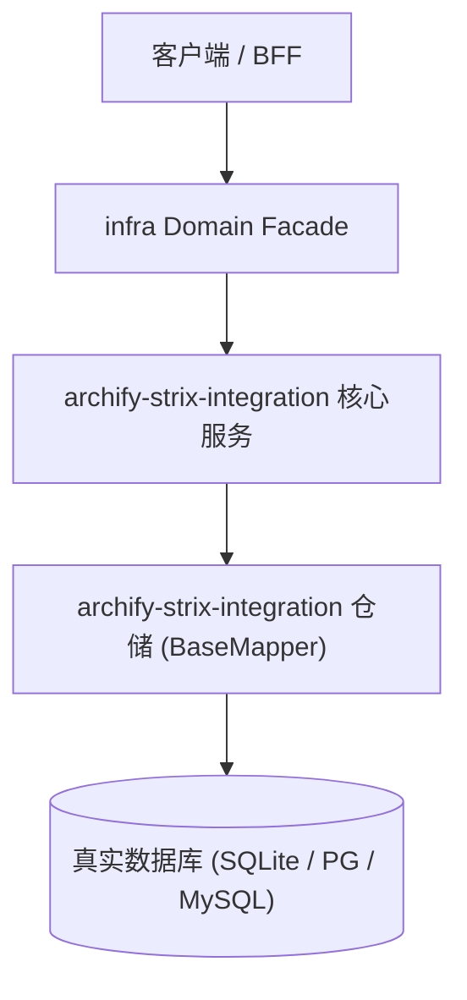

# Design: 开源顶流技能吸收：Archify 架构可视化与 Strix 自主渗透防御

上游：`requirements.md`（本设计严格支撑需求，不得反向修改需求定义）

## 1. 架构总览与拓扑边界

Archify 输出静态声明式 JSON 与单文件交互 HTML，挂载于 docs/03_design/diagrams/；Strix 作为外部红队智能体靶向测试本地 BFF 与插件路由，防御基线与测试结果收敛至 docs/architecture/artifacts/。

## 2. 数据模型与持久化契约

- **-**: 本特性为基础设施技能与安全架构增强，不涉及业务表新建

## 3. 交互与状态机流转

- 加载中：HTML 原生自包含 JS/CSS 瞬时渲染，无外部 CDN 依赖
- 空数据：拓扑图内置 17 领域完整全息数据
- 出错：若 JSON 格式损坏控制台给出明确解析报错
- 无权限：架构图面向内部团队公开

## 4. 容错与防御设计

- **风险**: 外部容器工具体积过大占用空间 -> **缓释策略**: 遵循容器环境与宿主机穿透准则，不在本仓库内存储任何镜像层或大二进制包
