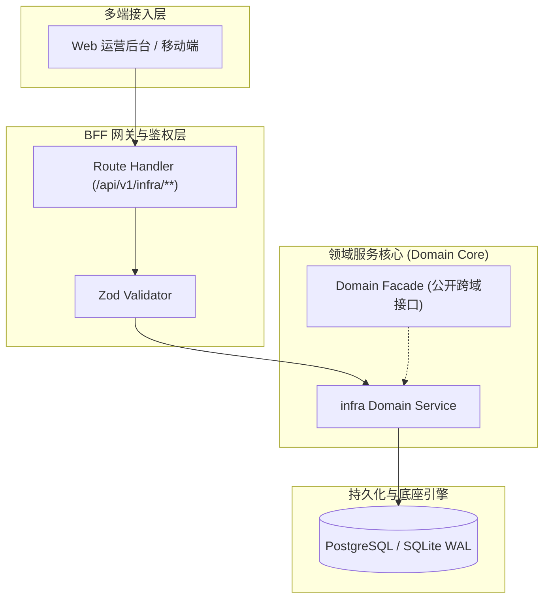

# Design: 开源顶流技能吸收：Archify 架构可视化与 Strix 自主渗透防御

上游：`requirements.md`（本设计严格支撑需求，不得反向修改需求定义）

## 1. 架构总览与组件边界 (Architecture & Component Boundaries)

Archify 输出静态声明式 JSON 与单文件交互 HTML，挂载于 docs/03_design/diagrams/；Strix 作为外部红队智能体靶向测试本地 BFF 与插件路由，防御基线与测试结果收敛至 docs/architecture/artifacts/。

## 2. 数据模型 (Data Models)

| 表名 | 说明 | 租户隔离策略 | 审计底座 |
|---|---|---|---|
| `-` | 本特性为基础设施技能与安全架构增强，不涉及业务表新建 | Strict tenant_id | 8 大审计列在位 |

> **表定义真源**：低代码元数据与 Prisma Migrations（AGENTS §9.5），不手写破坏性 DDL。

## 3. 关键不变量与状态机守卫 (Invariants & State Guards)

1. **真实防御纵深不变量** —— 无论外部如何伪造请求头或制造并发竞争，Kysely AST 租户隔离与 CAS 乐观锁防线严格不可穿透

## 4. 接口契约与错误语义 (API Contracts & Error Semantics)

- **成功响应**：统一返回 `{ success: true, data: T }`
- **400 Bad Request**：参数缺失或 Zod Schema 校验不通过
- **401 Unauthorized**：未认证或 Token 过期失效
- **403 Forbidden**：缺乏对应权限码 (Permission Code)
- **409 Conflict**：并发乐观锁版本冲突 (`version` 漂移)

## 5. UI 与交互要点 (UI & Interactions)

* Archify 交互式单文件 HTML 架构图（docs/03_design/diagrams/ruoyi-architecture.arch.html），支持点击节点高亮链路、按领域过滤与组件拖拽

## 6. SRE 与运维保障 (SRE & Operations)

* 门禁链：npm run check 验证门禁合规与 OpenWiki 百科同步
* 压测基准：test/load/k6-load-benchmark.js 支持本地与 CI 自动化压测执行
* 红队渗透：host-exec 穿透调用 ghcr.io/usestrix/strix-sandbox:latest 容器

## 7. 风险评估与缓解对策 (Risks & Mitigations)

| 风险描述 | 严重等级 | 缓解机制与应急预案 |
|---|---|---|
| 外部容器工具体积过大占用空间 | 高 | 遵循容器环境与宿主机穿透准则，不在本仓库内存储任何镜像层或大二进制包 |
