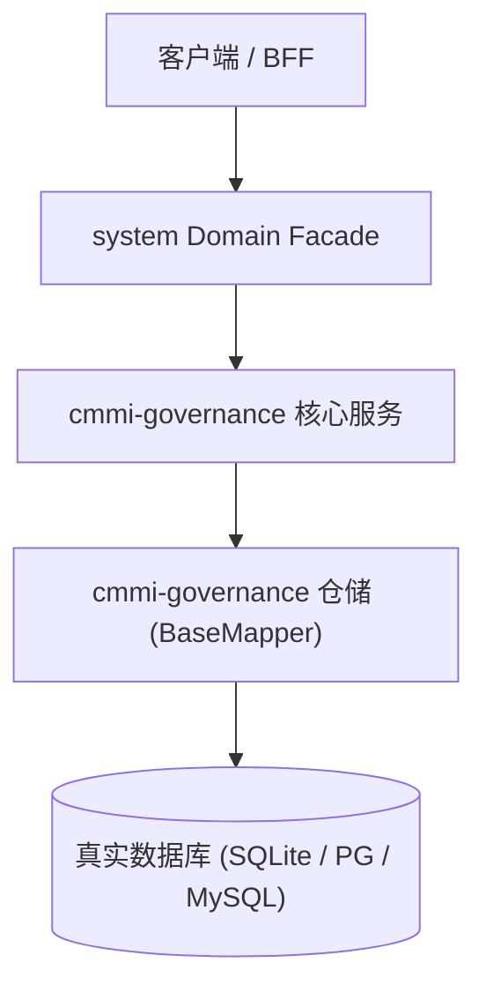

# Design: CMMI 全生命周期交付治理与 8 大工程技能体系

上游：`requirements.md`（本设计严格支撑需求，不得反向修改需求定义）

## 1. 架构总览与拓扑边界

过程资产规约 docs/architecture/CMMI-PROCESS-ASSETS-AND-DELIVERY-STANDARD.md 作为顶层标准，驱动 .agents/skills/ 原生技能与 01~09 标准资产目录，由 scripts/sync-openwiki.cjs 自动同步至 OpenWiki 知识库。

## 2. 数据模型与持久化契约

- **-**: 本特性为系统工程治理规范增强，不涉及新增业务数据库表

## 3. 交互与状态机流转

- 加载中：不适用
- 空数据：无真实数据目录保持严格留空
- 出错：门禁检测异常时退出码非 0 阻断构建
- 无权限：不适用

## 4. 容错与防御设计

- **风险**: 过程文档与实际工程代码脱节漂移 -> **缓释策略**: 通过 check-engineering-standards 与 openwiki:check 自动化门禁脚本进行静态校验
