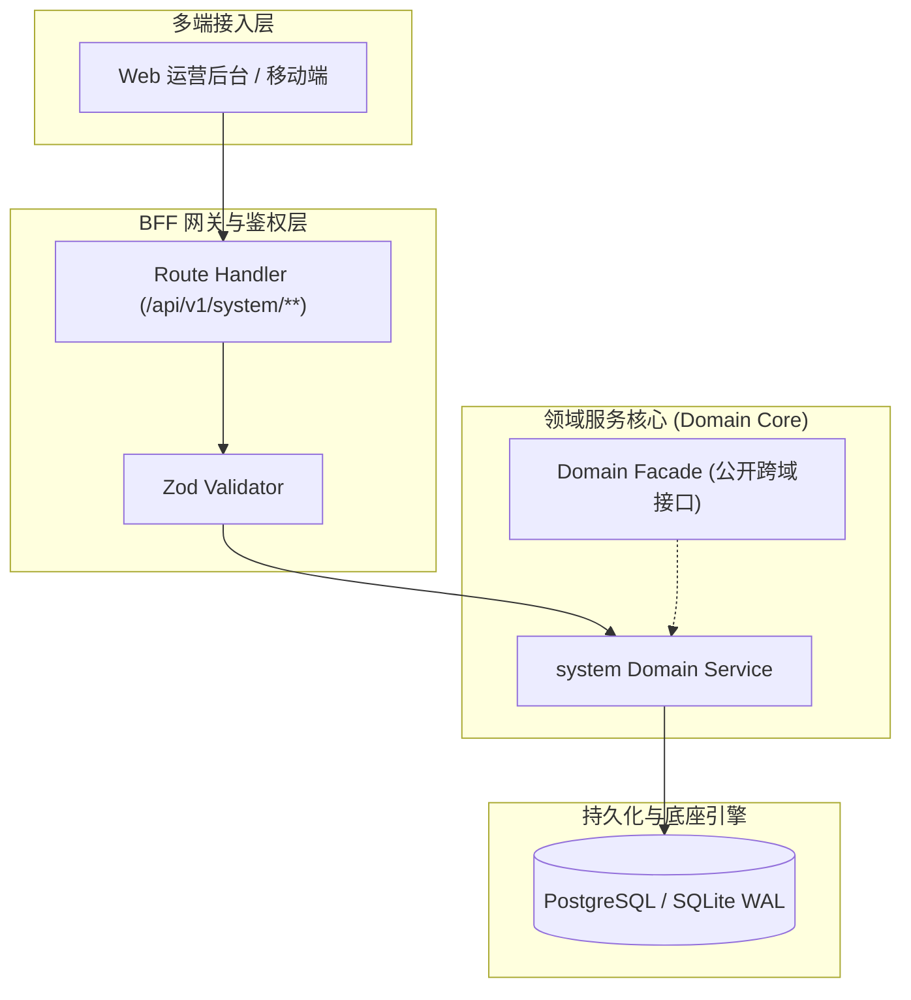

# Design: CMMI 全生命周期交付治理与 8 大工程技能体系

上游：`requirements.md`（本设计严格支撑需求，不得反向修改需求定义）

## 1. 架构总览与组件边界 (Architecture & Component Boundaries)

过程资产规约 docs/architecture/CMMI-PROCESS-ASSETS-AND-DELIVERY-STANDARD.md 作为顶层标准，驱动 .agents/skills/ 原生技能与 01~09 标准资产目录，由 scripts/sync-openwiki.cjs 自动同步至 OpenWiki 知识库。

## 2. 数据模型 (Data Models)

| 表名 | 说明 | 租户隔离策略 | 审计底座 |
|---|---|---|---|
| `-` | 本特性为系统工程治理规范增强，不涉及新增业务数据库表 | Strict tenant_id | 8 大审计列在位 |

> **表定义真源**：低代码元数据与 Prisma Migrations（AGENTS §9.5），不手写破坏性 DDL。

## 3. 关键不变量与状态机守卫 (Invariants & State Guards)

1. **No Artifact, No Done** —— 每个阶段必须交付真实物理工程资产，严禁口头声明完工
2. **实事求是留空准则** —— 无真实生产事故与流水账单的目录保持严格留空，杜绝伪造假 Demo 糊弄

## 4. 接口契约与错误语义 (API Contracts & Error Semantics)

- **成功响应**：统一返回 `{ success: true, data: T }`
- **400 Bad Request**：参数缺失或 Zod Schema 校验不通过
- **401 Unauthorized**：未认证或 Token 过期失效
- **403 Forbidden**：缺乏对应权限码 (Permission Code)
- **409 Conflict**：并发乐观锁版本冲突 (`version` 漂移)

## 5. UI 与交互要点 (UI & Interactions)

* 纯工程治理增强，无管理端与 C 端业务 UI 页面变更

## 6. SRE 与运维保障 (SRE & Operations)

* 门禁链：npm run check 验证 20 道质量门禁与技能规范
* 测试：npm run test:matrix 真实数据库测试套件验证
* 知识库同步：npm run openwiki:sync 动态更新 CMMI 百科词条

## 7. 风险评估与缓解对策 (Risks & Mitigations)

| 风险描述 | 严重等级 | 缓解机制与应急预案 |
|---|---|---|
| 过程文档与实际工程代码脱节漂移 | 高 | 通过 check-engineering-standards 与 openwiki:check 自动化门禁脚本进行静态校验 |
